# 招投标智能助手

面向招投标信息查询与法规问答的 AI Agent，结合 **MySQL 结构化查询**与 **Milvus 法律知识库检索**，提供可查看来源依据的问答结果。

项目重点关注三个问题：如何选择合适的数据工具、如何为回答提供证据，以及如何明确表达查询失败或证据不足。

- **业务数据与法规检索**：查询企业工商信息、经营范围、处罚记录、项目中标详情和企业中标历史，并检索招投标法规知识。
- **Agent 工具调度**：主 Agent 根据本轮问题逐次选择已注册的只读工具，读取工具返回结果后继续查询或结束；后续查询可使用前一步返回的精确字段。
- **交互与来源核验**：网页支持流式输出、引用原文展开、结构化结果展示、停止生成和浏览器本地会话保存。

## 项目演示

以下截图展示页面交互、查询结果及引用溯源。**完整在线问答按需开启，面试时可预约体验**；运行需要本地后端、MySQL、Milvus 和模型服务，非全天在线。

截图按照原始编号升序排列，并沿用图片文件夹名称分组。除主界面外，各组可点击展开；点击图片可查看原图细节。

### 主界面+功能展示（1）

首页提供法规问答及五类业务查询入口，可切换真实问答与明确标识的界面演示模式。

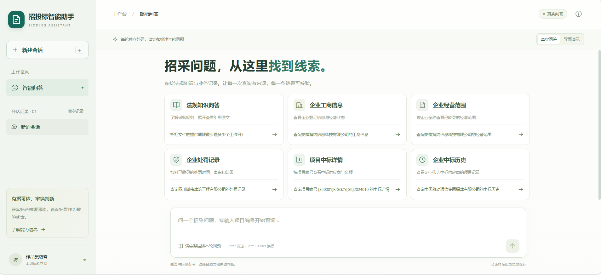

<details>
<summary><strong>法律法规问答，支持查看引用溯源（2–4）</strong></summary>

法规回答附带来源编号；展开引用后，可以查看来源书目、章节和原文片段。

**图 2 · 法规问答结果与引用入口**

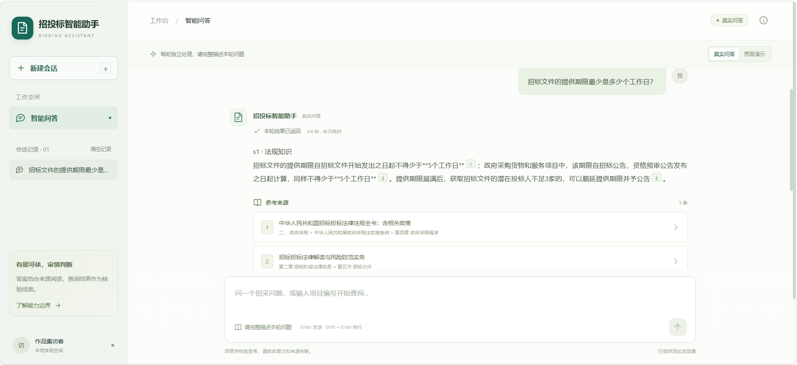

**图 3 · 展开第一条引用，核对来源原文**

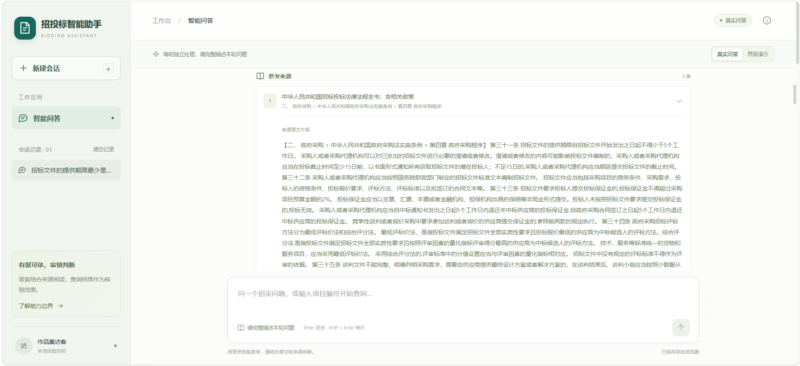

**图 4 · 查看另一条引用及其上下文**

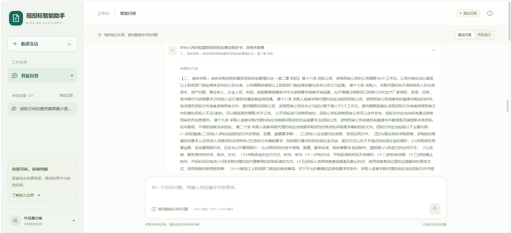

</details>

<details>
<summary><strong>SQL工具，查询某个项目的中标详情（5–6，界面演示）</strong></summary>

本组截图处于“界面演示”模式，使用页面标明的虚构项目 `DEMO2026001`，展示中标信息的回答与表格布局。真实问答模式下的项目查询结果另见图 15、16、18。

**图 5 · 虚构项目的演示回答**

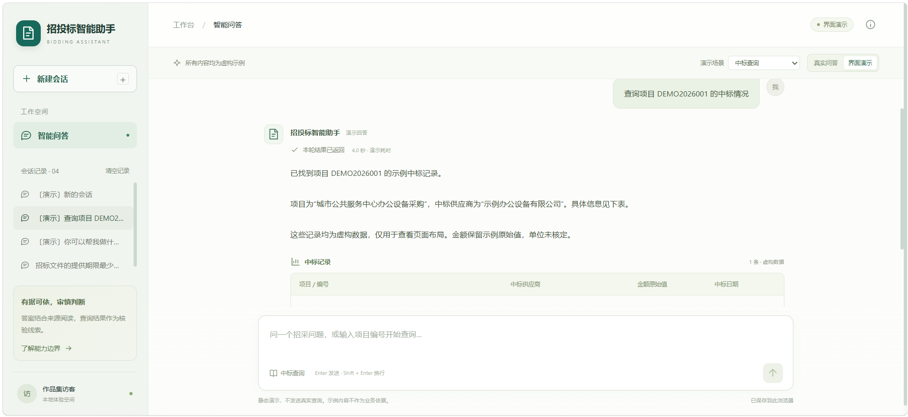

**图 6 · 虚构中标记录的表格展示**

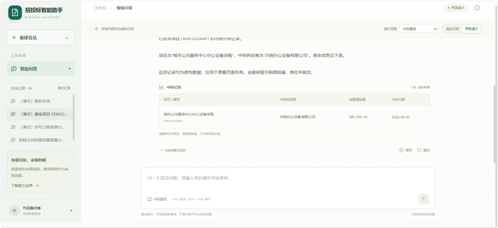

</details>

<details>
<summary><strong>SQL工具，查询某个公司的工商信息（7–8）</strong></summary>

按企业名称查询已收录工商信息，并以字段卡片展示名称、统一社会信用代码、注册资本原记录、经营状态等信息。

**图 7 · 企业工商信息查询结果**

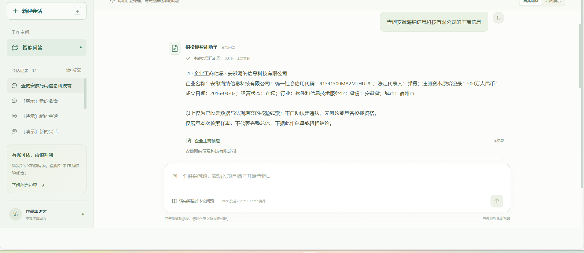

**图 8 · 工商信息字段卡片**

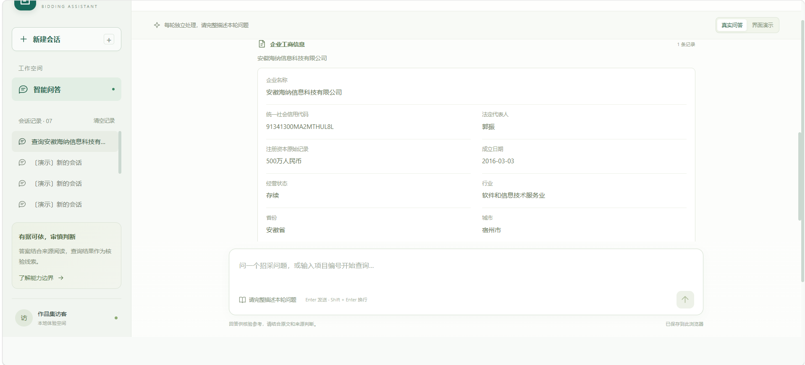

</details>

<details>
<summary><strong>SQL工具，查询某个公司的经营范围（9–10）</strong></summary>

经营范围单独查询，以长文本保留已收录记录的内容。

**图 9 · 企业经营范围查询结果**

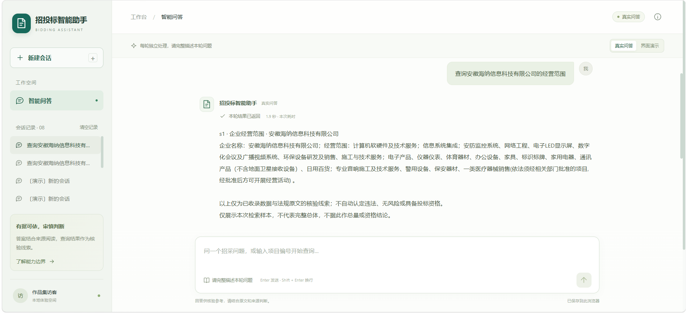

**图 10 · 经营范围详情卡片**

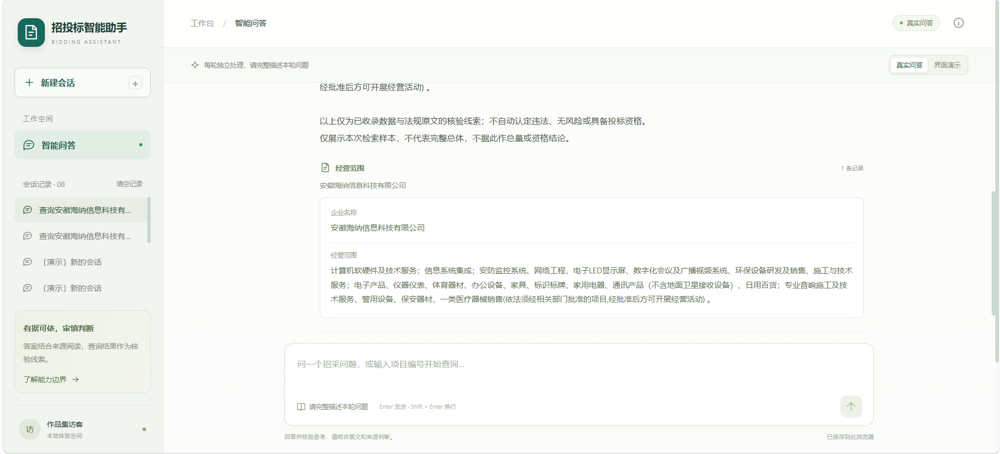

</details>

<details>
<summary><strong>SQL工具，查询某家公司的处罚记录（11–12）</strong></summary>

展示已收录的处罚日期、违法行为记录、处罚结果和执法单位，供进一步核验。

**图 11 · 企业处罚记录查询结果**

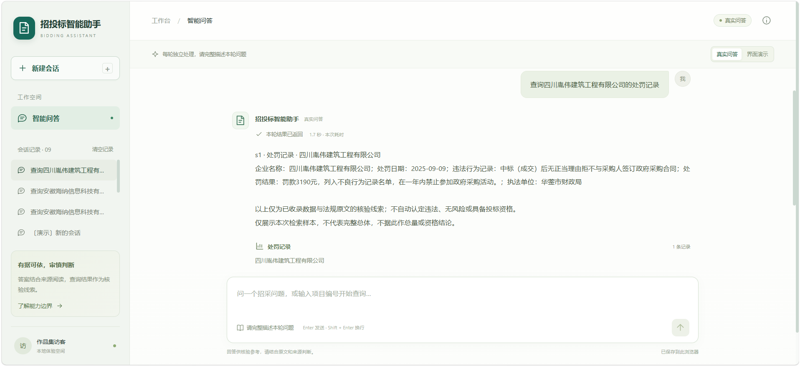

**图 12 · 处罚记录结构化表格**

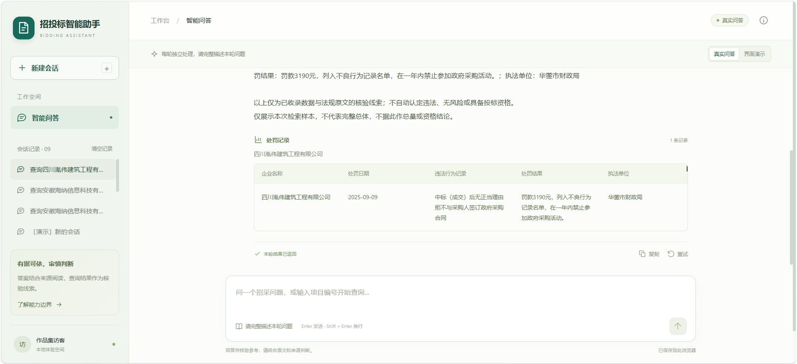

</details>

<details>
<summary><strong>SQL工具，查询某个公司的中标历史（13–14）</strong></summary>

按中标企业名称查询项目记录，展示项目编号、采购人、中标供应商、金额原始值和日期。

**图 13 · 企业中标历史查询结果**

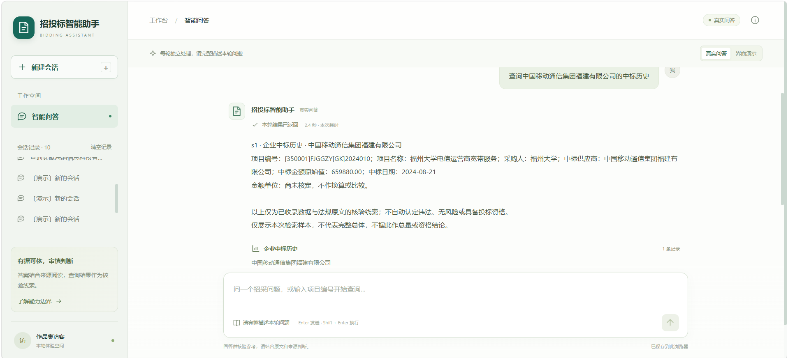

**图 14 · 企业中标历史表格**

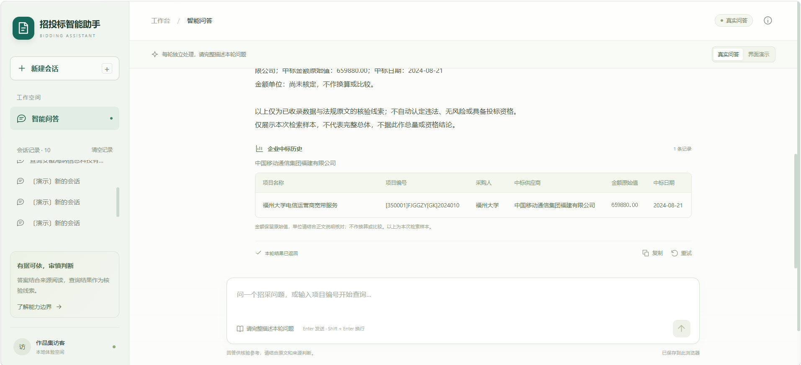

</details>

<details>
<summary><strong>多工具联合查询，RAG+SQL（15–21）</strong></summary>

同一问题包含企业中标历史、项目详情、工商信息、处罚记录和法规问答。结果按 `s1–s5` 分段展示，并配有业务表格和法规引用。

图 15 的提问没有直接提供项目编号，而后续项目查询结果展示了中标历史中的编号，可用于观察前后步骤之间的数据关联。图 16、20 同时展示“暂未收录匹配记录”的表达边界。

本组展示多工具查询的最终结果。另一次成功查询的实际调用顺序、参数传递与返回状态，见下方[完整 ReAct 链路验证](#完整-react-链路验证)。

**图 15 · 复合问题、中标历史与项目详情**

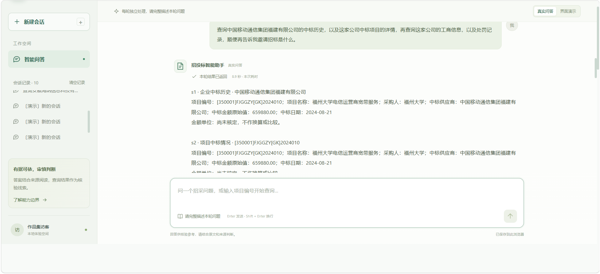

**图 16 · 工商信息、处罚查询与法规回答**

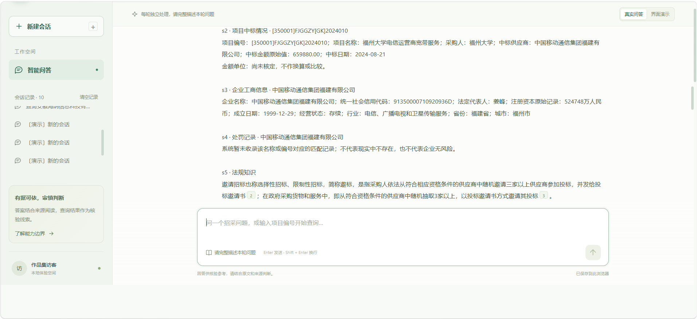

**图 17 · 法规回答续页与引用编号**

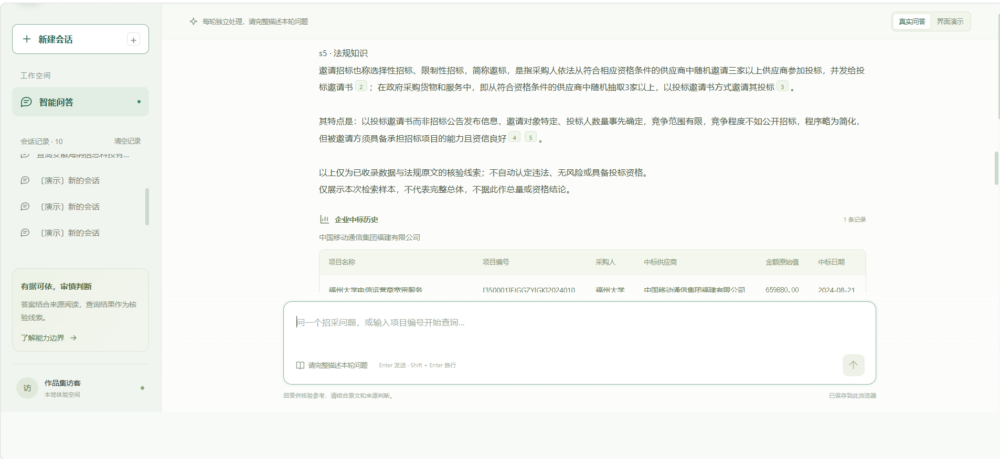

**图 18 · 中标历史与项目详情表格**

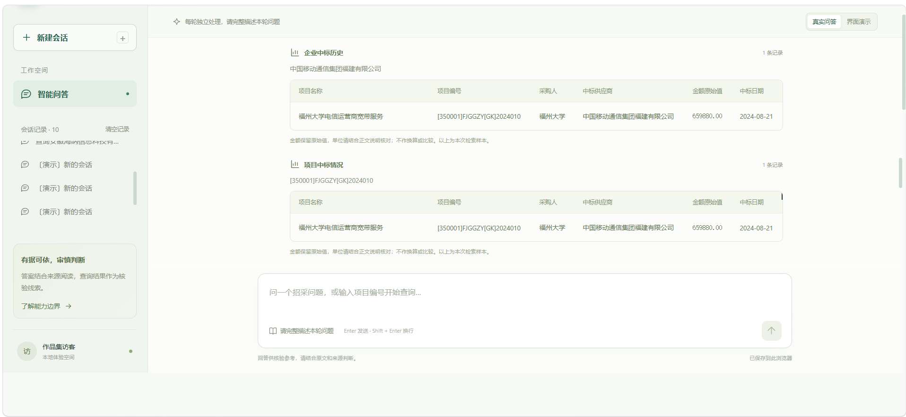

**图 19 · 工商信息卡片**

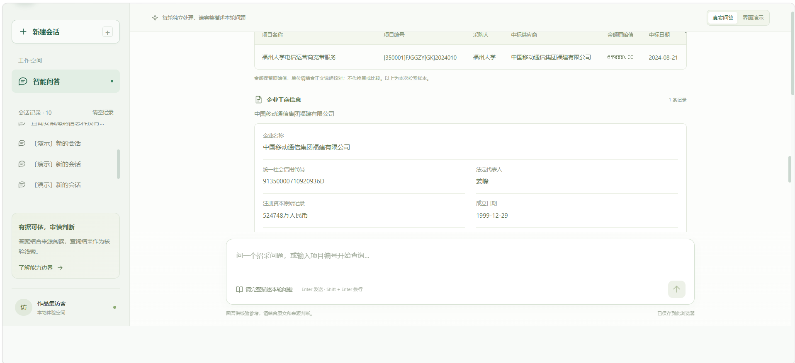

**图 20 · 工商信息续页与处罚查询空结果**

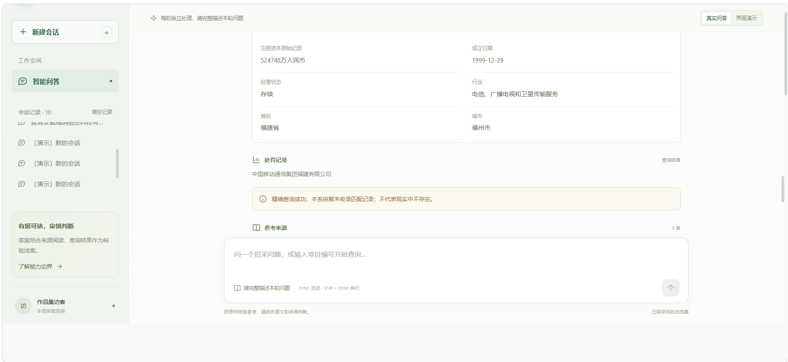

**图 21 · 联合法规问答的参考来源**

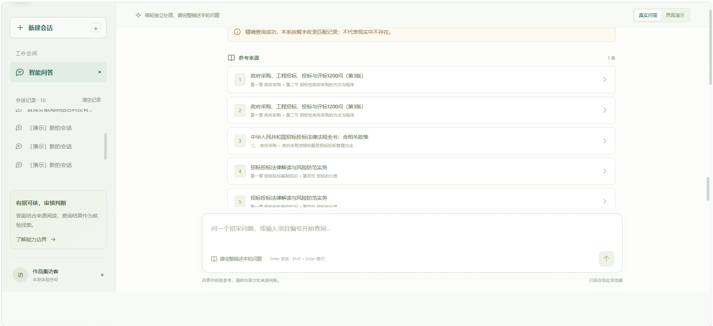

</details>

## 完整 ReAct 链路验证

本案例展示主 Agent 如何读取工具结果，再使用其中的项目编号发起下一次查询，并联合 MySQL 业务数据与法规 RAG 完成回答。以下截图与调用记录对应 **2026-09-24 19:04** 的同一次真实问答。

### 查询任务

> 请查询中国移动通信集团福建有限公司的中标历史，从查询结果中选取一个项目，再查询该项目的中标详情，列出项目编号、采购人、中标供应商、中标金额和日期。另外，请检索法规知识库，解释“邀请招标”的含义。
>
> 我只有公司名称，没有项目编号。如果查询结果没有可用的项目编号，请说明情况，不要猜测或编造。

用户只提供公司名称；项目编号由中标历史工具返回，并成为项目详情工具的输入。

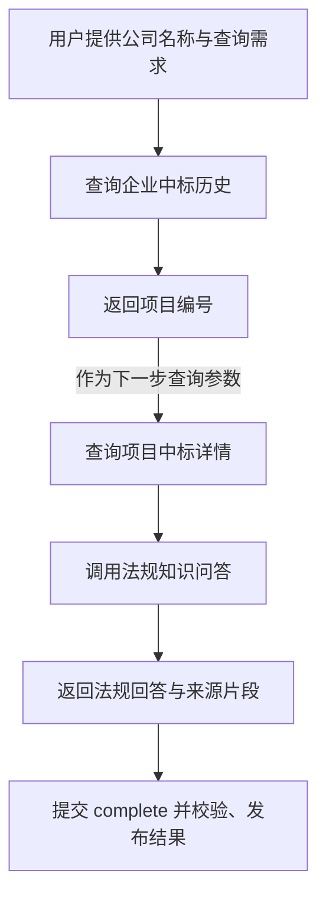
```mermaid
flowchart TD
    A[用户提供公司名称与查询需求] --> B[查询企业中标历史]
    B --> C[返回项目编号]
    C -->|作为下一步查询参数| D[查询项目中标详情]
    D --> E[调用法规知识问答]
    E --> F[返回法规回答与来源片段]
    F --> G[提交 complete 并校验、发布结果]
```

### 本次实际执行

| 步骤 | 工具 | 实际参数 | 返回结果 |
| --- | --- | --- | --- |
| s1 | `query_company_award_history` | `{"company_name": "中国移动通信集团福建有限公司"}` | 返回 1 条中标记录，含项目编号 `[350001]FJGGZY[GK]2024010` |
| s2 | `query_project_award` | `{"project_number": "[350001]FJGGZY[GK]2024010"}` | 返回对应项目详情，参数与上一步返回编号一致 |
| s3 | `knowledge_qa` | `{"question": "解释“邀请招标”的含义"}` | 生成法规回答，返回 5 个来源片段，正文标注来源 1、2、5 |

本次三个工具均成功执行，最终状态为 **`complete`**，缺失字段为空；后端记录总耗时 **7.266 秒**。耗时仅代表此次运行。当前启用的引用结构检查全部通过。

[查看本次结构化调用记录](examples/react_trace/successful_query.json)：包含全部工具回执、阶段事件、已发布业务记录、最终回答、来源索引与完成状态。来源原文可在页面的参考来源中展开查看。

<details>
<summary><strong>展开逐步调用记录与返回结果</strong></summary>

**执行时间线（北京时间）**

| 时间 | 事件 | 结果 |
| --- | --- | --- |
| 19:04:45.558 | Agent 开始处理 | — |
| 19:04:46.188 | s1 · `query_company_award_history` | 开始调用 |
| 19:04:46.200 | s1 · `query_company_award_history` | 调用完成，ok=true |
| 19:04:47.268 | s2 · `query_project_award` | 开始调用 |
| 19:04:47.277 | s2 · `query_project_award` | 调用完成，ok=true |
| 19:04:48.190 | s3 · `knowledge_qa` | 开始调用 |
| 19:04:51.983 | s3 · `knowledge_qa` | 调用完成，ok=true |
| 19:04:52.824 | Agent 提交完成状态 | complete |
| 19:04:52.825 | 开始校验 | — |
| 19:04:52.826 | 校验结束 | — |

**全部工具回执（实际参数与状态）**

```json
[
  {
    "step_id": "s1",
    "tool": "query_company_award_history",
    "args": {
      "company_name": "中国移动通信集团福建有限公司"
    },
    "ok": true,
    "code": "ok",
    "empty": false,
    "exact_scope": true,
    "outcome": "tool_result"
  },
  {
    "step_id": "s2",
    "tool": "query_project_award",
    "args": {
      "project_number": "[350001]FJGGZY[GK]2024010"
    },
    "ok": true,
    "code": "ok",
    "empty": false,
    "exact_scope": true,
    "outcome": "tool_result"
  },
  {
    "step_id": "s3",
    "tool": "knowledge_qa",
    "args": {
      "question": "解释“邀请招标”的含义"
    },
    "ok": true,
    "code": "ok",
    "empty": false,
    "exact_scope": false,
    "outcome": "tool_result"
  }
]
```

**发布的业务记录（保留步骤关联）**

```json
[
  {
    "step_id": "s1",
    "record_ref": "r_337b646ee1efa452c822",
    "project_number": "[350001]FJGGZY[GK]2024010",
    "project_name": "福州大学电信运营商宽带服务",
    "purchaser": "福州大学",
    "successful_bidder": "中国移动通信集团福建有限公司",
    "winning_amount": "659880.00",
    "winning_date": "2024-08-21"
  },
  {
    "step_id": "s2",
    "record_ref": "r_87d251995f89dec3de8f",
    "project_number": "[350001]FJGGZY[GK]2024010",
    "project_name": "福州大学电信运营商宽带服务",
    "purchaser": "福州大学",
    "successful_bidder": "中国移动通信集团福建有限公司",
    "winning_amount": "659880.00",
    "winning_date": "2024-08-21"
  }
]
```

金额 `659880.00` 为原始记录值，单位尚未核定，未换算或比较。

**法规工具返回的回答（与图 23 对应）**

> 邀请招标，是指采购人依法从符合相应资格条件的供应商中随机抽取3家以上供应商，并以投标邀请书的方式邀请其参加投标的采购方式【来源1】；也称选择性招标、限制性招标，简称邀标【来源5】。
>
> 在招标投标法语境下，邀请招标是招标人以发送投标邀请书的方式邀请特定的法人或其他组织参加投标竞争，并从中选择中标人的方式；采用该方式的，应当向3个以上具备承担招标项目能力、资信良好的特定法人或其他组织发出投标邀请书【来源2】。

**法规来源索引**

| 来源 | 文档 | 章节 | 精排分数 | 正文标注 |
| --- | --- | --- | --- | --- |
| 1 | 中华人民共和国招标投标法律法规全书：含相关政策 | 二、 政府采购 > 政府采购货物和服务招标投标管理办法 | 0.7698 | 是 |
| 2 | 招标投标法律解读与风险防范实务 | 第一章 招标投标基础知识 > 第四节 招标的分类 | 0.7125 | 是 |
| 3 | 招标投标法律解读与风险防范实务 | 第一章 招标投标基础知识 > 第一节 招标投标概述 > 二、对“招标投标”概念的理解 | 0.6521 | 否 |
| 4 | 招标投标法律解读与风险防范实务 | 第一章 招标投标基础知识 > 第五节 招标投标的程序及法律性质 | 0.6239 | 否 |
| 5 | 政府采购、工程招标、投标与评标1200问（第3版） | 第一章 政府采购 > 第二节 招标性政府采购的方式与程序 | 0.5874 | 是 |

5 个上下文片段均保留溯源信息，正文实际标注来源 1、2、5；要求所有片段均在正文标注的 R7 严格规则未启用。

**完成状态**

```json
{
  "status": "complete",
  "missing_fields": []
}
```

</details>

<details>
<summary><strong>完整ReAct链路验证：页面截图</strong></summary>

**图 22 · 完整问题与企业中标历史**

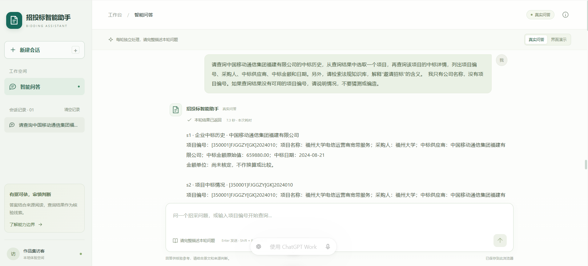

**图 23 · 项目中标详情与法规回答**

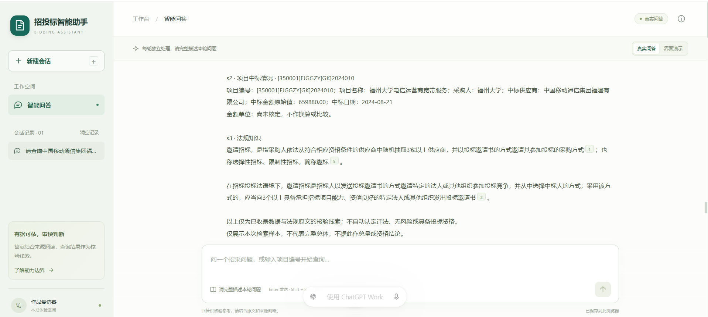

**图 25 · 中标历史和项目详情的结构化结果**

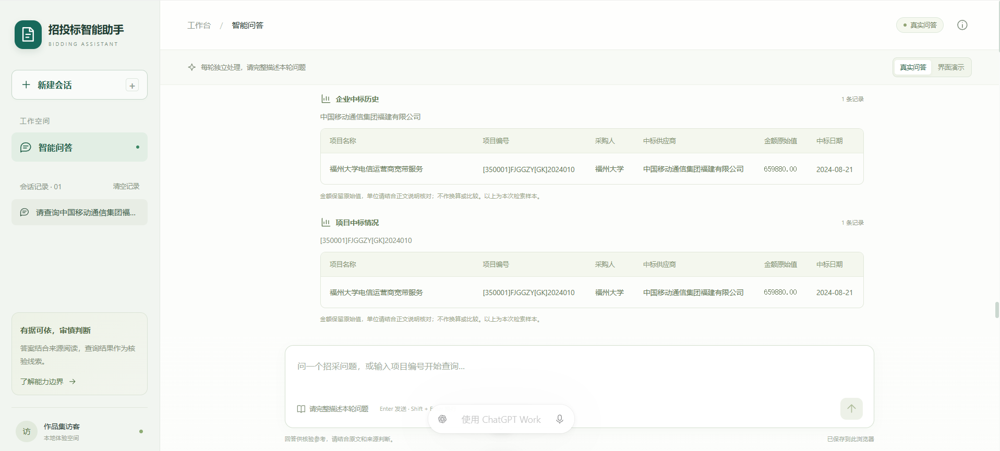

**图 26 · 法规问答的参考来源**

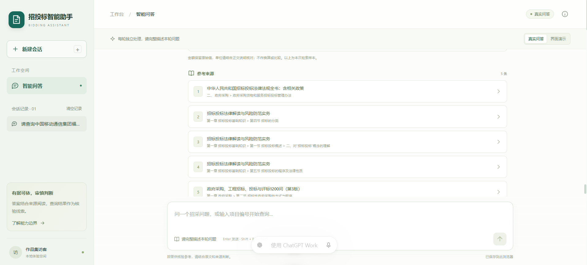

</details>

## 实现要点与代码入口

当前默认入口为 `unified`。主 Agent 每次申请一个工具，程序校验参数并执行，将结果写入证据台账，再把可见结果返回给 Agent。Agent 随后选择下一步工具或提交结束状态，程序依据已校验的工具结果组织最终展示。

| 实现要点 | 可查看的代码 |
| --- | --- |
| 主 Agent 工具循环、参数来源约束、完成状态与结果发布 | [agent/execution/unified.py](agent/execution/unified.py) |
| 工具接口、注册与只读查询能力 | [agent/tools/](agent/tools/) |
| 工具结果收集与证据关联 | [agent/execution/evidence.py](agent/execution/evidence.py) |
| 法律知识库问答、混合检索与引用 | [public_kb/rag_engine.py](public_kb/rag_engine.py)、[public_kb/qa_chain.py](public_kb/qa_chain.py)、[public_kb/citations.py](public_kb/citations.py) |
| SSE 问答服务与前端事件处理 | [service/api.py](service/api.py)、[frontend/src/api/](frontend/src/api/) |
| 业务卡片、表格和引用展示 | [frontend/src/App.tsx](frontend/src/App.tsx)、[frontend/src/BusinessResults.tsx](frontend/src/BusinessResults.tsx) |
| 前一步项目编号用于后一步查询的回归用例 | [test/test_unified_agent.py](test/test_unified_agent.py) |

### 技术栈

| 层次 | 使用的技术 |
| --- | --- |
| Agent | LangChain / LangGraph、DeepSeek、结构化工具调用 |
| 法规检索 | Milvus、BGE-m3、稠密与稀疏混合检索、RRF 融合、BGE-reranker-v2-m3 |
| 业务查询 | MySQL、只读工具、参数与查询主体校验 |
| 服务与交互 | FastAPI、SSE、React、TypeScript、Vite |
| 数据准备 | MinerU PDF 解析、清洗与分块、向量化与入库 |

## 当前能力边界

- 默认 `unified` 模式提供法规问答及五类业务查询，共六个只读工具；文档上传问答仍为预留功能。
- 每轮问题独立处理。浏览器会保存会话和草稿，但历史聊天不参与下一轮模型判断；每次提问需提供完整条件。
- 查询主体和项目编号需来自本轮输入或先前工具的有效记录。项目详情查询要求项目编号；企业中标历史按中标供应商查询。
- 只有精确查询成功且结果为空时，才表示系统暂未收录匹配记录；不能据此认定企业无风险或具备投标资格。
- 金额保留原始值，单位未核定时不作换算或比较。截图是特定数据与问题下的运行样例，不代表完整数据覆盖或性能基准。
- 网页可停止接收当前回答；浏览器断开请求不等于确认远端模型调用或计费已立即终止。

## 本地运行

完整问答需要自行准备 MySQL 业务数据和 Milvus 法规知识库，并配置模型服务。仓库保留代码、数据库建表脚本和部分评测汇总；原始业务数据、法律 PDF、知识库快照、JSONL 数据文件及真实密钥不随仓库提供。

### 1. 克隆与安装

建议使用独立 Python 3.12 环境。Python 依赖见 [requirements.txt](requirements.txt)，版本快照见 [requirements.lock.txt](requirements.lock.txt)。下面的命令使用 Windows PowerShell：

```powershell
git clone https://github.com/zonggao7-art/ztb_demo.git
cd ztb_demo
python -m venv .venv-react
.\.venv-react\Scripts\python.exe -m pip install -r requirements.txt
Copy-Item .env.example .env
```

编辑 `.env`，配置模型、Embedding / Rerank、MySQL 与 Milvus 的连接信息。配置字段说明见 [.env.example](.env.example)，真实密钥仅保留在本地。

### 2. 启动基础设施并准备数据

```powershell
docker compose -f docker/mysql/docker-compose.yml up -d
docker compose -f milvus/docker-compose.yml up -d
```

启动容器后，仍需导入业务数据并准备法规知识库。MySQL 建表脚本位于 [docker/mysql/init/01-schema.sql](docker/mysql/init/01-schema.sql)；知识库入口见 [public_kb/rag_engine.py](public_kb/rag_engine.py)。

### 3. 启动网页

在项目根目录启动后端：

```powershell
.\.venv-react\Scripts\python.exe -m uvicorn service.api:app --host 127.0.0.1 --port 8000
```

另开一个终端，在项目的 `frontend` 目录启动前端（需先安装 Node.js 和 npm）：

```powershell
cd frontend
npm.cmd ci
npm.cmd run dev
```

浏览器打开 <http://127.0.0.1:5173/>。真实问答依赖后端与数据服务；选择“界面演示”可查看虚构样例的交互展示，该模式不会向 Agent 发送查询。

前端配置、SSE 协议及 ngrok 临时演示的启动和停止方法见 [frontend/README.md](frontend/README.md)。

### 4. 命令行问答（可选）

```powershell
.\.venv-react\Scripts\python.exe -m agent --question "招标方式有哪些？"
.\.venv-react\Scripts\python.exe -m agent --interactive --stream
```

默认使用 `unified`；保留 `--execution-mode hybrid` 和 `--execution-mode legacy` 供回退。环境变量与 `.env` 中的显式配置可能覆盖默认设置。

## 测试与开发

后端测试与诊断脚本位于 [test/](test/)，前端测试与构建命令见 [frontend/README.md](frontend/README.md)。

```powershell
# 在项目根目录运行后端测试（测试环境需安装 pytest）
.\.venv-react\Scripts\python.exe -m pytest test/ -v

# 进入 frontend 目录运行前端测试与构建
cd frontend
npm.cmd test
npm.cmd run build
```

部分诊断与评测脚本需要真实数据库或模型服务；执行前应查看相应脚本说明。开发流程见 [CONTRIBUTING.md](CONTRIBUTING.md)。

## 目录导航

| 目录 | 内容 |
| --- | --- |
| [agent/](agent/) | Agent 入口、受约束执行、工具与业务查询 |
| [public_kb/](public_kb/) | 法规知识库解析、检索与问答 |
| [frontend/](frontend/) | 网页交互与前端测试 |
| [service/](service/) | 问答 API 与流式服务 |
| [photos/](photos/) | 本页展示截图 |
| [scripts/](scripts/) | 数据准备、评测与演示脚本 |
| [test/](test/) | 后端测试与诊断 |
| [docker/mysql/](docker/mysql/)、[milvus/](milvus/) | 本地基础设施配置 |

问题反馈：[GitHub Issues](https://github.com/zonggao7-art/ztb_demo/issues)。
