# LangGraph Agent 修正版可插拔骨架架构图

> 生成日期: 2026-07-30
> 状态: 架构设计稿（Demo 阶段落地）

```mermaid
flowchart TD
    %% ═════════════════════════════════════════════════════════
    %% 样式定义
    %% ═════════════════════════════════════════════════════════
    classDef layer fill:#1a1a2e,stroke:#e94560,stroke-width:2px,color:#eee
    classDef nodeEntry fill:#16213e,stroke:#0f3460,stroke-width:2px,color:#c0caf5
    classDef nodeCore fill:#0f3460,stroke:#1677ff,stroke-width:2px,color:#a8d8ff
    classDef nodeState fill:#1a3a5c,stroke:#1890ff,stroke-width:1.5px,color:#91caff,stroke-dasharray:5 5
    classDef nodeBiz fill:#162447,stroke:#1b998b,stroke-width:2px,color:#a8e6cf
    classDef nodeBizFallback fill:#162447,stroke:#e76f51,stroke-width:2px,color:#ffc069
    classDef nodeInfra fill:#1a1a2e,stroke:#5c6370,stroke-width:1.5px,color:#abb2bf
    classDef nodeOpt fill:#2d1b00,stroke:#f4a261,stroke-width:1.5px,color:#ffd166,stroke-dasharray:3 3
    classDef routerLabel fill:none,stroke:none,color:#e94560,font-style:italic,font-size:11px

    %% ═════════════════════════════════════════════════════════
    %% 第一层: 接入层
    %% ═════════════════════════════════════════════════════════
    subgraph L1["━━━ 接入层 (Entry Layer) ━━━"]
        direction LR
        CLI["🖥 CLI 命令行调用"]
        API["🌐 FastAPI 流式接口"]
    end

    %% ═════════════════════════════════════════════════════════
    %% 第二层: 核心骨架层
    %% ═════════════════════════════════════════════════════════
    subgraph L2["━━━ 核心骨架层 (Core Graph Layer) — StateGraph('agent') ━━━"]
        direction TB

        START((START)):::nodeCore

        subgraph StateDef["AgentState 定义"]
            MSG["messages\nAnnotated[list, add_messages]"]
            INT["router_intent\nstr 路由意图枚举"]
            BIZ["business_result\ndict 泛型业务字典"]
        end

        ROUTER["🔀 router\nwith_structured_output\n──────────────\n携带最近3轮对话上下文\n基于枚举值1:1精准路由"]:::nodeCore

        subgraph routerCond["条件边映射"]
            K["→ knowledge_qa"]
            P["→ price_inquiry"]
            G["→ general_chat"]
            D["→ doc_qa"]
            F["→ fallback"]
        end

        %% 优化标注节点
        OPT1["① add_messages\n替代 operator.add\nID去重·类型校验\nCheckpointer原生兼容"]:::nodeOpt
        OPT2["④ 上下文感知路由\nrouter结合3轮历史\n避免指代分类失准"]:::nodeOpt
        OPT3["③ 精简冗余\n已删除 is_complete\n已删除 format_output"]:::nodeOpt
    end

    %% ═════════════════════════════════════════════════════════
    %% 第三层: 业务插件层
    %% ═════════════════════════════════════════════════════════
    subgraph L3["━━━ 业务插件层 (Business Plugin Layer) — 统一包裹 _with_fallback ━━━"]
        direction LR

        subgraph nodeKQA["knowledge_qa"]
            KQA_BODY["📚 专业知识问答\n┈┈┈┈┈┈┈┈┈┈┈┈\n调用 PublicKB-RAG\n严格拒答·溯源引用"]:::nodeBiz
            KQA_GUARD["🛡 _with_fallback"]:::nodeOpt
        end

        subgraph nodePI["price_inquiry"]
            PI_BODY["💰 智能询价\n┈┈┈┈┈┈┈┈┈┈┈┈\n对接 MySQL 中标库\n产品·公司·金额·时间"]:::nodeBiz
            PI_GUARD["🛡 _with_fallback"]:::nodeOpt
        end

        subgraph nodeGC["general_chat"]
            GC_BODY["💬 通用对话\n┈┈┈┈┈┈┈┈┈┈┈┈\n纯 LLM 闲聊\n功能引导·无知识库"]:::nodeBiz
            GC_GUARD["🛡 _with_fallback"]:::nodeOpt
        end

        subgraph nodeDQ["doc_qa"]
            DQ_BODY["📄 文档问答预留\n┈┈┈┈┈┈┈┈┈┈┈┈\nPlaceholder 占位\n返回功能待上线提示"]:::nodeBiz
            DQ_GUARD["🛡 _with_fallback"]:::nodeOpt
        end

        subgraph nodeFB["fallback"]
            FB_BODY["🔄 兜底引导\n┈┈┈┈┈┈┈┈┈┈┈┈\n意图不明时引导\n列出可用功能清单"]:::nodeBizFallback
        end

        OPT4["② 全局异常兜底\n单节点崩溃不中断\n失败降级至fallback\n返回友好服务提示"]:::nodeOpt

        END_NODE((END)):::nodeCore
    end

    %% ═════════════════════════════════════════════════════════
    %% 第四层: 基础设施层
    %% ═════════════════════════════════════════════════════════
    subgraph L4["━━━ 基础设施层 (Infrastructure Layer) ━━━"]
        direction LR

        MILVUS[("Milvus\npublic_kb\n1024 dims")]:::nodeInfra
        MYSQL[("MySQL\nbidding_db\n中标历史")]:::nodeInfra
        LLM[("DeepSeek\nchat API\n对话生成")]:::nodeInfra

        subgraph MemModule["记忆模块 — Checkpointer 工厂预留"]
            MEM_CUR["MemorySaver\n进程内存\nDemo阶段"]:::nodeInfra
            MEM_SQL["SQLite\n本地持久化\n待接入"]:::nodeInfra
            MEM_PG["PostgreSQL\n生产级持久化\n待接入"]:::nodeInfra
            MEM_RD["Redis\n高性能缓存\n待接入"]:::nodeInfra
        end

        OPT5["⑤ 持久化升级预留\nCheckpointer抽象工厂\n内存→SQLite→PG→Redis\n业务代码零改动"]:::nodeOpt
    end

    %% ═════════════════════════════════════════════════════════
    %% 连线
    %% ═════════════════════════════════════════════════════════

    %% L1 → L2
    CLI -->|"invoke(question)"| START
    API -->|"invoke(question)"| START

    %% L2 内部
    START --> ROUTER
    StateDef -.- ROUTER
    ROUTER -.->|"读取"| MSG
    ROUTER --> routerCond
    OPT1 -.- MSG
    OPT2 -.- ROUTER
    OPT3 -.- StateDef

    %% L2 → L3
    K -.->|"intent = knowledge_qa"| KQA_BODY
    P -.->|"intent = price_inquiry"| PI_BODY
    G -.->|"intent = general_chat"| GC_BODY
    D -.->|"intent = doc_qa"| DQ_BODY
    F -.->|"intent = fallback"| FB_BODY

    %% L3 内部异常兜底
    KQA_BODY --> KQA_GUARD
    PI_BODY --> PI_GUARD
    GC_BODY --> GC_GUARD
    DQ_BODY --> DQ_GUARD
    KQA_GUARD -.- OPT4
    PI_GUARD -.- OPT4
    GC_GUARD -.- OPT4
    DQ_GUARD -.- OPT4

    %% L3 → END
    KQA_GUARD --> END_NODE
    PI_GUARD --> END_NODE
    GC_GUARD --> END_NODE
    DQ_GUARD --> END_NODE
    FB_BODY --> END_NODE

    %% L3 ↔ L4 依赖
    KQA_BODY -.- MILVUS
    KQA_BODY -.- LLM
    PI_BODY -.- MYSQL
    PI_BODY -.- LLM
    GC_BODY -.- LLM
    DQ_BODY -.- MILVUS
    DQ_BODY -.- LLM

    %% L4 记忆模块
    MEM_CUR --> MEM_SQL --> MEM_PG --> MEM_RD
    OPT5 -.- MemModule

    %% ═════════════════════════════════════════════════════════
    %% Layer class assignments
    %% ═════════════════════════════════════════════════════════
    class L1 layer
    class L2 layer
    class L3 layer
    class L4 layer
    class CLI,API nodeEntry
    class StateDef nodeState
    class KQA_BODY,PI_BODY,GC_BODY,DQ_BODY nodeBiz
    class FB_BODY nodeBizFallback
    class MILVUS,MYSQL,LLM,MEM_CUR,MEM_SQL,MEM_PG,MEM_RD nodeInfra
    class OPT1,OPT2,OPT3,OPT4,OPT5 nodeOpt
```

---

## 图例说明

| 颜色 | 含义 | 节点示例 |
|------|------|---------|
| 🔵 深蓝 | 核心骨架层（StateGraph / Router） | router 节点、AgentState 定义 |
| 🟢 青绿 | 业务插件层（正常分支） | knowledge_qa、price_inquiry |
| 🟠 橙红 | 兜底分支 | fallback |
| 🟡 琥珀 | 五项核心优化标注 | ① ~ ⑤ 优化点 |
| ⚫ 灰色 | 基础设施层 | Milvus、MySQL、LLM |

## 五项核心优化点清单

| 序号 | 优化项 | 位置 | 说明 |
|------|--------|------|------|
| ① | `add_messages` 替代 `operator.add` | 核心层 — State 定义旁 | 支持消息 ID 去重、类型校验、Checkpointer 原生兼容 |
| ② | 全局异常兜底 | 业务层 — 节点包裹区 | `_with_fallback` 包装所有业务节点，单点故障不中断整体流程 |
| ③ | 精简冗余中间节点 | 核心层 — State 定义旁 | 已删除 `is_complete`、`format_output` 等无实际逻辑作用的字段和节点 |
| ④ | 上下文感知路由 | 核心层 — router 节点旁 | Router 携带最近 3 轮对话历史进行意图判断，避免指代不清 |
| ⑤ | Checkpointer 持久化预留 | 基础设施层 — 记忆模块旁 | 抽象工厂支持内存→SQLite→PostgreSQL→Redis 平滑升级，业务代码零改动 |
