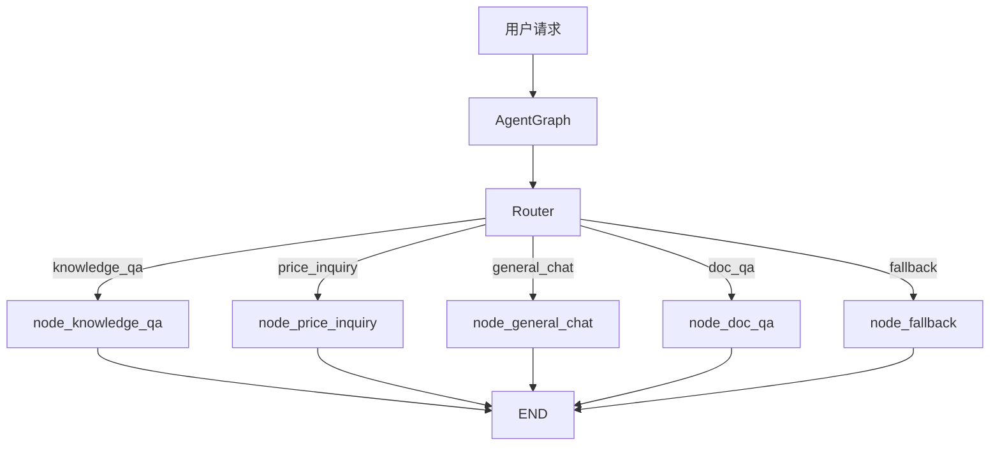
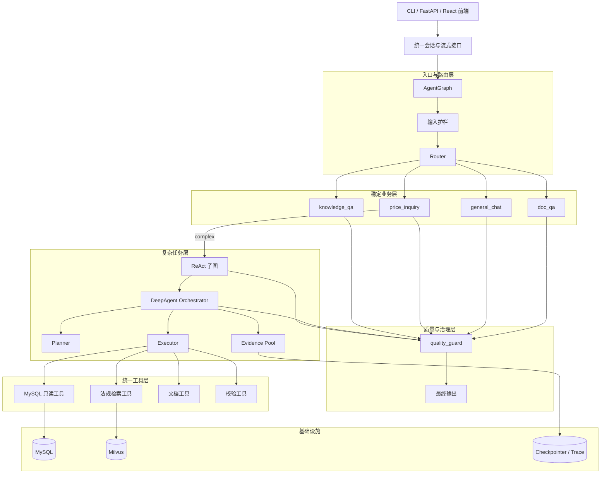
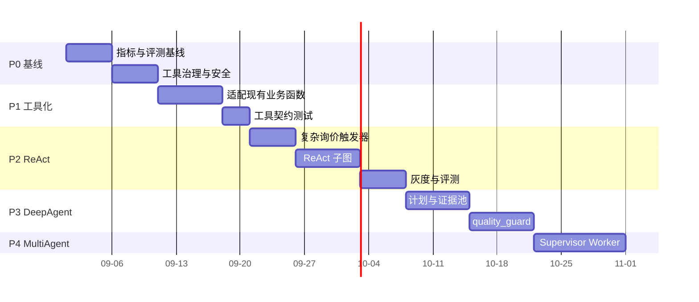
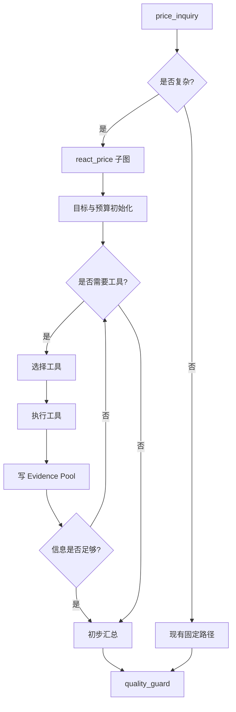
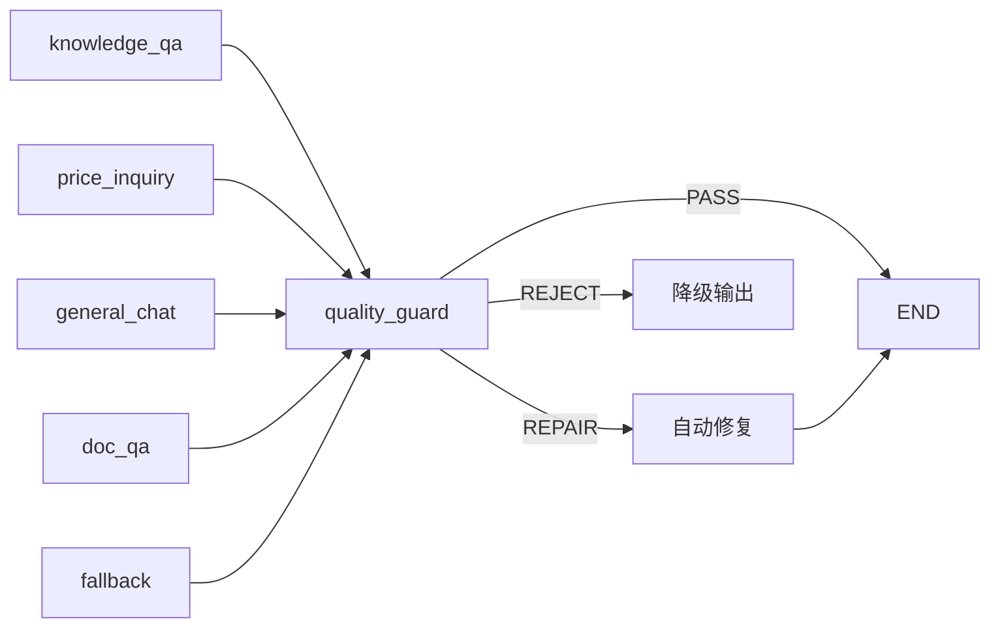
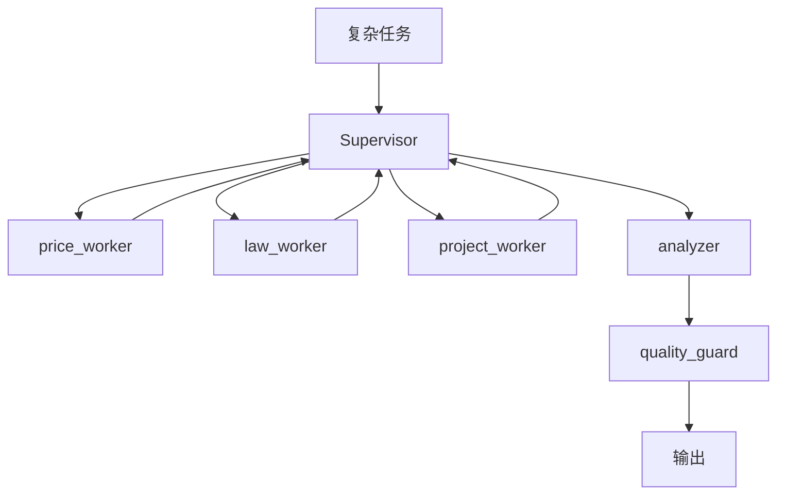

# AI Agent 架构升级方案：ReAct、DeepAgent 与 MultiAgent 引入策略

> 版本：v1.0  
> 适用系统：招投标智能助手  
> 基线架构：LangGraph StateGraph + Router + 业务节点 + MySQL/Milvus/LLM  
> 建议前置阅读：
>
> - [`react_architecture_for_beginners.md`](./react_architecture_for_beginners.md)
> - [`deep_agent_architecture_for_beginners.md`](./deep_agent_architecture_for_beginners.md)
> - [`multi_agent_architecture_for_beginners.md`](./multi_agent_architecture_for_beginners.md)

## 0. 执行摘要

### 0.1 结论

建议采用**渐进式混合架构**，而不是一次性改造为完整的 MultiAgent 系统。

目标形态可以概括为：

```text
稳定入口仍走现有固定业务节点；
复杂任务走 ReAct/DeepAgent 子通道；
所有工具被统一治理；
新增质量门控；
MultiAgent 只在职责边界和协作收益明确时启用。
```

第一阶段不要做“多 Agent 全家桶”。当前系统已经有清晰的 Router + Worker 骨架，直接引入大量协作 Agent 会增加延迟、Token 成本和调试难度。

### 0.2 推荐优先级

| 优先级 | 架构能力 | 判断 |
| --- | --- | --- |
| P0 | 工具治理、预算、Trace、评测基线 | 必做 |
| P1 | 把现有业务能力封装成统一工具 | 必做 |
| P2 | 对复杂询价启用 ReAct 子图 | 建议做 |
| P3 | 引入 DeepAgent 的 Planner/Critic/Verifier 思想 | 建议做 |
| P4 | Supervisor + Worker MultiAgent | 条件启用 |

### 0.3 不建议立即做的事

| 事项 | 原因 |
| --- | --- |
| 删除现有 Router + 固定节点 | 它们是低延迟、稳定、可测试的生产路径 |
| 所有请求都进入自主 Agent | 延迟、成本、失败面不可控 |
| 一开始拆很多 Agent | 收益不明确，上下文同步成本高 |
| 让模型自由生成 SQL | 涉及安全、权限和性能 |
| 把全部中间 Trace 放入上下文 | 容易撑爆上下文并引发幻觉 |
| 用“多个模型聊天”实现协作 | 生产系统需要结构化协议和状态机 |

### 0.4 关于 React 与 ReAct

本方案中的 **ReAct** 是 AI Agent 的 Reasoning + Acting 架构，不是前端框架 **React**。

如果后续需要浏览器端升级，可以做独立的前端 React 工程，通过现有 SSE 接口消费 `meta`、`stage`、`retrieval`、`citations`、`table`、`final` 等事件。前端 React 不属于本次 AI Agent 架构升级的核心。

## 1. 当前系统基线

### 1.1 现有架构

当前系统核心入口是 `agent/graph.py` 中的 `AgentGraph`，主流程为：



### 1.2 现有状态契约

`agent/state.py` 定义了共享的 `AgentState`：

| 字段 | 作用 |
| --- | --- |
| `messages` | 对话历史，使用 `add_messages` reducer |
| `router_intent` | 当前分支意图 |
| `business_result` | 业务负载，内部为泛型 dict |

当前设计原则是：**新增业务分支不新增 State 顶层字段**。这个原则应继续保留。

### 1.3 当前分支

| 分支 | 作用 | 现状评估 |
| --- | --- | --- |
| `knowledge_qa` | 公共法规知识问答 | RAG 链路较成熟，应保持稳定 |
| `price_inquiry` | 智能询价 | 已有多阶段召回，是 ReAct 最合适试点 |
| `general_chat` | 通用对话 | 不需要 Agent 化 |
| `doc_qa` | 文档问答 | 当前为占位能力，可作为后续扩展点 |
| `fallback` | 兜底 | 必须保留 |

### 1.4 已具备的工程基础

| 基础能力 | 位置/表现 | 对升级的价值 |
| --- | --- | --- |
| LangGraph 图编排 | `agent/graph.py` | 可直接增加子图和条件边 |
| 全局节点兜底 | `_with_fallback` | Agent 失败时仍能友好降级 |
| Checkpointer 工厂 | `agent/checkpointer.py` | 支持后续长任务恢复 |
| 统一流式事件 | `agent/streaming/` | 可展示 Agent 阶段和工具进度 |
| 异步运行时 | `agent/runtime/` | 支持超时、取消、并发控制 |
| FastAPI SSE | `service/api.py` | 前端可接收过程事件 |
| 引用溯源 | `public_kb/citations.py` 及相关测试 | 适合扩展证据链 |
| 已有 DeepAgent 质量门控设计 | `docs/deep_agents_integration_design.md` | 可作为 P3 的实现蓝本 |

## 2. 三种架构与当前系统的匹配度

### 2.1 匹配度总表

| 架构 | 当前系统匹配点 | 主要收益 | 主要代价 | 引入建议 |
| --- | --- | --- | --- | --- |
| ReAct | `price_inquiry` 已有多步召回；Milvus/MySQL 可工具化 | 复杂查询可根据中间结果调整路径 | 延迟、Token、循环风险 | 选择性启用 |
| DeepAgent | 已有 LangGraph、Checkpointer、流式、引用溯源 | 支持计划、证据、验证、恢复 | 设计复杂度高 | 引入思想，不重写系统 |
| MultiAgent | Router + 多业务节点已是雏形 | 职责隔离、权限隔离、并行执行 | 消息协议、Trace、成本、调试复杂 | 条件启用 |

### 2.2 ReAct：最适合的试点是复杂询价

当前 `price_inquiry` 已经包含意图解析、语义召回、FULLTEXT、LIKE、SQL Builder 等多阶段逻辑。这些能力天然可以拆成只读工具。

ReAct 只应处理“固定模板难以完成”的问题，例如：

```text
对比 A 公司近两年服务类项目报价，并说明变化原因。
```

不应处理：

```text
A 公司上次中标价是多少？
```

后者应继续走固定路径。

### 2.3 DeepAgent：先引入思想，再落一个质量门控

DeepAgent 的核心不是让系统更“深奥”，而是补齐当前固定节点缺少的三件事：

1. **显式目标与验收标准**；
2. **可追踪计划与证据池**；
3. **输出前质量校验**。

已有文档 `docs/deep_agents_integration_design.md` 提出了 `quality_guard`。建议把它作为 DeepAgent 思想的第一个落地件，而不是马上做完整规划系统。

### 2.4 MultiAgent：当前没有必须多 Agent 的强需求

当前系统已经是：

```text
Router Agent + 多个 Worker 分支
```

只是 Worker 目前是固定节点，不是自由对话型 Agent。

如果没有以下需求，不建议引入完整 MultiAgent：

1. 多个独立证据源需要稳定并行；
2. 一个复杂报告任务需要价格、法规、项目、风险多个职责；
3. 单节点提示词和工具集已经难以维护；
4. 需要按职责设置不同权限和预算。

## 3. 目标架构

### 3.1 总体分层



### 3.2 关键原则

| 原则 | 说明 |
| --- | --- |
| 保留稳定通道 | 高频、简单、可预测的问题不进 Agent 循环 |
| 状态最小改动 | 不为每个能力新增顶层 State 字段 |
| 工具优先 | 优先封装现有函数，而不是新造 Agent |
| 证据驱动 | 结论必须能定位 SQL 来源、Milvus chunk 或文档段落 |
| 预算受限 | 每个任务有时间、步数、Token、工具调用预算 |
| 失败可降级 | Agent 失败回退到固定路径或 `fallback` |
| 流式透明 | 用户能看到阶段、检索和最终输出 |
| 可评测 | 每个阶段有基线、数据集和指标 |

## 4. 目标状态与数据契约

### 4.1 不改变 `AgentState` 顶层字段

继续保留：

```python
class AgentState(TypedDict, total=False):
    messages: Annotated[list[BaseMessage], add_messages]
    router_intent: str
    business_result: dict
```

Agent 元数据放在 `business_result.data` 中：

```json
{
  "branch": "price_inquiry",
  "answer": "...",
  "data": {
    "records": [],
    "agent_meta": {
      "mode": "react",
      "goal": "对比 A 公司近两年服务类项目报价",
      "plan_id": "plan-001",
      "steps": [],
      "evidence_ids": [],
      "budget": {"max_steps": 6, "time_budget_s": 25},
      "usage": {"tool_calls": 3, "input_tokens": 0, "output_tokens": 0}
    }
  }
}
```

这样可以避免破坏现有 Checkpointer、测试、节点契约和外部消费者。

### 4.2 统一工具结果契约

所有工具返回：

```python
class ToolResult(TypedDict):
    ok: bool
    data: dict | list | None
    error: dict | None
    metadata: dict
```

示例：

```json
{
  "ok": true,
  "data": {
    "records": [
      {"project_name": "示例项目", "bid_price": 980000, "award_date": "2025-07-15"}
    ]
  },
  "error": null,
  "metadata": {
    "source": "mysql.ztb_clean",
    "row_count": 1,
    "elapsed_ms": 128,
    "query_id": "q-001"
  }
}
```

### 4.3 统一证据契约

```python
class Evidence(TypedDict):
    evidence_id: str
    kind: str
    source: str
    locator: str
    excerpt: str | None
    score: float | None
    metadata: dict
```

`kind` 建议先支持：

| kind | locator 示例 |
| --- | --- |
| `mysql_row` | `ztb_clean.bid_project:project_id=123` |
| `milvus_chunk` | `public_kb:chunk_uid=...` |
| `doc_paragraph` | `doc_id=...#para=12` |
| `tool_metric` | `calc:avg_price=input_evidence_ids` |
| `human_input` | `thread_id=...#message_id=...` |

### 4.4 统一流式事件

不新增事件协议，优先复用：

| 事件 | 用途 |
| --- | --- |
| `stage` | Agent 阶段，如 planning / tool_call / verifying |
| `retrieval` | Milvus 或 MySQL 检索进度 |
| `citations` | 引用信息 |
| `partial` | 中间产物或低置信结果 |
| `table` | 结构化表格 |
| `final` | 最终答案 |
| `error` | 错误 |
| `cancelled` | 超时或取消 |

示例 payload：

```json
{
  "type": "stage",
  "payload": {
    "stage": "tool_call",
    "agent": "react_price",
    "step": 2,
    "action": "query_bid_price",
    "status": "running"
  }
}
```

## 5. 统一工具层设计

### 5.1 目录建议

```text
agent/
  tools/
    __init__.py
    base.py            # ToolContext / ToolResult / 装饰器
    mysql_tools.py     # 只读 SQL 工具
    knowledge_tools.py # Milvus/公共知识库工具
    doc_tools.py       # 文档问答预留
    validation_tools.py# 引用、数字、结构校验
  planning/
    __init__.py
    schemas.py         # Goal / Plan / Step / Budget
    planner.py         # 静态 + 动态规划
  graphs/
    __init__.py
    react_price.py     # 复杂询价 ReAct 子图
  nodes/
    quality_guard.py   # 质量门控
```

`agent/nodes/price_inquiry/` 现有模块继续保留，逐步被工具适配器调用。

### 5.2 工具上下文

每个工具调用都应携带运行上下文：

```python
class ToolContext(TypedDict):
    request_id: str
    thread_id: str
    trace_id: str
    branch: str
    mode: str
    budget: dict
    user_role: str | None
```

工具内部禁止读取全局 `.env` 之外的隐式用户状态。

### 5.3 工具白名单

第一阶段建议只开放这些只读工具：

| 工具 | 目标能力 | 允许来源 |
| --- | --- | --- |
| `normalize_company_name` | 公司名归一化 | MySQL/词典 |
| `normalize_project_type` | 项目类型枚举归一化 | `enum_norm` |
| `search_price_semantic` | 价格语义召回 | Milvus |
| `search_price_fulltext` | 价格关键字召回 | MySQL FULLTEXT |
| `query_bid_records` | 查询历史投标/中标记录 | MySQL 视图或白名单 SQL |
| `query_project_context` | 查询项目上下文 | MySQL |
| `search_public_kb` | 查询法规知识 | Milvus |
| `validate_citations` | 校验引用与证据 | 内部规则 |
| `calculate_price_metrics` | 均价、降幅、排名等 | 受控计算 |

不建议开放：

- 任意 SQL；
- `DELETE`、`UPDATE`、`INSERT`；
- 文件系统写入；
- 外部网络请求；
- 未脱敏的敏感字段查询。

### 5.4 SQL 安全边界

| 控制点 | 要求 |
| --- | --- |
| 数据库账号 | 只读账号 |
| 表白名单 | 只能访问询价相关表/视图 |
| 字段白名单 | 敏感字段默认不返回 |
| SQL 生成 | 只能通过 SQL Builder，不允许自由拼接 |
| 语句类型 | 只允许 `SELECT` |
| 行数限制 | 强制 `LIMIT` |
| 超时 | 每个 SQL 设置语句级超时 |
| EXPLAIN | 新 SQL 模板上线前做执行计划验证 |
| 审计 | 记录模板名、参数、行数、耗时 |

## 6. 分阶段升级路线

### 6.1 路线总览



日期仅为示例排期，应根据人力和业务优先级调整。

### 6.2 P0：建立基线、治理和开关（必须先做）

#### 目标

没有基线就升级，无法判断收益和回归。

#### 工作项

1. 建立核心指标：
   - 任务成功率；
   - 引用覆盖率；
   - 首响时间；
   - 总耗时；
   - Token 成本；
   - SQL 耗时与行数；
   - `fallback` 率。
2. 建立评测集：
   - 100 条现有稳定问题；
   - 30 条复杂询价；
   - 20 条模糊或对抗问题；
   - 10 条应拒答问题。
3. 增加 Agent 配置开关：

```python
agent_enable_tools: bool = False
agent_enable_react: bool = False
agent_enable_deep_agent: bool = False
agent_enable_multi_agent: bool = False
react_trigger_mode: str = "rules"   # rules / llm / off
react_max_steps: int = 6
agent_time_budget_s: float = 25
agent_tool_call_budget: int = 8
```

4. 统一 Trace 记录：
   - `trace_id`、`request_id`、`thread_id`；
   - 节点/工具名；
   - 输入摘要；
   - 输出摘要；
   - 错误；
   - 耗时；
   - Token。
5. 数据库安全确认：
   - 只读账号；
   - 表/字段白名单；
   - SQL 超时；
   - 行数限制。

#### 完成标准

- 能拿到升级前基线报告；
- 所有新能力默认关闭；
- 每个工具调用可追踪；
- 存在安全测试用例。

### 6.3 P1：工具化现有能力（必做）

#### 目标

不是让模型直接接管业务，而是把已验证的能力封装成可组合、可测试、可授权的工具。

#### 改造方式

不要先重写 `price_inquiry`。先加适配器：

```python
@tool
def query_bid_records(
    company_name: str,
    project_type: str | None = None,
    start_date: str | None = None,
    end_date: str | None = None,
) -> dict:
    """查询历史投标/中标记录。只返回白名单字段。"""
    context = current_tool_context()
    with tool_budget(context, max_timeout_s=5):
        normalized_type = normalize_project_type(project_type)
        rows = run_whitelisted_sql(
            sql_template="bid_records_by_company",
            params={
                "company_name": company_name,
                "project_type": normalized_type,
                "start_date": start_date,
                "end_date": end_date,
            },
            limit=50,
        )
        return make_tool_result(
            ok=True,
            data={"records": rows},
            metadata={"source": "mysql.ztb_clean", "row_count": len(rows)},
        )
```

#### 迁移顺序

| 顺序 | 迁移对象 | 原因 |
| --- | --- | --- |
| 1 | 枚举归一化 | 纯函数，易测试 |
| 2 | MySQL 查询模板 | 安全边界清晰 |
| 3 | Milvus 语义召回 | 已有异步能力 |
| 4 | 引用校验 | 支撑后续质量门控 |
| 5 | 文档问答 | 等能力稳定后再接入 |

#### 完成标准

- 每个工具有 Pydantic/Tool Schema；
- 每个工具有单元测试；
- 每个工具返回统一 `ToolResult`；
- 现有节点行为不回归。

### 6.4 P2：在复杂询价中启用 ReAct 子图

#### 6.4.1 触发策略

不建议让 Router 直接新增“复杂问题就全部 ReAct”的逻辑。建议在 `price_inquiry` 内部做二级判断：

```text
Router 仍输出 price_inquiry
    ↓
node_price_inquiry 判断：
    简单 → 固定路径
    复杂 → react_price 子图
```

触发规则示例：

| 信号 | 示例 | 判断 |
| --- | --- | --- |
| 多实体 | 公司 + 项目 + 对比对象 | 可能复杂 |
| 时间对比 | 近两年、同比、逐年 | 可能复杂 |
| 分析词 | 原因、趋势、风险、对比 | 可能复杂 |
| 缺少关键条件 | 无公司名但要求报价 | 需澄清或召回 |
| 结果歧义 | 多个同名公司 | 需澄清或选择 |
| 多数据源 | 价格 + 法规 + 项目背景 | 复杂 |

推荐混合触发：

1. 规则快速识别高置信复杂问题；
2. 低置信样本用轻量 LLM 分类；
3. 开关和采样控制灰度比例。

#### 6.4.2 ReAct 子图



#### 6.4.3 最小实现伪代码

```python
def should_use_react(state: AgentState) -> bool:
    if not settings.agent_enable_react:
        return False
    features = extract_complexity_features(state)
    if features.missing_required_entity:
        return True
    if features.has_time_comparison and features.has_analysis_intent:
        return True
    if features.multi_data_source:
        return True
    return False


async def react_price_node(state: AgentState) -> dict:
    goal = build_goal(state)
    budget = ToolBudget(
        max_steps=settings.react_max_steps,
        time_budget_s=settings.agent_time_budget_s,
        max_tool_calls=settings.agent_tool_call_budget,
    )
    workspace = PriceReActWorkspace(goal=goal, budget=budget)

    while not workspace.finished:
        action = await decide_next_action(workspace)
        result = await execute_tool(action, context=workspace.context)
        workspace.observe(action, result)

        if workspace.is_goal_satisfied():
            break
        if workspace.budget.exceeded:
            return workspace.degrade()

    answer = await summarize_with_evidence(workspace)
    return {
        "business_result": {
            "branch": "price_inquiry",
            "answer": answer.text,
            "data": {
                **answer.data,
                "agent_meta": workspace.to_meta(),
            },
        },
        "messages": [AIMessage(content=answer.text)],
    }
```

#### 6.4.4 降级策略

| 情况 | 处理 |
| --- | --- |
| 步数超限 | 使用已有证据生成保守答案，并说明缺失 |
| 时间超限 | 返回部分结果或转固定路径 |
| 工具连续失败 | 走现有固定路径 |
| 关键实体歧义 | 输出候选清单，请用户确认 |
| 证据不足 | 明确说未查到，不编造 |

#### 6.4.5 完成标准

- 简单询价延迟不高于基线 +10%；
- 复杂询价任务成功率提升且引用可回查；
- 无无限循环；
- React/ReAct 灰度可随时关闭；
- 评测报告证明收益。

### 6.5 P3：引入 DeepAgent 的计划、证据与质量门控

#### 6.5.1 为什么不一步到“全自动 DeepAgent”

全自动规划会带来：

- 计划不稳定；
- 难以复现；
- Token 成本不可控；
- 错误传播；
- 测试困难。

因此先引入三个可验证组件：

```text
Goal → Evidence Pool → quality_guard
```

再逐步引入 Planner。

#### 6.5.2 Goal 模型

```python
class AgentGoal(BaseModel):
    goal: str
    branch: str
    required_entities: list[str] = []
    must_have_evidence: list[str] = []
    acceptance_rules: list[str] = []
    budget: dict = {}
```

示例：

```json
{
  "goal": "对比 A 公司近两年服务类项目报价并解释变化",
  "branch": "price_inquiry",
  "required_entities": ["company_name", "time_range"],
  "must_have_evidence": ["mysql_row", "mysql_row"],
  "acceptance_rules": [
    "所有价格结论有 mysql_row 证据",
    "法规解释有 milvus_chunk 证据",
    "推断与事实分开"
  ],
  "budget": {"max_steps": 6, "time_budget_s": 25}
}
```

#### 6.5.3 Evidence Pool

Evidence Pool 不放入 `AgentState` 顶层，而是作为运行时对象或 `business_result.data.agent_meta`：

```json
{
  "evidence_pool": [
    {
      "evidence_id": "E-001",
      "kind": "mysql_row",
      "source": "mysql.ztb_clean",
      "locator": "bid_project:project_id=123",
      "excerpt": {"project_name": "示例项目", "bid_price": 980000},
      "score": null
    },
    {
      "evidence_id": "E-002",
      "kind": "milvus_chunk",
      "source": "public_kb",
      "locator": "chunk_uid=abc123",
      "excerpt": "服务类项目价格评审规则...",
      "score": 0.78
    }
  ]
}
```

#### 6.5.4 Planner 策略

推荐“固定骨架 + 动态补全”：

```text
固定骨架：
  S1 实体与范围确认
  S2 结构化数据检索
  S3 公共知识检索（可选）
  S4 指标计算（可选）
  S5 汇总
  S6 质量校验

动态补全：
  - 实体歧义 → 澄清或候选选择
  - 数据不足 → 换检索口径
  - 发现法规影响 → 增加法规检查
```

#### 6.5.5 quality_guard

`quality_guard` 应挂在业务节点之后、`END` 之前：



第一版建议只实现低成本规则：

| 校验 | 规则 |
| --- | --- |
| 结构 | `branch`、`answer` 必须存在 |
| 引用 | 数据结论必须有 `mysql_row` 或 `milvus_chunk` |
| Milvus 回查 | `chunk_uid` 能定位原 collection |
| 数字 | 金额、日期、百分比格式一致 |
| 拒答 | 无数据时必须说“未查到” |
| 幻觉 | 回答中的公司/项目名必须来自实体归一化结果 |

暂不默认启用 LLM-as-Judge，只做采样或灰度。

#### 6.5.6 完成标准

- 关键结论可引用；
- `REPAIR` 能自动修复格式和引用；
- `REJECT` 能安全降级；
- 质量指标进入基线报告；
- 不明显增加简单请求延迟。

### 6.6 P4：条件启用 MultiAgent

#### 6.6.1 触发条件

只有满足以下条件才进入 P4：

1. P2/P3 已经稳定；
2. 存在稳定的多源分析任务；
3. 单 ReAct 子图的工具集超过 8–10 个；
4. 需要并行查询价格、法规、项目背景；
5. 需要按职责配置权限与预算；
6. 有完整 Trace 和评测能力。

#### 6.6.2 第一版拓扑

建议使用 **Supervisor + 有限 Worker**：



第一版 Worker 不必是独立 LLM Agent，可以是：

```text
一个 LangGraph 子图 + 一组白名单工具 + 独立预算
```

#### 6.6.3 状态组织

```json
{
  "business_result": {
    "branch": "price_inquiry",
    "answer": "...",
    "data": {
      "agent_meta": {
        "mode": "multi_agent",
        "supervisor": {
          "goal": "...",
          "status": "RUNNING"
        },
        "tasks": {
          "T1": {"owner": "price_worker", "status": "SUCCEEDED"},
          "T2": {"owner": "law_worker", "status": "SUCCEEDED"},
          "T3": {"owner": "project_worker", "status": "PARTIAL"}
        },
        "results": {
          "price_worker": {"ok": true},
          "law_worker": {"ok": true},
          "project_worker": {"ok": false, "missing": ["region"]}
        }
      }
    }
  }
}
```

#### 6.6.4 Worker 边界

| Worker | owns | not_owns |
| --- | --- | --- |
| `price_worker` | 历史报价查询、语义召回 | 法规解释、最终结论 |
| `law_worker` | 公共法规检索、引用定位 | SQL 查询 |
| `project_worker` | 项目上下文查询 | 报价分析 |
| `analyzer` | 基于证据汇总 | 直接访问数据库 |
| `quality_guard` | 校验与修复建议 | 新增证据 |

#### 6.6.5 完成标准

- 每个 Worker 有独立超时、重试、预算；
- TaskMessage 可追踪；
- 部分失败能生成部分结论；
- 并发不拖垮 MySQL/Milvus/LLM；
- 总体收益优于单 ReAct 子图。

## 7. 取舍决策

### 7.1 核心取舍

| 决策 | 选择 | 理由 |
| --- | --- | --- |
| 是否替换 LangGraph | 否 | 当前图、Checkpointer、流式、兜底已经可用 |
| 是否保留固定 Router | 是 | 简单请求需要低延迟和高确定性 |
| 是否所有请求 Agent 化 | 否 | 成本和稳定性不可接受 |
| 是否立即上 MultiAgent | 否 | 当前缺乏明确职责边界和评测证明 |
| 是否让 LLM 自由生成 SQL | 否 | 安全、性能、权限不可控 |
| 是否新增顶层 State 字段 | 否 | 保持节点契约和 Checkpointer 兼容 |
| 是否引入前端 React | 可选，但不属于本方案核心 | 只需消费现有 SSE 事件 |
| 是否用 LLM-as-Judge | 第二阶段采样启用 | 规则校验更快、更便宜、更稳定 |
| 是否追求完全自主 | 否 | 招投标场景必须证据可查、风险可解释 |

### 7.2 如果必须二选一

如果资源只够做一个升级：

```text
先做工具化 + 复杂询价 ReAct 子图。
```

原因是它能直接解决固定流程不擅长的多步查询问题，并且不需要引入完整 MultiAgent。

如果已经解决了多步查询，下一步做：

```text
quality_guard + Evidence Pool。
```

原因是招投标场景对证据溯源和防幻觉要求最高。

### 7.3 不同目标下的推荐组合

| 目标 | 推荐组合 |
| --- | --- |
| 提高复杂询价成功率 | P0 + P1 + P2 |
| 降低幻觉和错误引用 | P0 + P1 + P3 |
| 支持多源综合报告 | P0 + P1 + P2 + P3 + P4 |
| 只想让系统更像 Agent | P0 + P1；不要盲目加 MultiAgent |
| 长期演进为平台 | 全部阶段，但每阶段必须灰度 |

## 8. 收益评估

### 8.1 预期收益

| 能力 | 当前痛点 | 升级收益 |
| --- | --- | --- |
| 复杂询价 | 固定召回路径难以覆盖多条件 | 可根据中间结果补查、换口径 |
| 数据溯源 | 分支内部数据结构不完全统一 | Evidence Pool 统一定位 |
| 可解释性 | 用户只看到最终答案 | 可展示阶段、工具、引用 |
| 防幻觉 | 模型可能超出数据回答 | 质量门控强制证据绑定 |
| 失败处理 | 节点异常只能兜底 | Agent 可部分降级和恢复 |
| 可扩展能力 | 新能力要改节点和路由 | 工具和子图可插拔 |
| 权限治理 | 业务节点内部逻辑耦合 | 每个工具有白名单和预算 |
| 可观测性 | 缺少统一 Agent Trace | 工具、计划、质量结果可追踪 |

### 8.2 业务收益

| 场景 | 收益 |
| --- | --- |
| 历史价格分析 | 支持多年度、多项目类型、多口径对比 |
| 投标风险提示 | 结合价格、法规、项目背景生成风险摘要 |
| 法规问答 | 引用更完整，低置信可识别 |
| 数据查询 | 查询口径、来源、缺失字段更透明 |
| 客服体验 | 可解释“为什么这样回答” |

### 8.3 工程收益

| 方面 | 收益 |
| --- | --- |
| 代码组织 | 业务能力变成工具，复用更清晰 |
| 测试 | 工具可独立单测 |
| 灰度 | Agent 能力可用开关控制 |
| 排查 | Trace 可定位失败节点 |
| 演进 | 子图可逐步替换，不影响全系统 |

## 9. 风险评估

### 9.1 风险总表

| 风险 | 等级 | 影响 | 缓解措施 |
| --- | --- | --- | --- |
| 延迟增加 | 高 | 用户等待时间变长 | 只对复杂问题启用；流式展示；总预算 |
| Token 成本上升 | 高 | API 成本上升 | 规则触发；上下文裁剪；步数预算 |
| 无限循环 | 高 | 请求挂起或费用失控 | 最大步数、超时、重复 Action 检测 |
| SQL 安全 | 高 | 数据泄露或性能问题 | 只读账号、SQL Builder、白名单、EXPLAIN |
| 数据幻觉 | 高 | 误导业务决策 | Evidence Pool、引用校验、拒答 |
| 路由错误 | 中高 | 走错分支 | Router 回退、二级触发、评测集 |
| 上下文过长 | 中高 | 遗忘、成本高 | 分层上下文、证据裁剪、摘要 |
| MultiAgent 协议混乱 | 中高 | 难调试 | 结构化 TaskMessage、状态机、Trace |
| 并发压垮 DB | 中高 | 系统不稳定 | 并发上限、队列、降级、熔断 |
| 流式协议膨胀 | 中 | 前端兼容问题 | 复用现有 EventType，不随意新增 |
| 计划不稳定 | 中 | 结果不可复现 | 固定骨架 + 局部动态 |
| 质量门控误伤 | 中 | 正确答案被拒 | 分级 PASS/REPAIR/REJECT，先告警后拦截 |
| Checkpointer 兼容 | 中 | 状态恢复异常 | 不加顶层字段，做兼容测试 |
| 调试复杂度 | 中 | 定位困难 | Trace、评测集、可回放日志 |
| 团队维护成本 | 中 | 交付变慢 | 先工具化，不提前引入复杂拓扑 |

### 9.2 高风险控制红线

以下条件不满足，不应开启自主 Agent：

1. 数据库没有只读账号；
2. 工具没有参数校验；
3. 没有最大步数和总超时；
4. 没有工具调用预算；
5. 没有 Trace；
6. 没有评测集和基线；
7. 没有 feature flag；
8. 没有降级路径。

## 10. 成本估算

### 10.1 研发成本

| 阶段 | 主要工作 | 预估规模 |
| --- | --- | --- |
| P0 | 指标、评测集、开关、Trace、安全检查 | 1–2 人周 |
| P1 | 工具适配器、契约测试、权限 | 1–2 人周 |
| P2 | ReAct 子图、触发器、流式、评测 | 2–3 人周 |
| P3 | Goal/Evidence/Planner/quality_guard | 2–4 人周 |
| P4 | Supervisor/Worker 协议、并发、降级 | 3–5 人周 |

P4 只有条件触发才建议投入。

### 10.2 运行成本

| 项目 | 变化 | 控制 |
| --- | --- | --- |
| LLM Token | 复杂任务明显增加 | 触发器、摘要、预算 |
| MySQL 调用 | 可能增加 | 白名单模板、缓存、限流 |
| Milvus 调用 | 可能增加 | 语义召回去重、阈值 |
| 观测存储 | 增加 | 只存摘要与关键 Trace |
| 开发运维 | 增加 | 标准协议、面板、告警 |

## 11. 测试与验收方案

### 11.1 测试金字塔

```text
单元测试：工具参数校验、SQL Builder、状态转换、引用格式
契约测试：ToolResult、Evidence、StreamEvent、business_result
子图测试：ReAct 状态机、预算、降级
集成测试：LangGraph + FastAPI SSE + Checkpointer
安全测试：SQL 注入、越权字段、敏感信息、提示注入
评测测试：成功率、引用覆盖率、延迟、成本
```

### 11.2 关键用例

| 类别 | 用例示例 | 期望 |
| --- | --- | --- |
| 稳定路径 | “A 公司上次中标价是多少？” | 走固定路径，不启用 ReAct |
| 复杂路径 | “对比 A 公司近两年服务类项目报价并说明变化” | 触发 ReAct，证据完整 |
| 实体歧义 | 多个同名公司 | 输出候选或澄清，不猜 |
| 缺失数据 | 无相关中标记录 | 明确说未查到 |
| SQL 安全 | 请求删除数据 | 拒绝并记录 |
| 引用伪造 | 回答中引用不存在 chunk | quality_guard 拒绝或修复 |
| 超时 | 工具慢 | 部分结果或降级 |
| 取消 | 客户端断开 | 任务取消，Trace 记录 |
| 幂等 | 重试同一请求 | 不重复写入副作用 |

### 11.3 建议命令

```bash
python -m pytest test/ -v
python -m pytest test/test_price_inquiry_async.py -v
python -m pytest test/test_graph_astream.py -v
python -m pytest test/test_citation_tracing.py -v
python -m pytest test/test_streaming_protocol.py -v
python test/explain_sql.py --db ztb_clean --sql "<白名单 SELECT SQL>"
python scripts/run_knowledge_citation_eval.py
```

新增能力后建议补充：

```bash
python -m pytest test/test_agent_tools.py -v
python -m pytest test/test_react_price.py -v
python -m pytest test/test_quality_guard.py -v
```

## 12. 发布策略

### 12.1 环境与开关

| 环境 | 开关建议 |
| --- | --- |
| 开发 | 可开启工具和 ReAct |
| 测试 | 开启 ReAct，采集指标 |
| 预发 | 按 sampling 灰度 |
| 生产 | 默认关闭，按用户/问题类型灰度 |

### 12.2 灰度步骤

1. **Shadow Mode**：真实请求同时走新旧路径，但只返回旧路径结果；
2. **Diff 评测**：对比新旧答案、引用、耗时、Token；
3. **内部灰度**：小范围用户启用新路径；
4. **复杂问题灰度**：只对高复杂度请求启用；
5. **全量灰度**：确认指标后逐步放量；
6. **一键回滚**：关闭 `agent_enable_react` 等开关。

### 12.3 上线检查清单

- [ ] `AgentState` 顶层字段未变化；
- [ ] 现有 SSE 事件向后兼容；
- [ ] 所有工具默认只读；
- [ ] SQL 只走白名单模板；
- [ ] 所有工具调用有 Trace；
- [ ] ReAct 有最大步数和超时；
- [ ] Agent 能力可一键关闭；
- [ ] 复杂任务失败可降级；
- [ ] 引用可回查；
- [ ] 评测指标优于或等于基线；
- [ ] 质量门控只降级不崩溃。

## 13. 落地后的演进方向

### 13.1 短期（P0–P2 后）

```text
统一工具层 + 复杂询价 ReAct + 基础 Trace
```

这已经能把系统从固定流水线升级为有选择能力的 Agent。

### 13.2 中期（P3 后）

```text
Goal + Evidence Pool + Planner + quality_guard
```

系统具备可解释、可验证、可恢复的深度任务能力。

### 13.3 长期（P4 后）

```text
Supervisor + 有限 Worker + 统一治理平台
```

只有在业务复杂度足够时，才进入完整 MultiAgent。

### 13.4 平台化能力

后续可以补齐：

| 能力 | 说明 |
| --- | --- |
| Agent Registry | 管理 Agent、工具、权限、预算 |
| Tool Registry | 管理工具版本和调用策略 |
| Eval Platform | 持续跑评测集 |
| Trace UI | 可视化查看计划与工具链 |
| Memory Service | 统一会话、用户、任务记忆 |
| Human Approval | 高风险步骤审批 |
| Cost Dashboard | Token、SQL、Milvus 成本 |

## 14. 实施优先级清单

### 立即做

1. 增加 Agent feature flags；
2. 定义 `ToolResult` 和 `Evidence`；
3. 建立复杂询价评测集；
4. 记录每个请求的耗时、Token、分支和 fallback；
5. 确认 MySQL 只读访问边界；
6. 为 `price_inquiry` 现有能力写工具适配器。

### 短期做

7. 实现复杂询价触发器；
8. 实现 `react_price` 子图；
9. 接入 `stage`、`retrieval`、`citations` 流式事件；
10. 加入最大步数、超时和重复调用检测；
11. 增加 ReAct 回归测试。

### 中期做

12. 实现 Evidence Pool；
13. 实现 `quality_guard`；
14. 引入固定骨架 Planner；
15. 把引用覆盖率纳入评测报告；
16. 做 Shadow Mode 灰度。

### 条件做

17. 设计 TaskMessage；
18. 实现 Supervisor + 有限 Worker；
19. 为每个 Worker 配置独立权限与预算；
20. 建设成本与质量面板。

## 15. 最终建议

### 15.1 推荐架构

```text
保留当前 LangGraph 和 Router；
把业务能力工具化；
复杂询价走 ReAct；
复杂分析走 DeepAgent 思想；
所有输出经过 quality_guard；
MultiAgent 只作为受控扩展。
```

### 15.2 一句话方案

**先用统一工具层把现有能力解耦，再让复杂问题进入有预算、有证据、有质量门控的 ReAct/DeepAgent 子通道；MultiAgent 只在职责边界明确、收益可测量时启用。**

### 15.3 成功标准

升级成功的标志不是“系统里有多个 Agent”，而是：

1. 简单请求仍然快；
2. 复杂请求更完整；
3. 结论可溯源；
4. 失败可降级；
5. 成本可控；
6. 问题可排查；
7. 新能力可插拔。
