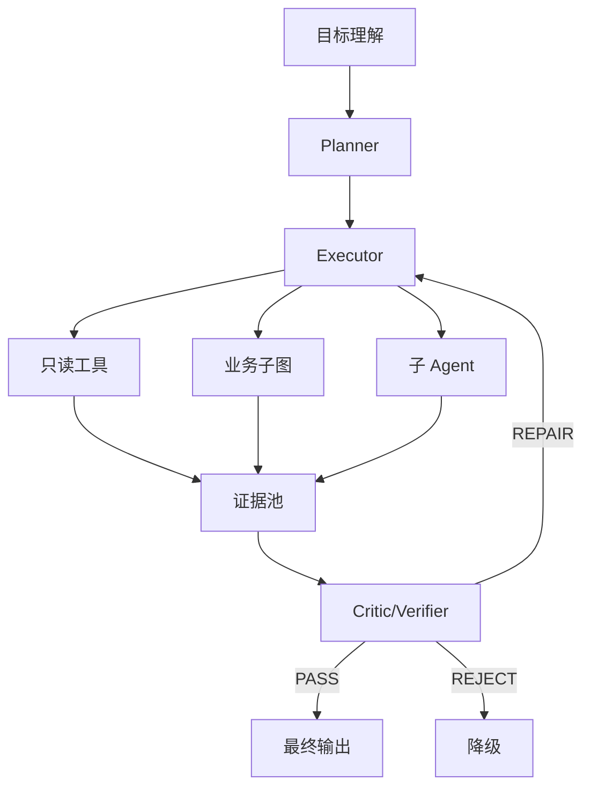

# DeepAgent 架构入门：让 Agent 学会规划、拆解、执行与验证

> 目标读者：已经理解 ReAct 基本循环，想进一步学习复杂任务 Agent 的开发者。  
> 阅读目标：理解 DeepAgent 的核心思想、常见组件、上下文工程和与普通 ReAct 的区别。  
> 关联系统：招投标智能助手（LangGraph 单图 + Router + 业务节点）。

## 1. 一句话理解 DeepAgent

DeepAgent 可以理解为：

```text
一个会先想清楚、再拆解执行、并持续检查质量的深度任务 Agent。
```

它不只是一个“会调用工具的模型”，而是围绕复杂目标组织起一套：

```text
理解目标 → 规划任务 → 分派执行 → 汇总证据 → 审查质量 → 交付结果
```

普通 ReAct 解决的是“下一步做什么”；DeepAgent 更关注“整体目标如何分阶段完成，中间结果是否可靠”。

## 2. DeepAgent 不是某个固定框架名

“DeepAgent”在不同语境下可能指不同产品或设计风格，但工程上通常包含这些思想：

| 能力 | 说明 | 直观类比 |
| --- | --- | --- |
| 深度规划 | 先形成任务图或阶段计划，再执行 | 项目经理先做 WBS |
| 长任务状态 | 保存目标、计划、中间产物、验证结果 | 项目看板 |
| 子任务执行 | 复杂步骤交给工具、子图或子 Agent | 交给专业同事 |
| 上下文工程 | 决定每一步把哪些信息送进模型 | 只把必要资料放上会议桌 |
| 记忆与压缩 | 长任务不无限堆积上下文 | 会议纪要取代完整录音 |
| 质量验证 | 用规则、评估器或 Critic 检查结果 | 交付前验收 |
| 人工介入 | 高风险步骤暂停确认 | 关键合同签署前审批 |

因此，DeepAgent 不等于必须引入某个库。它更像一种架构风格。

## 3. 与普通 ReAct 的区别

| 维度 | 普通 ReAct | DeepAgent |
| --- | --- | --- |
| 主要决策 | 当前一步怎么走 | 整个任务如何完成 |
| 典型时长 | 数秒到几十秒 | 几十秒到数分钟，甚至更久 |
| 任务复杂度 | 2–5 步 | 5–20 步或更多 |
| 状态重点 | 工具 Trace | 目标、计划、产物、验收记录 |
| 上下文管理 | 尽量携带关键上下文 | 分层摘要、裁剪、恢复 |
| 验证方式 | 常见只看最终输出 | 中间产物和最终产物都验证 |
| 适用场景 | 多步查询 | 跨模块、长周期、高风险任务 |

可以这样记忆：

```text
ReAct：想一步，做一步，看一步。
DeepAgent：先定目标，拆成阶段，逐段推进，边做边验收。
```

## 4. 核心组件

### 4.1 目标理解器

负责把自然语言请求转换成任务目标：

```json
{
  "goal": "评估 A 公司投标 A 项目的价格风险",
  "must_have": ["历史报价", "项目类型", "评分规则", "法规约束"],
  "nice_to_have": ["区域市场价格", "同行报价"],
  "constraints": {"max_steps": 10, "time_budget_s": 30},
  "acceptance": ["价格数据有来源", "结论区分事实与推断"]
}
```

这一步不是简单分类，而是澄清目标、范围、约束和验收标准。

### 4.2 Planner

Planner 输出任务计划，计划项要有编号、依赖关系和完成条件：

```json
{
  "plan": [
    {"id": "P1", "task": "抽取公司、项目、时间范围", "depends_on": [], "done_when": "实体结构完整"},
    {"id": "P2", "task": "查询历史中标价", "depends_on": ["P1"], "done_when": "至少返回 1 条可溯源数据"},
    {"id": "P3", "task": "查询项目类型与评分规则", "depends_on": ["P1"], "done_when": "返回规则来源"},
    {"id": "P4", "task": "查询法规限制", "depends_on": ["P1"], "done_when": "有政策引用"},
    {"id": "P5", "task": "汇总风险并生成报告", "depends_on": ["P2", "P3", "P4"], "done_when": "每个结论都有证据"}
  ]
}
```

Planner 不应该直接写答案，它应该输出可执行、可检查、可恢复的任务序列。

### 4.3 Executor

Executor 按计划执行子任务。执行方式有三类：

| 执行方式 | 说明 | 适用 |
| --- | --- | --- |
| 工具调用 | 查 MySQL、Milvus、文档、校验器 | 确定性任务 |
| 子图 | 调用现有业务节点封装成子流程 | 保留稳定业务能力 |
| 子 Agent | 复杂任务交给专职 Agent | 需要独立规划或反思 |

DeepAgent 最好优先使用工具和子图，避免一开始就为每个子任务造一个 Agent。

### 4.4 上下文管理器

它回答一个关键问题：当前步骤需要什么上下文？

| 信息 | 放哪里 | 是否进模型 |
| --- | --- | --- |
| 用户原始目标 | 任务状态 | 压缩后进入 |
| 会话历史 | messages | 摘要后进入 |
| 工具返回 | 任务状态/日志 | 裁剪后进入 |
| 中间产物 | artifact store | 引用进入 |
| 完整 Trace | Trace 存储 | 默认不进入 |

推荐做三层：

1. **工作集**：当前子任务需要的目标、约束、最新证据；
2. **摘要层**：已完成阶段的一句话结果；
3. **归档层**：完整 JSON Trace，可回放但不常驻模型上下文。

### 4.5 Memory

Memory 可按生命周期分层：

| 类型 | 生命周期 | 示例 |
| --- | --- | --- |
| 工作记忆 | 单次任务 | 当前计划、证据、待办 |
| 会话记忆 | 一个 Thread | 用户偏好、已确认实体 |
| 用户记忆 | 跨会话 | 常用公司、项目类型、输出格式 |
| 知识记忆 | 长期知识 | 法规库、业务规则、FAQ |

不要把所有记忆都塞进 messages。正确做法是给每类记忆设计读取、写入、失效和优先级规则。

### 4.6 Critic / Verifier

Critic 检查结果是否达到验收标准，通常分成三层：

```text
规则校验 → 结构化校验 → LLM-as-Judge
```

| 校验层 | 速度 | 成本 | 示例 |
| --- | --- | --- | --- |
| 规则校验 | 极快 | 低 | 必填字段、引用格式、只读 SQL |
| 结构校验 | 快 | 低 | 计划项是否完成、证据是否关联 |
| LLM-as-Judge | 慢 | 高 | 判断幻觉、推理链是否成立 |

结果建议分三档：

```text
PASS / REPAIR / REJECT
```

项目内已有 `docs/deep_agents_integration_design.md`，其中提出的 `quality_guard` 思路可以作为 DeepAgent 落地的第一个载体。

### 4.7 Human-in-the-Loop

DeepAgent 面对高风险动作时可以暂停：

```json
{
  "type": "need_human_approval",
  "task_id": "P5",
  "reason": "结论将对外提交，涉及处罚风险",
  "candidate": "...",
  "timeout_s": 300
}
```

审批后继续执行，超时或拒绝则降级。

## 5. 一个招投标风险评估示例

用户请求：

```text
评估 A 公司投标 B 项目的价格风险，并给出建议。
```

### 阶段 1：理解目标

```json
{
  "goal": "评估 A 公司投标 B 项目的价格风险",
  "must_have": ["历史报价", "项目类型", "评分规则", "法规约束"],
  "constraints": {"max_steps": 10},
  "acceptance": ["价格有来源", "政策有引用", "区分事实与推断"]
}
```

### 阶段 2：生成计划

```text
P1 抽取实体：A 公司、B 项目、投标时间。
P2 查历史中标价。
P3 查项目类型和评分规则。
P4 查相关法规。
P5 汇总价格风险和政策约束。
P6 Critic 校验引用与结论。
```

### 阶段 3：并行/串行执行

```text
P1 成功：得到 company_id、project_id、time_range。
P2 成功：拿到 8 条历史报价，包含来源。
P3 成功：确认 B 项目属于服务类。
P4 成功：拿到 2 条政策片段。
```

### 阶段 4：Critic 检查

```json
{
  "decision": "REPAIR",
  "issues": [
    "第 3 条结论缺少政策编号",
    "均价计算未剔除异常低价"
  ],
  "repair": "补充来源；重新计算并说明剔除规则"
}
```

### 阶段 5：交付

```text
结论：价格中风险。历史报价显示近两年均价下降，服务类项目权重较高，
评分规则更关注服务方案。相关数据和政策来源见下方引用。
```

DeepAgent 的关键不是步骤多，而是每一步都有完成条件和证据。

## 6. 状态模型设计

一个可落地的 DeepAgent 状态可以拆成多个命名空间：

```python
class GoalState(TypedDict):
    goal: str
    must_have: list[str]
    acceptance: list[str]

class PlanState(TypedDict):
    plan_id: str
    items: list[dict]
    current_item: str | None

class EvidenceState(TypedDict):
    mysql_records: list[dict]
    milvus_chunks: list[dict]
    citations: list[dict]

class QualityState(TypedDict):
    decision: str
    issues: list[dict]
    repair_log: list[dict]

class DeepAgentState(TypedDict):
    messages: Annotated[list, add_messages]
    goal: GoalState
    plan: PlanState
    evidence: EvidenceState
    quality: QualityState
    artifacts: dict
```

注意：这只是教学示例。迁移到现有系统时，应遵守当前 `AgentState` 的“分支共享字段”原则，优先用 `business_result.data` 承载 DeepAgent 元数据，避免为每个能力新增顶层字段。

## 7. 上下文工程

DeepAgent 的上下文工程可以用一句话概括：

```text
给模型刚好够用的信息，而不是所有信息。
```

常见策略：

| 策略 | 做法 |
| --- | --- |
| 目标锚定 | 每轮重申目标和验收标准 |
| 历史压缩 | 把已完成任务压成一行结论 |
| 证据裁剪 | 只保留当前子任务相关字段和分页 |
| Trace 分离 | 完整日志进存储，不进模型 |
| 引用绑定 | 证据 ID 与引用编号绑定 |
| 失败摘要 | 失败原因压缩成下一步建议 |
| 计划优先 | 先说明剩余任务，再处理当前任务 |

上下文不足会导致模型靠猜；上下文过多会导致遗忘和成本上升。

## 8. 规划策略

### 8.1 静态规划

提前定义固定阶段，适合高确定性业务：

```text
实体抽取 → 数据查询 → 法规检索 → 汇总 → 校验
```

优点是稳定、可测试、成本低。

### 8.2 动态规划

由模型根据工具结果更新计划，适合开放任务：

```text
发现时间范围不足 → 增加澄清步骤
发现项目类型不同 → 调整对比口径
发现法规变化 → 增加合规检查
```

优点是灵活，缺点是稳定性差。

### 8.3 混合规划（推荐）

用固定骨架 + 局部动态调整：

```text
固定：抽取、查询、检索、汇总、验证
动态：根据缺失信息决定是否澄清、补查、换口径
```

企业系统通常应采用混合规划。

## 9. 质量验证体系

DeepAgent 需要把“验收标准”前置到计划中：

```json
{
  "plan_id": "P2",
  "task": "查询历史中标价",
  "done_when": [
    "返回至少 1 条记录",
    "每条记录包含 award_date 和 bid_price",
    "记录来源可追踪"
  ]
}
```

推荐的质量门控：

1. **目标一致性**：是否回答了用户目标？
2. **证据充分性**：关键结论是否有来源？
3. **引用可回查**：Milvus chunk、SQL 表、文档段落是否可定位？
4. **数字一致性**：金额、百分比、日期是否一致？
5. **风险披露**：推断与事实是否分开？
6. **降级可用**：失败时是否给出可执行建议？

不要只依赖 LLM 评分。规则校验应该是第一道门。

## 10. DeepAgent 与工具、子图、子 Agent 的关系



选择顺序建议：

```text
优先 Tool > 业务子图 > 子 Agent。
```

只有当子任务需要独立状态、独立提示词、独立工具集和反思循环时，才使用子 Agent。

## 11. 何时不需要 DeepAgent

以下情况保留普通节点更合理：

| 场景 | 更合适方案 |
| --- | --- |
| 用户问法规条文 | knowledge_qa 直连 RAG |
| 精确公司报价查询 | price_inquiry 固定查询 |
| 闲聊 | general_chat |
| 意图明确、一步可完成 | 单节点 |
| 延迟要求极高 | 固定流程 |
| 输出格式固定 | 模板 + 规则校验 |

DeepAgent 应该是入口后面的一条“重型通道”，不是所有请求的默认通道。

## 12. 评测方法

上线前至少准备三类数据：

| 数据集 | 目的 |
| --- | --- |
| 正例 | 验证复杂任务成功率 |
| 边界例 | 验证模糊时间、同名公司、缺失字段 |
| 反例 | 验证系统不会编造 |

核心指标：

| 指标 | 定义 |
| --- | --- |
| 任务完成率 | 达到验收标准的比例 |
| 证据覆盖率 | 关键结论有来源的比例 |
| 首响时间 | 用户看到第一个非心跳事件的时间 |
| 总耗时 | 从请求到 FINAL |
| 步数分布 | 是否超出合理范围 |
| Token 成本 | 输入/输出 Token 总量 |
| 修复率 | REPAIR 成功比例 |
| 拒答准确率 | 证据不足时正确说未查到 |

建议先离线评测，再灰度，再全量。

## 13. 初学者常见误区

1. **把 DeepAgent 等同于多 Agent**  
   DeepAgent 可以先只有一个主流程和多个工具。

2. **一开始就追求完全自主**  
   高风险和模糊任务仍需要人工介入。

3. **只看最终答案**  
   中间产物质量决定最终答案质量。

4. **把全部 Trace 放进上下文**  
   应该分层存储和裁剪。

5. **没有可恢复状态**  
   长任务必须有 Checkpointer 和幂等设计。

6. **没有预算**  
   必须限制时间、Token、步数和工具次数。

## 14. 小结

DeepAgent 的核心思想是：**以目标为中心组织长任务，通过计划、状态、上下文工程和验证器，把复杂问题拆成可控阶段，并在每个阶段确认质量。**

对现有系统而言，DeepAgent 不应推翻 LangGraph，而是为复杂任务增加一条可规划、可验证、可恢复的深度执行通道。
