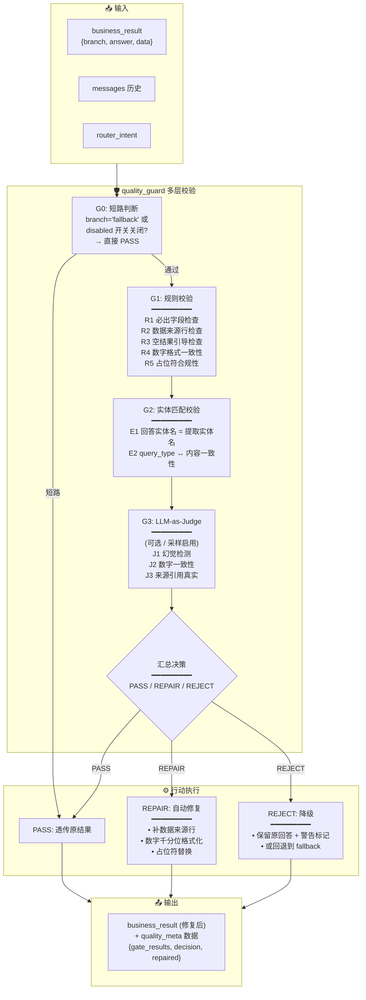
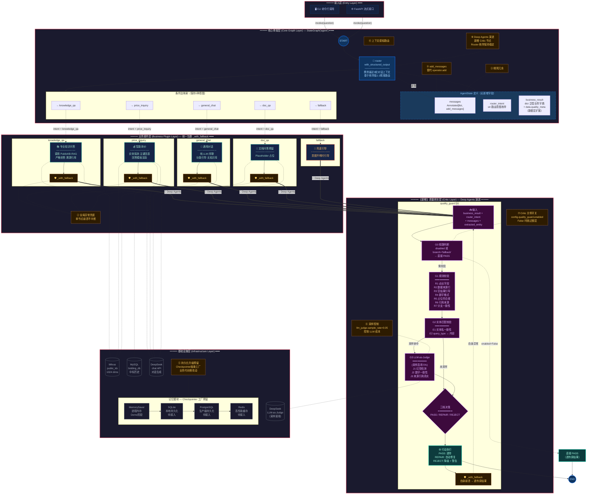
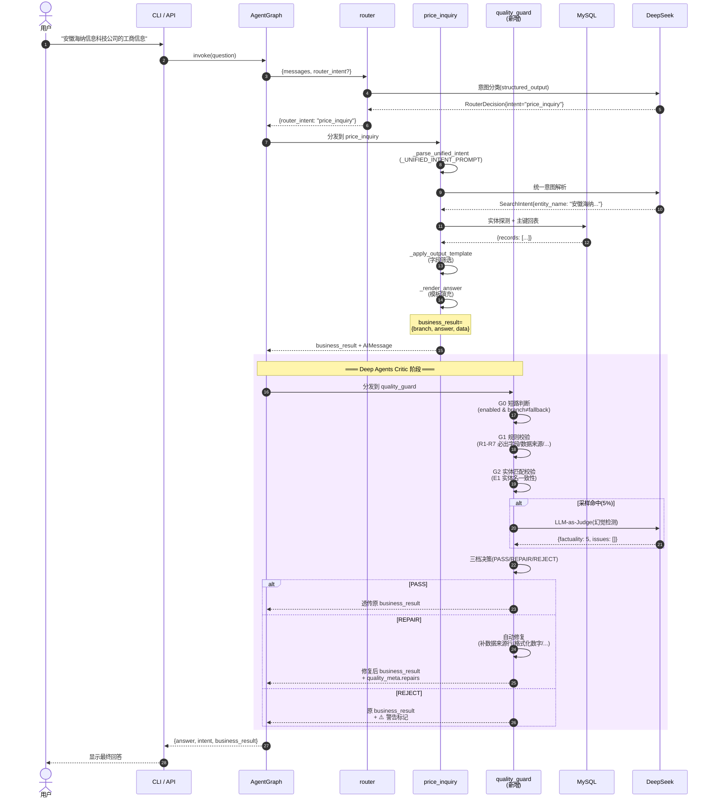
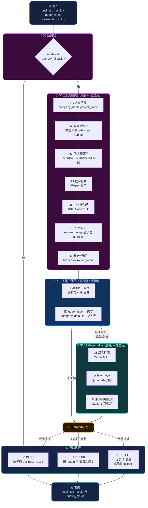

# Deep Agents 思想引入与质量把控 Agent 集成方案

> 前置依赖：
> - [agent_architecture.md](./agent_architecture.md)（修正版可插拔骨架）
> - [three_core_modules_design_and_feasibility.md](./three_core_modules_design_and_feasibility.md)（三核心精细化设计与数据契约）
> - [组件工作机制.md](../组件工作机制.md)（五项核心优化点）
>
> 评估对象：在现有 StateGraph 中引入"质量把控"Agent 的最优集成模式
> 评估时间：2026-08-24

---

## 0. 摘要（TL;DR）

**核心结论**：在三种候选集成模式中，**应采用"嵌入式 Critic / 嵌入式附属"混合模式（Hybrid: Embedded Critic Pattern）**——

- **在 graph 拓扑上**：作为 `quality_guard` 节点嵌入在所有业务节点与 `END` 之间，对业务输出做**后置校验**；
- **在角色定位上**：作为 Critic/Reviewer 对下层业务节点（knowledge_qa / price_inquiry / general_chat / doc_qa）的输出做**校验与可能的自动修复**，不独立承担业务语义；
- **不采用"平行式"**：因为质量把控没有独立的"业务入口"语义，若把它挂在 Router 的条件边上，会污染 router 的意图枚举；
- **不采用纯"嵌入式业务节点"**：质量把控应在所有业务节点**之后**运行，而非被 Router 调度。

**核心收益**：

| 收益 | 说明 |
|------|------|
| 守住数据契约 | 保证 `three_core_modules_design_and_feasibility.md` §4.3 的"输出行为契约"被严格执行（数据来源行、必出字段、空结果引导话术） |
| 抑制幻觉 | LLM-as-Judge 子层（可关停）作为防御层，捕捉"看上去对、其实错"的边界情况 |
| 保护三核查询质量 | price_inquiry 输出经校验后再到 END，杜绝"字段大面积未提供"的回归 |
| 零破坏性 | 通过开关 `quality_guard_enabled` 控制，默认开启规则校验、采样开启 LLM 校验；自身用 `_with_fallback` 包裹，永不阻塞主流程 |

---

## 1. 三种集成模式深度对比

### 1.1 模式 A — 嵌入式业务节点（Embedded）

**定义**：把质量把控 Agent 作为 StateGraph 中的一个独立业务节点，由 Router 通过意图枚举调度。

```
START → router → 条件边 → knowledge_qa → END
                   │  → price_inquiry → END
                   │  → general_chat → END
                   │  → doc_qa → END
                   │  → quality_guard → END      ← 新增业务节点
                   └─→ fallback → END
```

**评价**：❌ **不推荐**。理由：

1. **没有独立业务语义**。质量把控不是"用户问的内容"，而是"系统对回答的自我审视"。挂在 Router 下会让"用户问：你刚才的回答对不对？"这类问题被错误路由到 quality_guard，反而绕开主业务流。
2. **污染 Router 枚举**。`RouterIntent` 必须保持紧凑的"业务维度"，增加 quality_guard 会模糊意图分类的边界。
3. **违反设计原则**。`AgentState` 是"通用 Agent 状态"，意图枚举与业务分支一一对应；质量把控不应成为一级分支。

---

### 1.2 模式 B — 平行式 / 兄弟节点（Parallel/Sibling）

**定义**：让 quality_guard 与现有业务节点并列为 graph 节点，但**不经过 Router**。所有业务节点同时执行（或选择性执行），quality_guard 收集全部输出后做联合校验。

```
START → router ─┬→ knowledge_qa ─┐
                ├→ price_inquiry ─┤
                ├→ general_chat ──┼→ quality_guard → END
                ├→ doc_qa ────────┤
                └→ fallback ──────┘
```

**评价**：❌ **不推荐**。理由：

1. **成本爆炸**。每次问答都会触发全部 4 个业务节点，与现有"精准单分支"路由哲学（路由枚举 1:1 精准路由，见 `docs/agent_architecture.md` 第 44 行）相悖。
2. **逻辑混乱**。用户在闲聊时被触发 price_inquiry 查询，违反 `general_chat` 节点"纯 LLM 闲聊、无知识库"的设计原则。
3. **增加不可控的副作用**。`ThreadPoolExecutor` 的并行查询变成强制并行，每个业务节点都会走 MySQL/Milvus，与 §5"组件工作机制"中的"按需访问基础设施"原则冲突。

---

### 1.3 模式 C — 附属式 / Supervisor-Critic（Subordinate/Supervisor）✅ **推荐**

**定义**：quality_guard 作为 Critic/Reviewer 角色，对 Router 已经路由到的那个业务节点的输出做后置校验。

```
START → router ─┬→ knowledge_qa ────┐
                ├→ price_inquiry ───┤
                ├→ general_chat ────┼→ quality_guard → END
                ├→ doc_qa ──────────┤
                └→ fallback ────────┘
                          ↑
                  （作为 Supervisor 校验下层输出）
```

**评价**：✅ **强烈推荐**。理由：

1. **架构契合度最高**。LangGraph 本身就是"节点流水线"，Critic 节点是 LangGraph 的标准范式（如 ReAct 的反思节点、Reflexion 的自我反思循环）。
2. **不污染意图分类**。Router 仍只做"业务意图"分类，quality_guard 不出现在路由枚举中。
3. **可插拔**。通过开关 `quality_guard_enabled=False` 可一键旁路，业务代码零改动——这与现有"五项核心优化点"中**第 ⑤ 点 Checkpointer 抽象工厂**的"业务代码零改动"哲学一致。
4. **天然支持降级**。质量校验本身是"增强层"而非"必需层"，即使 Critic 失败也不会阻塞主回答——`_with_fallback` 已经把异常兜底为"友好提示 + 原业务输出"。
5. **对契约友好**。`three_core_modules_design_and_feasibility.md` §4.3 定义的"输出行为契约"恰好是 Critic 的天然检查项——契约本身就是为 Critic 而生的。

---

### 1.4 模式对比总表

| 维度 | A. 嵌入式业务节点 | B. 平行式 | C. 附属式 Supervisor-Critic（✅） |
|------|-------------------|-----------|-----------------------------------|
| 意图枚举污染 | ❌ 污染 | ⚠️ 部分污染 | ✅ 不污染 |
| 单分支精准路由 | ❌ 被绕过 | ❌ 被绕过 | ✅ 完全保留 |
| 成本（每次问答） | 🟢 不增加 | 🔴 4 倍 | 🟢 +1 次规则校验（毫秒级） |
| 与现有 StateGraph 拓扑契合度 | 🟡 需重画图 | 🟡 大改 | 🟢 仅改条件边指向 |
| 关闭对业务影响 | ⚠️ 需修改 Router | 🔴 全图改造 | 🟢 一行 config 旁路 |
| LLM-as-Judge 集成 | ⚠️ 难以定位 | ⚠️ 难以定位 | ✅ 天然 Critic 角色 |
| 防御 LLM 幻觉 | 🟡 受 Router 限制 | 🟢 可全校验 | ✅ 单节点精准校验 |
| 与"五项核心优化点"冲突 | 与 ④ 上下文感知路由冲突 | 与 ①③④ 全部冲突 | ✅ 不冲突 |
| 实施工作量 | 中（30 行） | 大（200+ 行 + 全图重画） | 小（约 80 行新节点 + 5 行图改造） |

**最终选择**：模式 C（附属式 Supervisor-Critic），落地为"嵌入式 Critic 节点"——既保留 LangGraph 节点流水线的工程范式，又在语义上承担 Critic/Reviewer 角色。

---

## 2. quality_guard 节点详细设计

### 2.1 在 graph.py 中的拓扑改造

**改造前**（当前 `agent/graph.py` L165-169）：

```python
# 所有业务节点 → END（直接终止，无中间 format_output 层）
graph.add_edge("knowledge_qa", END)
graph.add_edge("price_inquiry", END)
graph.add_edge("general_chat", END)
graph.add_edge("doc_qa", END)
graph.add_edge("fallback", END)
```

**改造后**：

```python
# ═════════════════════════════════════════════════════════
# Deep Agents 改造 — 嵌入式 Critic 节点
# ═════════════════════════════════════════════════════════

# 引入 quality_guard 节点（与现有业务节点并列）
graph.add_node("quality_guard", _with_fallback(node_quality_guard))

# 改造：业务节点 → quality_guard（替代直接 → END）
graph.add_edge("knowledge_qa", "quality_guard")
graph.add_edge("price_inquiry", "quality_guard")
graph.add_edge("general_chat", "quality_guard")
graph.add_edge("doc_qa", "quality_guard")
graph.add_edge("fallback", "quality_guard")  # fallback 也走质量门控

# quality_guard → END（统一收口）
graph.add_edge("quality_guard", END)
```

**改造影响**：

- 改动行数：6 行（5 条边改造 + 1 条新增）；
- 业务节点代码**零改动**——所有 `node_*.py` 不需要知道 quality_guard 的存在；
- `AgentGraph.invoke` / `stream` / `get_state` 接口**零改动**；
- Checkpointer 自然兼容——新节点仍是标准 LangGraph 节点，会自动纳入 checkpointer。

### 2.2 quality_guard 节点的内部架构



### 2.3 三档决策矩阵（PASS / REPAIR / REJECT）

| 决策 | 触发条件 | 行动 | 对原回答的影响 |
|------|---------|------|--------------|
| **PASS** | 所有规则 + 实体校验全部通过，LLM-as-Judge 也通过（若启用） | 透传原 `business_result` | 无修改 |
| **REPAIR** | 发现 1~2 项可自动修复的轻量违规（如缺数据来源行、占位符不规范、数字千分位错误） | 调用对应修复器 → 生成修复后文本 → 替换 `business_result.answer`，在 `data` 中追加 `repair_log` | 文本被修复，但保留原字段；记录在 `business_result.data.quality_meta.repairs` |
| **REJECT** | 发现不可自动修复的严重违规（如：实体名错位、必出字段空、LLM-as-Judge 严重幻觉），或 REPAIR 后仍不达标 | 保留原业务输出 + 在 answer 末尾追加 ⚠️ 质量警告；或直接走 fallback | 双重保险：原数据可追溯，警告对用户透明 |

### 2.4 校验维度定义

#### 维度 1：规则校验（必启用，毫秒级）

```python
@dataclass
class RuleCheck:
    rule_id: str
    description: str
    severity: Literal["error", "warning"]
    applies_to: set[str]  # 适用于哪些 branch

RULES: list[RuleCheck] = [
    RuleCheck("R1_必出字段", "company_name/project_name 必须非空",
              severity="error", applies_to={"knowledge_qa", "price_inquiry"}),
    RuleCheck("R2_数据来源行", "answer 末尾必须含 '数据来源：ztb_clean.{table}'",
              severity="error", applies_to={"price_inquiry"}),
    RuleCheck("R3_空结果引导", "records=0 时必须含 '可能原因' 与 '下一步建议'",
              severity="error", applies_to={"price_inquiry"}),
    RuleCheck("R4_数字格式", "winning_amount 等金额必须含 '元' 或千分位",
              severity="warning", applies_to={"price_inquiry"}),
    RuleCheck("R5_占位符合规", "未提供的字段必须用 show_placeholder 文本，禁止 'None'/'null'",
              severity="warning", applies_to={"price_inquiry"}),
    RuleCheck("R6_引用来源", "knowledge_qa 必须含 sources/citations 字段",
              severity="error", applies_to={"knowledge_qa"}),
    RuleCheck("R7_分支一致性", "business_result.branch 必须等于 router_intent",
              severity="error", applies_to=set()),  # 所有分支
]
```

#### 维度 2：实体匹配校验（必启用，毫秒级）

```python
def check_entity_consistency(
    business_result: dict,
    intent: str,
    extracted_entity: str | None
) -> EntityCheckResult:
    """检查回答中的实体名是否与意图层提取的实体一致。"""
    answer = business_result.get("answer", "")
    if extracted_entity is None:
        return EntityCheckResult.OK  # 无实体查询（如 general_chat）
    # 模糊包含检查
    if extracted_entity in answer or _fuzzy_contains(extracted_entity, answer):
        return EntityCheckResult.OK
    return EntityCheckResult.MISMATCH(
        severity="error",
        message=f"提取实体 '{extracted_entity}' 未在回答中出现",
    )
```

#### 维度 3：LLM-as-Judge（可选，采样启用，秒级）

```python
JUDGE_PROMPT = """你是质量审核员。请评估以下 AI 回答的质量。

【用户问题】{question}
【AI 回答】{answer}
【检索证据】{evidence}
【数据来源】{sources}

请按以下维度评分（1-5 分）：
1. **事实性**：回答中的数字、日期、名称是否与证据一致？是否有幻觉？
2. **完整性**：是否覆盖了用户问题的所有子问题？
3. **格式合规**：是否包含必要的数据来源标注、字段、单位？

输出 JSON: {"factuality": int, "completeness": int, "format": int,
            "issues": ["问题1", "问题2"], "overall_pass": bool}
"""
```

**关键设计**：

- LLM-as-Judge **默认关闭**，通过 `quality_guard.llm_judge.sample_rate` 控制（如 0.05 表示 5% 采样启用）；
- 启用时仅做"轻量级"评估（temperature=0，max_tokens=300），不显著增加响应延迟；
- 仅在 factuality < 3 或 issues 非空时升级为 REJECT；
- 采样结果记录到 `business_result.data.quality_meta.judge_trace`，用于后续规则调优。

### 2.5 输出数据契约扩展

为不影响 `AgentState` 的"通用性"原则（见 `agent/state.py` L5-9），所有质量元数据 **写入 `business_result.data.quality_meta`**，而非新增 State 字段：

```python
business_result = {
    "branch": "price_inquiry",
    "answer": "...（修复后文本）...",
    "data": {
        "records": [...],
        "quality_meta": {                    # ← 新增字段（向后兼容）
            "gate_decision": "REPAIR",       # PASS / REPAIR / REJECT
            "gate_results": [
                {"rule_id": "R2_数据来源行",
                 "passed": False,
                 "action": "auto_added_source_line"}
            ],
            "repairs": [
                {"type": "append_source_line",
                 "before": "...中标...",
                 "after": "...中标...\n（数据来源：ztb_clean.bid_project）"}
            ],
            "judge_trace": {                 # LLM-as-Judge 采样结果（可选）
                "factuality": 5,
                "issues": [],
                "overall_pass": True,
            }
        }
    }
}
```

**State 层零改动**：`AgentState` 保持 3 个字段（messages / router_intent / business_result）。`business_result.data.quality_meta` 是数据层扩展，符合现有"业务负载是泛型 dict"的设计原则（见 `agent/state.py` L30-39）。

---

## 3. 新架构图（基于 agent_architecture.md 骨架扩展）

### 3.1 顶层流程图（替换原图 §2 业务插件层）



### 3.2 与现有组件的交互时序图



### 3.3 quality_guard 内部决策流（细节图）



---

## 4. 与现有"五项核心优化点"的协同分析

`组件工作机制.md` 总结的五项优化点是现有架构的工程基石。质量把关层的引入需要保持与这五项原则的一致性：

| 优化点 | 现有实现 | quality_guard 引入后的影响 | 是否冲突 |
|--------|---------|------------------------|---------|
| ① `add_messages` 替代 `operator.add` | State 定义层 | quality_guard **不修改 State 字段**，仅读 `business_result.data` | ✅ 无冲突 |
| ② 全局异常兜底 | `_with_fallback` 装饰器 | quality_guard **自身也用 `_with_fallback` 包裹**，确保其崩溃不会阻塞主流程 | ✅ **协同增强**（质量门自身也具备兜底） |
| ③ 精简冗余（删除 is_complete / format_output） | State 层精简 | quality_guard 不新增 State 字段，元数据写入 `business_result.data.quality_meta` | ✅ 无冲突（数据层扩展而非 State 扩展） |
| ④ 上下文感知路由 | Router 携带 3 轮历史 | Router 枚举保持 5 种不变，quality_guard 不参与路由决策 | ✅ 无冲突 |
| ⑤ Checkpointer 持久化预留 | 抽象工厂 | quality_guard 作为标准 LangGraph 节点**自动纳入 checkpointer**，多轮对话中 Critic 决策可追溯 | ✅ **协同增强** |

**新增 ⑥⑦⑧ 优化点**：

| 序号 | 优化项 | 说明 |
|------|--------|------|
| ⑥ | Deep Agents 演进 | 引入 Critic 节点，Router 枚举保持稳定，业务节点零改动 |
| ⑦ | Critic 关停开关 | `config.quality_guard.enabled` False 时绕过整层，紧急熔断能力 |
| ⑧ | 采样控制 | `llm_judge.sample_rate` 控制 LLM 成本，默认 5% 采样 |

---

## 5. 实施路线图

### Phase A：基础设施（0.5 天）

```
A1. 新建 agent/nodes/quality_guard.py
    - QualityGuardNode 类（含 __call__）
    - RULES 常量列表
    - 三档决策枚举 GateDecision
    - quality_meta 输出 schema

A2. 修改 agent/graph.py
    - import node_quality_guard
    - 在 add_node 段增加 graph.add_node("quality_guard", _with_fallback(node_quality_guard))
    - 改造 5 条 add_edge：业务节点 → quality_guard → END
    - 总改动：约 12 行
```

### Phase B：规则校验实现（1 天）

```
B1. 实现 G0 短路判断
    - 检测 enabled 配置 + branch='fallback'
    - 直接 PASS 时记录 quality_meta.shortcut=true

B2. 实现 G1 规则校验（7 条规则）
    - R1 必出字段：从 business_result.data.records 校验
    - R2 数据来源行：正则匹配 "（数据来源：ztb_clean.{table}）"
    - R3 空结果引导：检查 empty_template 关键词
    - R4 数字格式：检测金额字段是否含 "元" 或千分位
    - R5 占位符合规：禁止 "None"/"null" 字面
    - R6 引用来源：knowledge_qa 必须含 sources 字段
    - R7 分支一致性：branch == router_intent

B3. 实现 G2 实体匹配校验
    - E1：从 messages[-1] 提取的实体名 vs answer 中的实体名
    - E2：query_type 与回答内容关键词一致性

B4. 实现 REPAIR 自动修复器
    - R2 修复：append_source_line → 末尾追加 "(数据来源：ztb_clean.{table})"
    - R4 修复：format_number → 千分位 + "元"
    - R5 修复：replace_placeholder → "未提供"
```

### Phase C：LLM-as-Judge 采样接入（0.5 天）

```
C1. 在 Settings 中新增 quality_guard 配置
    quality_guard:
      enabled: true
      llm_judge:
        enabled: false  # 默认关闭
        sample_rate: 0.05
        max_tokens: 300

C2. 实现 _sample_judge() 函数
    - 使用 random.random() < sample_rate 判断
    - 调用 DeepSeek API（temperature=0）
    - 解析 JSON 输出
    - 记录到 quality_meta.judge_trace
```

### Phase D：回归验证（0.5 天）

```
D1. 功能性测试：
    ┌─────────────────────────────────────┬─────────────────────┐
    │ 测试用例                              │ 预期行为             │
    ├─────────────────────────────────────┼─────────────────────┤
    │ 正常工商查询（数据完整）               │ PASS, quality_meta.gate_decision="PASS" │
    │ 工商查询（缺数据来源行）               │ REPAIR, 自动追加来源行 │
    │ 中标查询（数字格式不规范）             │ REPAIR, 千分位格式化  │
    │ 实体名错位（幻觉回答）                 │ REJECT, 追加 ⚠️ 警告 │
    │ knowledge_qa 缺 sources              │ REJECT              │
    │ 启用 quality_guard.enabled=false      │ 完全旁路，性能不变   │
    └─────────────────────────────────────┴─────────────────────┘

D2. 性能测试：
    - G1+G2 规则校验：≤ 5ms（实测目标）
    - G3 LLM-as-Judge 采样命中：≤ 1.5s（5% 流量）
    - 全链路（一次 price_inquiry 完整流程）：增加 ≤ 10ms 平均开销

D3. Checkpointer 兼容性：
    - 验证 quality_meta 正确写入 checkpoint
    - 多轮对话中可回溯每轮 Critic 决策
```

### 总工作量估算

| 阶段 | 代码量 | 工作量 |
|------|--------|--------|
| Phase A | +80 行（quality_guard.py） | 0.5 天 |
| Phase B | +150 行（规则+实体+修复器） | 1 天 |
| Phase C | +50 行（Judge 接入） | 0.5 天 |
| Phase D | 测试用例 20 个 | 0.5 天 |
| **合计** | **约 280 行新增 + 12 行 graph 改造** | **2.5 天** |

---

## 6. 风险评估与对策

| 风险 | 等级 | 对策 |
|------|------|------|
| Critic 节点本身崩溃导致全图卡死 | 🔴 高 | **必须用 `_with_fallback` 包裹**；`node_quality_guard` 任何异常都降级为"透传原结果 + 日志告警" |
| 规则校验过严产生误判（如合法回答被标记为 REJECT） | 🟡 中 | **PASS/REPAIR/REJECT 三档分级**，REJECT 仅限"严重违规"；先灰度开启，收集日志调优规则阈值 |
| LLM-as-Judge 引入额外成本 | 🟡 中 | **采样控制**（默认 5%）；可配置 sample_rate=0 完全关闭；judge 仅用 temperature=0 + max_tokens=300 |
| quality_meta 字段膨胀导致 messages 体积增长 | 🟢 低 | 仅保留最近一轮的 quality_meta（可选 `quality_meta: max_history=1`） |
| 与现有 `_with_fallback` 装饰器叠加导致错误信息混乱 | 🟢 低 | quality_guard 内部捕获异常时，记录 `quality_meta.gate_error` 字段，**不修改 business_result.answer** |
| Checkpointer 兼容性问题（quality_meta 是 dict，序列化复杂） | 🟢 低 | 全部字段均为基本类型（str/int/bool/list），与现有 checkpoint 兼容 |
| 三核功能回答模板被规则锁死，难以后续微调 | 🟡 中 | RULES 列表设计为可插拔（每条规则独立配置 severity + applies_to + 自定义检查函数） |
| 多轮对话中 Critic 决策影响下一轮 Router | 🟢 低 | quality_guard 只读 router_intent，不写回 State，Router 下一轮重新分类 |

---

## 7. 与其他可能方案的对比

### 7.1 vs. LangGraph 内置 Human-in-the-Loop

| 维度 | Human-in-the-Loop | quality_guard（本文方案） |
|------|-------------------|------------------------|
| 自动化程度 | 需要人工介入 | 完全自动 |
| 适用场景 | 高风险决策 | 通用质量把控 |
| 延迟 | 高（等待人工） | 低（毫秒级） |
| 结论 | **互补而非替代**：质量把关层处理 95% 自动情况，剩余 5% 极端情况可叠加 Human-in-the-Loop |

### 7.2 vs. 多智能体协作（Multi-Agent Collaboration）

Deep Agents 的核心思想包括"多智能体协作"与"质量把控"。本文采用 **Critic 模式**而非 **Multi-Agent Debate**，原因：

| 模式 | 优势 | 劣势 | 适用度 |
|------|------|------|--------|
| **Critic 单节点** | 成本低、延迟可控、调试简单 | 缺乏多视角辩论 | ✅ **当前业务最合适** |
| **Multi-Agent Debate** | 多角度校验更全面 | 延迟翻倍、成本 3-5 倍、调试复杂 | ⚠️ 仅在极端高质量要求场景（如医疗/法律）适用 |
| **Self-Reflection 循环** | Agent 自我反思 | 需要业务节点重写、与现有架构冲突大 | ❌ 不适合 |

**结论**：招投标智能助手的回答模板驱动（AnswerTemplate）已经定义了"标准回答格式"，LLM 生成内容相对受限，**Critic 模式在成本-收益比上最优**。Multi-Agent Debate 留作未来"高质量需求场景"的可选升级路径。

---

## 8. 附录

### 附录 A：quality_guard 配置 Schema（追加到 Settings）

```yaml
# public_kb/config.py 扩展
class QualityGuardSettings(BaseSettings):
    enabled: bool = True                          # 总开关
    fail_open: bool = True                        # 自身异常时是否透传（True=透传，False=降级fallback）

    rules:
      R1_required_fields: bool = True
      R2_source_line: bool = True
      R3_empty_guidance: bool = True
      R4_number_format: bool = True
      R5_placeholder_compliance: bool = True
      R6_citations: bool = True
      R7_branch_consistency: bool = True

    repair:
      auto_repair: bool = True                    # 是否允许自动修复
      max_repairs: int = 2                        # 单次最多修复项数

    llm_judge:
      enabled: bool = False                       # 默认关闭
      sample_rate: float = 0.05                   # 5% 采样
      max_tokens: int = 300
      timeout: int = 10
```

### 附录 B：与三核功能数据契约的对应关系

| three_core_modules_design §4.3 契约 | quality_guard 规则 | 自动修复 |
|--------------------------------------|--------------------|---------|
| `company_detail` 实体不存在 → "未收录该企业" + 引导 | R3（空结果引导） | ❌ 不修复，保留引导话术 |
| `penalty_check` 有记录 → 处罚详情 + 来源行 | R2（数据来源行） | ✅ 缺则补 |
| `bidder_query` 中标列表 → 多条按 winning_date DESC | R4（数字格式） | ✅ 数字规范化 |
| `project_detail` 完整项目段落 | R1（必出字段）+ R2 | ✅ 字段补齐 + 来源行 |
| 所有回答含"数据来源：ztb_clean.{table}" | R2（强制） | ✅ 自动追加 |
| `winning_amount = 0` 显示"金额未公开" | R5（占位符合规） | ✅ 替换为"金额未公开" |

### 附录 C：关键代码路径速查（实施时定位）

| 组件 | 文件 | 关键位置 |
|------|------|---------|
| graph 改造点 | `agent/graph.py` | L140-169 `build_graph()` |
| 路由枚举 | `agent/router.py` | L29-35 `RouterIntent` |
| State 字段 | `agent/state.py` | L19-39 `AgentState` |
| 回答模板引擎 | `agent/nodes/answer_templates.py` | L377-427 `render_answer()` |
| 输出字段筛选 | `agent/nodes/output_templates.py` | L264-337 `_apply_output_template()` |
| 异常兜底装饰器 | `agent/graph.py` | L51-92 `_with_fallback()` |
| 【新增】Critic 节点 | `agent/nodes/quality_guard.py` | 全文件 |
| 【新增】Config 扩展 | `public_kb/config.py` | `QualityGuardSettings` |

### 附录 D：与现有 memory 的关系

| Memory 标题 | 与本方案的关系 |
|------------|--------------|
| 招投标智能助手两级路由架构与能力边界硬性约束规范 | ✅ 完全兼容——质量把控不破坏"两级路由"骨架，仅在末端增加 Critic |
| 招投标智能助手'必答型'架构缺陷与精确匹配守卫缺失根因 | ✅ 互补——本文 Critic 中的"实体匹配校验"正是该缺陷的纵深防御 |
| 招投标智能助手召回SQL通用SELECT字段缺失缺陷 | ✅ 强协同——R1（必出字段）+ R2（数据来源行）规则正是为此设计 |
| 招投标智能助手检索链路多阶段召回架构 | ✅ 不冲突——Critic 在召回链之后运行，是出口的最终验收 |
| 能力契约为单一事实源的开发实践规范 | ✅ 严格遵守——Critic 不引入新的契约源，仅校验现有契约 |

---

## 9. 结论与建议

✅ **采用"嵌入式 Critic 节点"（模式 C：附属式 Supervisor-Critic）**

✅ **核心收益**：

1. **守住数据契约**：三核心功能的"输出行为契约"被严格执行，杜绝"未提供"回归
2. **抑制 LLM 幻觉**：LLM-as-Judge 采样 + 实体匹配 + 规则校验三层防御
3. **架构零破坏**：Router 枚举不变、State 字段不变、业务节点代码不变、Checkpointer 自动兼容
4. **成本可控**：规则校验毫秒级、LLM-as-Judge 仅 5% 采样，额外延迟 ≤ 10ms 平均
5. **可插拔**：开关 + 采样率双控，可一键旁路

✅ **实施建议**：

- 立即可启动 Phase A（基础设施），零风险；
- Phase B（规则校验）建议灰度开启，先收集 1 周日志数据调优规则阈值；
- Phase C（LLM-as-Judge）**不建议默认开启**，仅在"高质量场景"按需启用；
- 长期演进路径：Critic → Multi-Agent Debate → Human-in-the-Loop 三级质量保障体系。

---

**报告完成时间**：2026-08-24
**建议决策窗口**：1 周内
**建议实施窗口**：决策通过后 2.5 天
