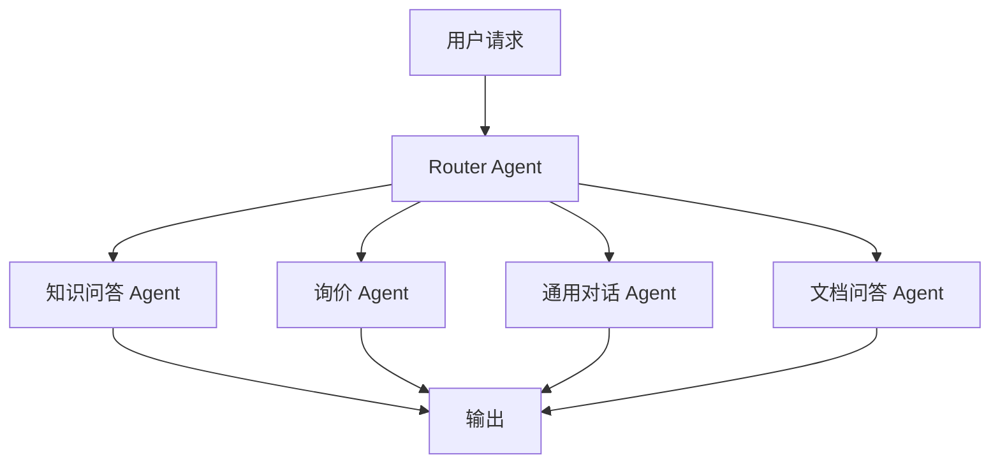
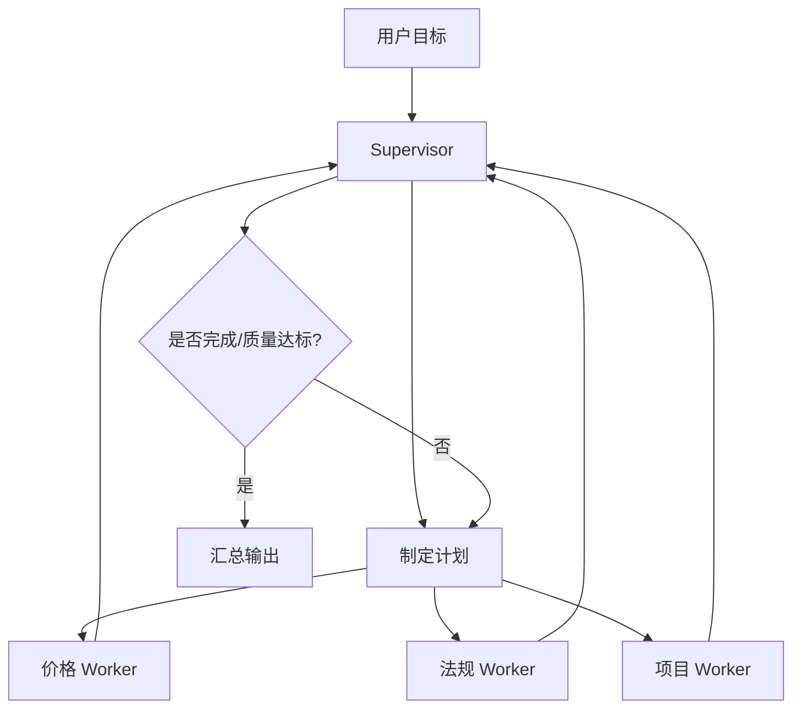
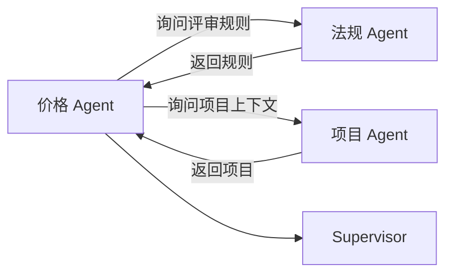

# MultiAgent 架构入门：多智能体不是“人多力量大”

> 目标读者：想判断是否需要多个 Agent 协作的初学者。  
> 阅读目标：理解 MultiAgent 的动机、拓扑结构、协作协议、治理方式和不适用场景。  
> 关联系统：招投标智能助手（当前是单入口 Router + 五个业务分支）。

## 1. 一句话理解 MultiAgent

MultiAgent 是指把一个复杂系统拆成多个有职责边界、可用同一套协议通信的智能体：

```text
每个 Agent 有自己的角色、目标、工具和上下文，
通过明确的任务交接和结果回传完成整体工作。
```

但要注意：

```text
多个 LLM 调用 ≠ MultiAgent。
多个工具 ≠ MultiAgent。
多个函数 ≠ MultiAgent。
```

只有当多个执行单元具有独立职责边界，并且需要显式协商、交接或分工时，才值得称为 MultiAgent。

## 2. 为什么要拆分 Agent

单 Agent 的问题不是“不够聪明”，而是职责过多后：

- 提示词变长，模型容易遗忘重点；
- 工具太多，选择错误率上升；
- 一套上下文要服务所有任务，信息互相污染；
- 失败时难以判断哪个能力出错；
- 权限、成本、限流无法按能力隔离。

MultiAgent 的收益来自**职责隔离**，不是简单堆叠模型调用。

### 2.1 适合拆分的信号

| 信号 | 例子 |
| --- | --- |
| 一个 Agent 的提示词里混有多种专业规则 | 法规问答、SQL 查询、风险评估混在一个 prompt |
| 工具集过大且容易冲突 | 30 个工具全部给一个模型 |
| 不同任务需要不同权限 | 只读查询、文档分析、外部调用 |
| 不同任务延迟和成本差异大 | 简单查询与深度报告 |
| 需要并行处理独立子任务 | 同时查价格、查法规、查项目 |
| 需要独立评审者 | 生成结果后再由 Critic 检查 |

### 2.2 不适合拆分的信号

| 信号 | 建议 |
| --- | --- |
| 一个业务分支能稳定完成 | 保留单节点 |
| 任务间强依赖且很快完成 | 用单 Agent 或固定图 |
| 拆分只是为了“更智能” | 先做评测，不要先拆 |
| 需要共享大量状态 | 上下文同步成本会抵消收益 |
| 没有可评测的失败点 | 不清楚为什么要拆 |

## 3. 常见拓扑结构

### 3.1 Router + Worker

最简单也最接近当前系统。



特点：

| 优点 | 缺点 |
| --- | --- |
| 简单、可控 | Router 是单点 |
| 与现有架构匹配 | Router 失败影响全局 |
| 每个 Worker 可以独立演进 | Worker 之间难以直接协作 |

当前系统本质上已经是 Router + Worker 的雏形。如果没有跨分支协作需求，可以继续保留这个结构。

### 3.2 Supervisor + Worker

Supervisor 不是简单分类，而是负责任务分解、分配、跟踪和汇总。



适用：

- 多个子任务必须组合；
- 需要根据中间结果重派任务；
- 需要统一追踪进度；
- 需要统一降级策略。

### 3.3 Pipeline 流水线

适合阶段固定、顺序明确的任务。

```text
实体抽取 → SQL 查询 → 法规检索 → 风险汇总 → 质量校验
```

特点：

| 优点 | 缺点 |
| --- | --- |
| 易测试 | 灵活性低 |
| 可观测 | 上游错误会传递 |
| 每阶段可替换 | 不适合分支多的开放任务 |

### 3.4 Peer-to-Peer 协作

Agent 之间可以互相请求协作。



适合真正需要多视角的任务，但容易失控。生产系统应避免完全自由协作，最好仍由 Supervisor 或状态机约束。

### 3.5 Generator + Critic

一个负责生成，一个负责验证。

```text
Generator 生成草稿 → Critic 校验 → REPAIR → Generator 修改 → PASS → 输出
```

适合需要控制幻觉的场景。可以先用规则校验器实现 Critic，不一定要第二个 LLM。

## 4. 核心角色

| 角色 | 职责 | 招投标系统示例 |
| --- | --- | --- |
| Router | 意图识别与第一次分发 | 判断知识问答/询价/通用对话 |
| Supervisor | 目标拆解、任务分配、进度跟踪 | “评估投标风险”任务的负责人 |
| Researcher | 检索与证据收集 | 查公共法规库 |
| Data Worker | 查询结构化数据 | 查历史中标价 |
| Analyzer | 分析数据与生成推断 | 分析报价变化 |
| Critic | 校验质量与引用 | 检查来源、数字、幻觉 |
| Writer | 组织最终表达 | 生成用户可读报告 |
| Guardrail Agent | 安全与合规检查 | 过滤敏感字段和危险操作 |

注意：角色是职责，不是必须多个模型实例。一个 Python 节点可以承担 Critic 角色，也可以先不用 LLM。

## 5. Agent 的边界定义

每个 Agent 都应该有一张“身份卡”：

```yaml
name: price_worker
mission: 查询和整理历史中标价格数据
owns:
  - MySQL 只读查询
  - 语义召回
  - 查询结果裁剪
not_owns:
  - 法规解释
  - 最终结论
  - 用户对话
tools:
  - query_bid_price
  - query_project_context
input_contract:
  - company_id
  - project_type
  - time_range
output_contract:
  - ok
  - records
  - missing_fields
  - source
budget:
  max_steps: 3
  timeout_s: 8
```

边界不清是 MultiAgent 失败的第一原因。

## 6. 消息与状态协议

Agent 之间不要只传自然语言。建议统一 TaskMessage：

```python
class TaskMessage(TypedDict):
    task_id: str
    parent_task_id: str | None
    sender: str
    receiver: str
    action: str
    payload: dict
    status: str
    evidence_ids: list[str]
    error: str | None
    trace_id: str
```

一次协作示例如下。

### 6.1 请求

```json
{
  "task_id": "T-001",
  "parent_task_id": "T-000",
  "sender": "supervisor",
  "receiver": "price_worker",
  "action": "query_bid_price",
  "payload": {
    "company_name": "A 公司",
    "project_type": "服务类",
    "time_range": "2024-01-01/2026-08-29"
  },
  "status": "REQUESTED",
  "evidence_ids": [],
  "error": null,
  "trace_id": "trace-123"
}
```

### 6.2 响应

```json
{
  "task_id": "T-001",
  "parent_task_id": "T-000",
  "sender": "price_worker",
  "receiver": "supervisor",
  "action": "query_bid_price_result",
  "payload": {
    "ok": true,
    "records": [
      {"project_name": "示例项目", "bid_price": 980000, "award_date": "2025-07-15"}
    ],
    "row_count": 1,
    "missing_fields": ["region"],
    "source": "mysql.ztb_clean"
  },
  "status": "SUCCEEDED",
  "evidence_ids": ["E-001"],
  "error": null,
  "trace_id": "trace-123"
}
```

### 6.3 状态机

```text
REQUESTED → RUNNING → SUCCEEDED
                    ↘ FAILED
                    ↘ TIMEOUT
                    ↘ NEED_HUMAN
```

Supervisor 只依据状态和证据回传做下一步，不应通过“猜”来理解结果。

## 7. 状态共享策略

三种常见策略：

| 策略 | 说明 | 优点 | 缺点 |
| --- | --- | --- | --- |
| 共享黑板 | 所有 Agent 读写同一个状态对象 | 简单 | 容易污染和冲突 |
| 消息传递 | 只传 TaskMessage | 边界清晰 | 需要协议和重建上下文 |
| 中心状态 + 只写隔离 | 中心保存权威状态，Agent 写自己的 namespace | 兼顾调试和治理 | 设计要求更高 |

推荐第三种：Supervisor 持有全局任务状态，每个 Worker 只写自己的结果命名空间。

```json
{
  "task": {"goal": "评估投标价格风险", "status": "RUNNING"},
  "results": {
    "price_worker": {"ok": true, "records": []},
    "law_worker": {"ok": true, "chunks": []},
    "project_worker": {"ok": true, "project": {}}
  },
  "citations": [],
  "quality": {"decision": "PASS", "issues": []}
}
```

## 8. 任务分配与完成条件

每个子任务都要有验收标准：

```json
{
  "task_id": "T-002",
  "receiver": "law_worker",
  "action": "search_public_kb",
  "done_when": [
    "返回 1-5 条 chunk",
    "每条包含 chunk_uid 和 score",
  "当最高分低于阈值时明确标记 low_confidence"
  ],
  "timeout_s": 6,
  "max_retries": 1
}
```

Supervisor 的循环逻辑：

```text
1. 还有未完成任务？
2. 依赖是否满足？
3. 结果是否达标？
4. 失败是否可重试？
5. 是否需要澄清或人工介入？
6. 全部达标才进入汇总。
```

## 9. 并发、顺序与依赖

不要为了并行而并行。先画依赖图：

```text
抽取实体
  ├─ 查历史价格（可并行）
  ├─ 查法规（可并行）
  └─ 查项目上下文（可并行）
汇总分析
质量校验
```

可以并行的才并行，例如三个独立查询。不能并行的例如：

1. 先抽实体，再查询；
2. 先拿到数据，再汇总；
3. 先生成草稿，再校验。

并发时要设置：

| 控制项 | 建议 |
| --- | --- |
| 全局任务超时 | 例如 30 秒 |
| 单 Worker 超时 | 例如 5–8 秒 |
| 并发上限 | 避免打爆 MySQL/Milvus/LLM |
| 重试策略 | 幂等操作才重试 |
| 部分成功策略 | 标记缺失证据，而不是等待所有任务 |
| 取消策略 | 总超时后取消未完成任务 |

## 10. 输出汇总裁决

多个 Worker 可能给出不一致结果。Supervisor 需要裁决规则：

| 冲突类型 | 处理方式 |
| --- | --- |
| 数据字段缺失 | 明确列出缺失项，不做推测 |
| 多源价格不同 | 说明来源、时间口径和统计规则 |
| 数据与法规冲突 | 优先显示法规约束，数据作为参考 |
| 低置信检索 | 标记“低置信”，必要时降级 |
| 两个分析结论相反 | 保留证据，说明前提差异，不强行平均 |

最终输出建议包含：

```text
1. 结论；
2. 主要证据；
3. 限制条件；
4. 未查到或不确定的信息；
5. 引用来源。
```

## 11. 可观测性

MultiAgent 必须能看到：

```text
Trace ID → 用户请求 → Supervisor 决策 → Worker TaskMessage → 工具调用 → 状态变化 → 质量结果 → 最终输出
```

最小日志字段：

| 字段 | 说明 |
| --- | --- |
| trace_id | 全链路 ID |
| task_id | 子任务 ID |
| sender/receiver | 消息方向 |
| action | 动作名 |
| status | 状态 |
| duration_ms | 耗时 |
| token_usage | LLM Token |
| tool_name | 工具名 |
| row_count | 查询行数 |
| evidence_ids | 证据 ID |
| quality_decision | PASS/REPAIR/REJECT |

没有 Trace 的 MultiAgent 很难调试。

## 12. 安全治理

| 治理项 | 做法 |
| --- | --- |
| 权限隔离 | price_worker 只有 MySQL 只读权限 |
| 工具白名单 | 每个 Agent 只注册自己的工具 |
| 参数校验 | 使用 Pydantic/JSON Schema |
| SQL 防护 | 参数化、静态检查、只读账号 |
| 敏感字段脱敏 | 手机号、身份证、内部价格来源等 |
| 上下文隔离 | Worker 不需要完整用户历史 |
| 注入防护 | 不把外部文档内容当系统指令 |
| 成本限额 | 按 Agent 设置 Token 和调用预算 |
| 人工审批 | 高风险外部动作前暂停 |

一个 Worker 被攻破或失控时，权限边界能限制爆炸半径。

## 13. MultiAgent 何时值得引入

满足以下条件越多，越值得考虑：

1. 单个任务确实需要多个专业能力组合；
2. 子任务可以独立测试和独立降级；
3. 子任务之间存在可并行的独立查询；
4. 需要独立的生成者和校验者；
5. 单 Agent 提示词和工具已经难以维护；
6. 失败原因需要按职责隔离；
7. 有明确的预算、限流和 Trace 机制。

反过来说，如果当前系统只需要一个路由和几个稳定业务节点，那它已经是“最小 MultiAgent”，继续复杂化没有收益。

## 14. 一个招投标示例

用户：

```text
评估 A 公司投标 B 项目的价格风险。
```

### Supervisor 计划

```text
T1 抽取实体。
T2 查历史价格。
T3 查法规。
T4 查项目上下文。
T5 汇总分析。
T6 质量校验。
```

### Worker 分工

```text
entity_worker：T1
price_worker：T2
law_worker：T3
project_worker：T4
analyzer：T5
critic：T6
```

### 执行

```text
T1 完成：得到公司、项目、时间。
T2/T3/T4 并行完成，返回 evidence_ids。
T5 基于证据生成结论。
T6 发现一条结论缺引用，REPAIR 后 PASS。
```

### 输出

```text
价格风险：中。
主要依据：历史价格、项目类型、评分规则。
限制：缺少同区域最新项目样本。
引用：MySQL 查询记录 + Milvus 法规片段。
```

这个例子可以用 Supervisor + Worker，也可以先用 DeepAgent 的 Planner/Executor 实现。不要为了形式上“多 Agent”而拆。

## 15. 与 ReAct、DeepAgent 的关系

| 架构 | 解决重点 | 典型规模 |
| --- | --- | --- |
| ReAct | 单执行体的下一步决策 | 2–5 步 |
| DeepAgent | 复杂任务的计划、状态与验证 | 5–20 步 |
| MultiAgent | 多个职责单元的分工与协作 | 多角色/多工具/多状态域 |

三者不是互斥的：

```text
Supervisor 可以用 ReAct 决策；
Supervisor 内部可以采用 DeepAgent 的计划/验证思想；
Worker 可以是普通工具节点，也可以是独立 ReAct Agent。
```

## 16. 初学者常见误区

1. **以为多 Agent 一定更聪明**  
   多 Agent 只会放大架构清晰度或混乱程度。

2. **拆分太细**  
   例如“读 SQL”“解释 SQL”“格式化 SQL”各拆一个 Agent，通常没有必要。

3. **没有统一协议**  
   自然语言互传会让状态不可控。

4. **所有 Agent 共享全部上下文**  
   容易造成污染和成本失控。

5. **没有全局超时**  
   一个 Worker 卡住拖垮整体。

6. **没有 Trace**  
   失败后不知道是谁的责任。

7. **让 Agent 自由聊天式协作**  
   生产系统应该用状态机和结构化消息。

## 17. 小结

MultiAgent 的核心思想是：**通过清晰的职责边界和结构化协作协议，让多个智能体共同完成单 Agent 难以维护的复杂任务。**

它的最大收益是职责隔离、权限隔离和独立演进；最大风险是复杂度、延迟、成本和调试难度。引入前必须先回答：“哪个职责边界必须独立？”
