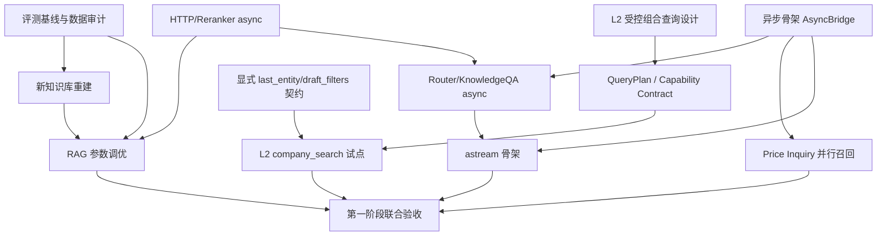

# 招投标智能助手项目改造总纲

> 版本：v1.1  
> 日期：2026-08-25  
> 定位：第一阶段工程加固与体验升级，第二阶段向可扩展 AI Agent 架构演进。  
> 原则：先建立统一评测基线，再并行改造；每个模块必须保持对外契约兼容；高风险能力先灰度，再替换旧链路。

## 0. 执行摘要

项目当前不是从零改造：

- **RAG 检索逻辑优化**已有重要基础：配置中已使用 `BAAI/bge-m3`、`BAAI/bge-reranker-v2-m3`，`qa_chain.py` 已实现稠密 + 稀疏混合检索、RRF 融合、Reranker 精排和自适应阈值。因此第一阶段 RAG 工作重点应是**数据重建、参数调优、评测回归和降级链路加固**。
- **法律知识库存在重复问题已被代码注释确认**：`chunk_ids.py` 提到存量数据约 55.57% chunk 内容重复。当前 `chunk_uid` 已具备稳定标识基础，但缺少完整的入库前去重、集合级唯一约束、重建流水线和数据质量看板。
- **Milvus 主集合 schema 仍以 dense vector 为主**；查询侧会检测 `sparse_vector` 字段并支持 BM25 Function 模式，但主 `initialize_collection()` 当前只显式创建 dense vector。若新库要长期使用混合检索，应在新集合 schema 中固化稀疏向量字段和 BM25 Function。
- **协程并发改造是流式输出和多 Agent 并行工具调用的地基**。建议与数据重建并行启动，但不要与 RAG 参数调优抢同一个评测集和发布窗口。
- **长期记忆与持久 Checkpointer 已于 2026-08-27 无限期延后**；§4 原方案保留为技术储备存档。延后原因是当前六类封闭问答没有稳定记忆消费点：三轮历史只参与 Router 一级路由，业务节点主要解析单条问题，用户偏好既不能扩展能力边界，也不能改变固定模板下的数据库事实。替代方向是先建设 L2 受控组合查询，再用显式 `last_entity`/`draft_filters` 上下文做多轮任务补参。
- **流式输出只有 LangGraph 图事件流**，CLI 仍等待完整答案后打印。端到端流式需要打通 LLM token 流、节点增量结果、前端 SSE/WebSocket 和引用后置校验。

总体路线：

```text
第 1～2 周   评测基线 + 数据审计 + 异步骨架 + 记忆方案设计
第 3～4 周   新知识库重建 + 协程并发落地 + L2 受控组合查询试点 + token 流 MVP
第 5 周      联调压测 + A/B 验证 + 灰度发布
第 6 周起    第二阶段按 DeepAgent / Tool Calling / ReAct / 多模态 / MCP / 微调 Text2SQL / Multi-Agent 分批推进
```

---

# 第一阶段：工程加固与核心体验升级

## 1. RAG 检索逻辑优化

### 1.1 目标状态

| 子项 | 当前状态 | 第一阶段目标 | 判定口径 |
| --- | --- | --- | --- |
| BGE-M3 Embedding | 配置已指向 bge-m3，1024 维 | 完成全量重建、维度/schema 校验、召回评测 | Recall@5/10/20、MRR、nDCG |
| Hybrid Retrieval | dense + sparse + RRF 已在查询侧实现 | 新集合固定 sparse_vector 与 BM25 Function；验证双路召回收益 | 相比 dense-only 的召回提升 |
| Reranker | bge-reranker-v2-m3 API 精排已接入 | 建立精排开关、失败回退、延迟预算与效果评估 | nDCG/MRR 提升 vs P95 延迟增幅 |
| 动态阈值 | `_adaptive_threshold(top_score)` 已存在 | 用标注集重新拟合阈值，避免拍脑袋参数 | 准确拒答率、误答率 |
| 引用溯源 | citations 与 R1-R7 校验已存在 | 新数据下保证来源编号稳定、chunk_uid 可回查 | 引用完整率、Milvus 回查成功率 |

### 1.2 技术路线

1. **建立 RAG 黄金评测集**
   - 从 `testset_knowledge.jsonl` 固化至少 100～300 题；
   - 补充易混法规、跨文档条文、时效版本冲突、超范围问题、拒答题；
   - 每题标注理想来源、可接受来源、关键词要点、期望行为；
   - 输出指标：Recall@K、MRR、nDCG@10、faithfulness、citation precision/recall、拒答准确率。

2. **Embedding 与切分策略验证**
   - 以当前 heading-aware SemanticChunker 为 baseline；
   - 对比不同块长（800/1200/2000 字）、overlap（50/100/150）；
   - 法条型内容优先保留“条款号 + 标题 + 正文”完整边界；
   - 表格、目录、附则、修订说明单独处理，不能简单按字数截断；
   - 所有实验记录 chunking version、embedding model/version、collection version。

3. **混合检索与 RRF**
   - 新集合 schema 显式增加 `sparse_vector` 字段；
   - 使用 Milvus BM25 Function 对原始文本生成稀疏向量，查询侧继续传原始 query；
   - 保持服务端 `hybrid_search + RRFRanker(k=60)`，不建议客户端拆开两路自行融合；
   - 分别评估 dense-only、sparse-only、hybrid 三组结果。

4. **Reranker 精排**
   - 候选池建议 30～100，精排 Top-K 3～8；
   - 设置 Reranker 超时（如 3～5 秒），失败时回退 RRF 排序或 dense-only；
   - 记录 rerank latency、API 错误率、过滤前后数量；
   - 用同一评测集对比“无精排/有精排”的效果与延迟。

5. **动态阈值与拒答策略**
   - 不只依赖 top score 单点阈值，可引入三档策略：
     - 高分：直接回答并给引用；
     - 中分：回答但标注置信度较低；
     - 低分：拒答或转通用对话/澄清提问；
   - 使用标注集拟合分数分布，而不是手工反复改常量；
   - 拒答时返回原因和建议改写问题，便于用户继续追问。

### 1.3 可行性分析

**可行性：高。**  
BGE-M3 和 Reranker 已接入，技术栈兼容 LangChain、Milvus 和 SiliconFlow/OpenAI 兼容 API。主要工作从开发转向数据治理和实验管理。风险集中在数据质量、外部 API 成本、评分阈值不可解释以及新旧集合切换时的引用错位。

### 1.4 风险收益评估

| 项目 | 收益 | 主要风险 | 缓解措施 | 建议 |
| --- | --- | --- | --- | --- |
| BGE-M3 全量重建 | 中文语义召回和多语/长文本能力更强 | 解析噪声、切分不当、维度不一致、成本高 | 影子集合、抽样人工评审、断点续跑 | 必做 |
| Hybrid + RRF | 法律条文编号、专有名词、精确短语召回更好 | sparse schema/function 兼容性；RRF 参数不合适 | 新集合先行、dense-only 回退 | 必做 |
| Reranker | Top-K 相关性和引用准确性提升 | 外部 API 延迟/限流/成本 | 超时回退、缓存、并发限制 | 必做但受延迟预算约束 |
| 动态阈值 | 减少胡编乱造和低相关回答 | 阈值过高导致拒答率上升；过低导致幻觉 | 标注集拟合 + 分档策略 + 人工抽评 | 必做 |
| 端到端评测 | 避免单点指标误导；支撑后续所有改造 | 标注成本高 | 先小规模金标集，逐步扩量 | 最高优先级 |

**综合评级：高收益、中高确定性。**

## 2. 数据改造：法律知识库扩量、去重与重写

### 2.1 目标状态

1. 建立“原始 PDF → 清洗 Markdown → 规范 Chunk → 去重 → 向量化 → Milvus 集合”的可重放流水线；
2. 每个数据资产都有 `source_id`、法名、发文字号、发布机关、生效日期、失效日期、版本号、URL/文件 hash；
3. 同一法规多版本可区分，默认检索生效版本；
4. 入库前完成文档级、章节级、chunk 级去重；
5. 支持全量重建、增量导入和失败重试；
6. 输出数据质量报告和检索评测报告。

### 2.2 数据分层

```text
L0 raw_pdfs / raw_policy / external source manifest
L1 parsed_markdown/{source_id}.md + parse_report.json
L2 cleaned_markdown/{source_id}.md + clean_report.json
L3 chunks/{source_id}.jsonl + dedup_report.json
L4 embedding_manifest.jsonl
L5 milvus_collection/public_kb_v{N}
L6 eval_snapshot/golden_set + metrics.json
```

每层保留输入指纹、版本号、时间戳、成功/失败统计，任何一层可以重建。

### 2.3 去重策略

采用三级去重：

1. **文档级**
   - PDF SHA-256；
   - 规范化后的标题 + 发文字号 + 发布日期；
   - URL 归一化。
2. **法规逻辑实体级**
   - 同名法规不同发布日期视为不同版本；
   - 建立 predecessor/successor 关系；
   - 默认只召回现行有效版本，历史版本可按需检索。
3. **Chunk 级**
   - 短 ID：规范化文本 MD5/SHA-256；
   - 近似重复：MinHash/SimHash 或 embedding cosine + normalized Levenshtein；
   - 保留规则：生效版本优先、权威来源优先、元数据更完整优先、chunk 边界更好优先；
   - 跨文档同一条文不强行物理合并，可保留来源关系，避免破坏引用溯源。

当前 `chunk_uid = doc_name + chapter + chunk_index + text_hash` 适合追踪行级来源，但不适合作为全局内容唯一键。建议新增：

```text
content_hash       = sha256(normalize(text))
near_duplicate_key = minhash/simhash(normalize(text))
canonical_chunk_id = 首次入库且被选中的 chunk 的 chunk_uid
duplicate_of      = canonical_chunk_id
```

入库前按 `content_hash` 精确去重，按近似键二次审查；`chunk_uid` 继续用于引用溯源。

### 2.4 重建流程

```text
扫描源清单
  → 文档级去重
    → 并发解析 MinerU
      → 清洗与结构识别
        → 版本/效力字段补齐
          → heading-aware chunking
            → exact/near duplicate detection
              → golden set regression
                → embed batches
                  → insert public_kb_vN shadow collection
                    → row count/hash/checkpoint verification
                      → RAG evaluation
                        → alias/cutover
```

切换要求：

- 不直接 drop 生产集合；先写 `public_kb_v2` 或影子集合；
- 通过 collection alias 或配置中心切换；
- 保留旧集合至少一个发布周期；
- 切换前后跑同一黄金评测集；
- 失败可在分钟级回滚到旧 alias。

### 2.5 可行性分析

**可行性：高，但工作量集中。**  
项目已有 PDF 解析、清洗、切片、Milvus 写入、chunk_uid 和部分评测脚本。缺的是源清单治理、版本/效力字段、三级去重、影子集合发布和数据质量看板。最大不确定性在于原始 PDF 质量和法规元数据的自动抽取准确率。

### 2.6 风险收益评估

| 工作 | 收益 | 风险 | 缓解措施 | 建议 |
| --- | --- | --- | --- | --- |
| 数据量增加 | 覆盖更多法规，减少知识盲区 | 低质量来源污染；重复进一步放大；版权/合规风险 | 白名单来源、准入审核、license 字段 | 高价值来源优先 |
| 精确去重 | 降低重复引用、节省向量存储和 API 成本 | 规范化过强导致相似但不同条文误删 | content_hash 只删完全一致；近似重复进入人工队列 | 必做 |
| 近似去重 | 解决快照/转载导致的重复 | 可能误合并不同法规版本 | 结合发文字号、日期、效力状态 | 先报告后删除 |
| 版本治理 | 避免引用失效条款 | 元数据抽取错误 | 权威源字段优先 + 人工抽检 | 必做 |
| 影子重建 | 安全切换、可回滚 | 存储与构建时间增加 | 批量调度、保留窗口 | 必做 |

**综合评级：第一阶段的最高收益项之一，也是 RAG 效果上限的决定因素。**

## 3. 协程并发改造

### 3.1 目标状态

1. `AgentGraph` 提供 `ainvoke()`、`astream()`；
2. Router、Knowledge QA、General Chat、Price Inquiry 支持 async 节点；
3. LLM、Embedding、Reranker、MySQL、Milvus 分别设置并发上限、超时和降级；
4. Price Inquiry 三表召回可控并行；
5. MySQL 使用有界连接池，禁止一个连接被多个并发任务共享；
6. SQL 超时不只是上层放弃等待，还要有 statement timeout 和可疑连接回收机制。

### 3.2 技术路线

采用渐进式方案：

```text
AsyncBoundary
  ├─ native async: OpenAI-compatible LLM, httpx/aiohttp, LangChain ainvoke
  └─ thread bridge: pymysql current queries, pymilvus sync client, CPU parsing
```

短期不强求全部替换为 aiomysql/asynchronous Milvus SDK：

1. 增加 `agent/runtime/async_bridge.py`；
2. `invoke()` 保留为兼容入口，内部委托 `ainvoke()`；
3. Router 和 Knowledge QA 先迁移；
4. Price Inquiry 在数据库池治理完成后迁移；
5. Reranker 替换为共享 `httpx.AsyncClient`；
6. 最后接入 FastAPI/SSE 并进行压测。

详细工程方案见既有文档：`docs/async_concurrency_refactor_plan.md`。

### 3.3 与 RAG 的依赖关系

| 场景 | 是否可并行 | 说明 |
| --- | --- | --- |
| 异步骨架、Router/Knowledge QA async 化 | 可以 | 只要 RAG 检索函数暂时通过 bridge 包装即可 |
| Reranker HTTP async 化 | 强相关 | 应共享同一 HTTP 客户端、超时和 semaphore 设计 |
| Price Inquiry 多表并行 | 基本独立 | 不依赖 public_kb 数据重建 |
| 端到端流式 | 强依赖 | 需要 `astream_events`/token stream 和异步节点配合 |
| 最终性能验收 | 依赖 | 需要新知识库版本冻结后再测，否则变量混杂 |

### 3.4 可行性分析

**可行性：高，但必须分阶段。**  
LangGraph 支持 async graph execution，LLM SDK 支持 ainvoke，阻塞 I/O 可用线程池桥接。风险来自同步资源对象跨任务共享、future timeout 后底层 SQL 仍在执行、事件循环被隐藏阻塞调用卡住，以及 checkpoint backend 的 async 兼容性差异。

### 3.5 风险收益评估

| 项目 | 收益 | 风险 | 缓解措施 | 当前建议 |
| --- | --- | --- | --- | --- |
| Async Graph 入口 | 服务化吞吐基础 | 同步测试脚本兼容性 | 双轨入口 | 必做 |
| Router/Knowledge QA async | 降低单请求阻塞 | structured output 行为差异 | mock + live smoke test | 必做 |
| Reranker async | RAG 延迟改善 | 连接池泄漏、限流 | shared client + semaphore | 必做 |
| Price Inquiry 并行召回 | all 兜底耗时显著下降 | MySQL pool 压力、cursor 污染 | 一任务一连接 + bounded pool | 必做 |
| 全面 aiomysql/pymilvus async 化 | 长期架构收益大 | 改动面广、生态兼容风险 | 第二阶段再做 | 暂缓 |

**综合评级：高收益、中等实施复杂度，是流式输出和后续 Agent 能力的前置条件。**

## 4. 长期记忆改造

### 4.0 状态修订：无限期延后（2026-08-27）

**状态**：不进入当前实施计划。§4.1～§4.5 及后续 Track C 中与记忆相关的排期仅保留为历史设计和技术储备，不应据此开发。

当前配置约定：

```env
CHECKPOINTER_BACKEND=memory
MEMORY_ENABLED=false
MEMORY_ALLOW_EXTRACTED=false
```

**核心原因**

1. **没有 Query Plan 消费点。** 系统当前是受限封闭问答：MySQL 分支经一级 Router、二级 `sub_route/query_type/hard_filters` 和固定回答模板处理；RAG 必须基于公共知识库参考资料回答。用户偏好不能新增系统能力，也不能直接作为已校验的 SQL 条件。
2. **历史消息消费面过窄。** Router 虽取最近三轮历史辅助一级意图判断，但 Knowledge QA 和 Price Inquiry 节点主要读取 `messages[-1]`。Price Inquiry 的统一意图 Prompt 只传入单条 `{question}`，缺少最近实体继承、指代消解和草稿条件槽位。
3. **持久 Checkpointer 不能自动产生多轮智能。** 它只保存同一 `thread_id` 的 LangGraph 执行状态；若不实现“上一家公司”“刚才那个项目”等显式实体继承逻辑，服务重启后也无法可靠续跑业务任务。
4. **收益不可验证且风险前置。** 完整工程需要 Store 抽象、schema 迁移、CRUD、身份认证、租户隔离、Prompt 预算、PII 审计和回归测试。在缺少真实多轮个性化场景的情况下，投入明显大于可量化收益。

**重启条件**

满足任一条件时再重新评估：

1. L2 受控组合查询落地，并确认偏好可以作为空槽位的默认过滤值；
2. 产品明确支持跨会话任务或“最近关注公司/项目”场景；
3. 部署架构出现多实例会话迁移和真实跨进程恢复需求；
4. 企微/飞书登录完成，系统能获得可信 `user_id` 并建立权限边界。

**替代思路：显式上下文优先**

不为长期记忆建独立画像系统；多轮参数由客户端每次请求传入：

```json
{
  "last_company_id": "...",
  "last_project_number": "...",
  "draft_filters": {
    "province": "江苏",
    "industry": "环保设备"
  }
}
```

后续 L2 Validator 只允许这些字段进入白名单能力、补全缺失参数、通过类型/枚举/权限校验、不覆盖本次显式输入，并在响应 `query_meta.applied_context` 中说明命中情况。

聊天记录展示、审计和删除交给普通业务表；LangGraph checkpoint 只在真正需要跨进程续跑时再评估。

**优先级调整**

```text
1. L2 受控组合查询契约、QueryPlan 评测集与 company_search 闭环
2. 修复结构化召回中硬过滤过严、实体映射错误等质量问题
3. 设计 last_entity/draft_filters 的显式 API 契约，为未来多轮任务做准备
```

### 4.1 目标状态

长期记忆不只是更换 Checkpointer。应分成四层：

```text
Session Memory      当前 thread 内消息与业务状态
User Profile        稳定偏好、行业、地区、常用企业/项目
Episodic Memory     历史任务、查询意图、反馈、成功/失败路径
Semantic Memory     用户授权保存的事实、笔记、组织私有知识
```

第一阶段交付：

1. 持久化 Session Memory；
2. 明确的记忆写入/读取/更新/删除接口；
3. 用户可见记忆列表与删除入口；
4. 记忆来源、置信度、创建/更新时间、有效期；
5. 隐私分级和敏感信息脱敏。

### 4.2 技术选型

| 层 | 建议方案 | 说明 |
| --- | --- | --- |
| Session State | PostgreSQL + LangGraph AsyncPostgresSaver | 生产优先；SQLite 可作为本地开发 |
| User Profile | MySQL/PostgreSQL 结构化表 | 用户 ID、字段、来源、置信度、版本 |
| Episodic Memory | MySQL/PostgreSQL + 必要时 pgvector | 按 thread/task/event 存储 |
| Semantic Memory | PostgreSQL/pgvector 或独立 Milvus collection | 必须租户隔离，不与公共法律知识库混写 |

不建议一开始把所有历史消息塞入向量库。应先由 LLM 抽取候选记忆，再经规则/用户确认写入。

### 4.3 记忆生命周期

```text
候选触发
  → 信息抽取
    → 冲突检测
      → 置信度/敏感级判断
        → 用户确认 or 自动写入
          → 检索注入 prompt
            → 反馈修正
              → 过期/删除
```

示例接口：

```text
GET    /threads/{thread_id}/memory
POST   /users/{user_id}/memories
PATCH  /users/{user_id}/memories/{memory_id}
DELETE /users/{user_id}/memories/{memory_id}
POST   /memory/search
```

Prompt 注入模板需要显示来源和有效期，例如：

```text
[用户长期记忆-高置信]
- 关注地区：江苏省（2026-08-25 由用户确认）
```

### 4.4 可行性分析

**可行性：中高。**  
Checkpointer 工厂已经预留 sqlite/postgres/redis，LangGraph 有对应持久化生态。难点不在保存消息，而在记忆抽取准确性、冲突处理、权限隔离和合规删除。Demo 阶段可以先做 SQLite + 显式记忆；生产阶段推荐 PostgreSQL。

### 4.5 风险收益评估

| 项目 | 收益 | 风险 | 缓解措施 | 建议 |
| --- | --- | --- | --- | --- |
| 持久 Checkpointer | 会话不断丢失，生产可用 | async backend 兼容性；迁移困难 | smoke test + 导出工具 | 无限期延后 |
| 用户偏好记忆 | 减少重复表达，体验更自然 | 错误记忆持续污染回答 | 来源标注、用户可编辑删除 | 无限期延后 |
| 自动抽取记忆 | 降低用户维护成本 | 抽取幻觉、隐私泄露 | 白名单字段 + 置信度门槛 + 审核 | 不做 |
| 向量记忆检索 | 复杂上下文召回 | 跨用户泄露、噪音注入 | tenant_id/user_id 强隔离 | 不做 |
| 显式 draft_filters / last_entity | 多轮任务稳定补参 | API 与产品契约需设计 | L2 白名单校验 + 本轮显式输入优先 | 待 L2 后做 |

**综合评级修订：当前不做长期记忆画像；多轮任务用显式上下文与 L2 Query Plan 补参解决。**

## 5. 流式输出改造

### 5.1 目标状态

分四级：

| 级别 | 内容 | 用户体验 |
| --- | --- | --- |
| L0 | 当前完整答案返回 | 等待时间长 |
| L1 | 图节点/状态事件流 | 显示路由、检索、查询进度 |
| L2 | LLM token 流 | 首字时间显著下降 |
| L3 | 结构化增量协议 | token + 进度 + 引用 + 数据表分帧推送 |

第一阶段目标为 L3 的最小闭环：文本 token 流、阶段事件、最终引用/结构化数据。

### 5.2 协议建议

使用 SSE 时可定义统一 envelope：

```json
{"type":"meta","data":{"request_id":"...","thread_id":"...","intent":"knowledge_qa"}}
{"type":"stage","data":{"stage":"router_done","intent":"knowledge_qa"}}
{"type":"retrieval","data":{"status":"done","candidates":30}}
{"type":"token","data":{"delta":"招标"}}
{"type":"citation","data":{"citations":[...]}}
{"type":"final","data":{"answer":"完整答案","business_result":{...}}}
{"type":"error","data":{"code":"rag_timeout","message":"..."}}
```

关键原则：

1. token 先流式展示，引用最后确认；
2. 引用校验失败时追加提示，不悄悄改写已输出正文；
3. 每个分支定义最小事件集；
4. 断线恢复基于 `request_id/thread_id/checkpoint`；
5. 取消请求要向下传播，停止 LLM/SQL/Reranker 等待。

### 5.3 各分支策略

| 分支 | 可流式内容 | 注意点 |
| --- | --- | --- |
| Knowledge QA | 阶段进度 + answer tokens + citations | 引用必须在最终帧校验 |
| General Chat | 直接 token 流 | 最容易先行上线 |
| Price Inquiry | 意图解析、SQL 阶段、表格/汇总 + 结论 token 流 | 部分结果要标记 partial |
| Doc QA | 解析进度 + 分析 token 流 | 大文件解析需要任务化 |
| Fallback | 短文本可直接 final | 无需复杂流 |

### 5.4 可行性分析

**可行性：中高。**  
DeepSeek/LangChain/LangGraph 支持 async streaming；FastAPI 支持 SSE/WebSocket。难点是现有业务节点返回完整 `business_result`，需要在节点内部拆出“过程事件、token 事件、最终结构化结果”。Price Inquiry 的表格和后置校验不适合逐 token 输出，应分帧推送。

### 5.5 风险收益评估

| 项目 | 收益 | 风险 | 缓解措施 | 建议 |
| --- | --- | --- | --- | --- |
| General Chat token 流 | 首字体验明显提升 | 改动小，收益范围有限 | 作为试点 | 先做 |
| Knowledge QA token 流 | 主观响应速度大幅提升 | 引用后置导致 UI 跳动 | 预留引用区域/占位符 | 第一阶段做 |
| Price Inquiry 分帧流 | 长查询不再像卡死 | SQL partial result 语义复杂 | 明确 partial/error/final 状态机 | MVP 后增强 |
| SSE/WebSocket 服务化 | Web 产品必需 | 部署代理缓冲、断线恢复 | Nginx buffering off + 心跳 | 第一阶段搭框架 |

**综合评级：用户感知收益最高的改造之一；必须以协程并发为前置。**

---

# 第一阶段并行执行方案

## 6. 依赖关系图



## 7. 可并行模块划分

### 7.1 四人参考分工

#### Track A — 数据与 RAG 质量

适合负责 RAG 检索优化的队友主导。

**第 1 周**

- 固定 RAG golden set v1；
- 审计重复率、来源覆盖率、版本冲突、chunk 分布；
- 定义 source manifest 和数据准入标准；
- 搭建影子集合 `public_kb_v2` 流水线。

**第 2 周**

- 完成 PDF → clean markdown → chunk → dedup → embedding → Milvus；
- 对比 dense/hybrid/rerank 开关组合；
- 调整动态阈值和拒答策略；
- 输出 RAG 评测报告。

**禁止事项**

- 不要同时修改 `agent/graph.py` 的执行模型；
- 不要直接 drop 当前 `public_kb`；
- 不要在未冻结评测集时调参。

#### Track B — 异步执行与询价并发

适合熟悉 Python asyncio、数据库和部署的成员。

**第 1 周**

- 建 `async_bridge`、semaphore registry、deadline helper；
- 增加 `AgentGraph.ainvoke()`；
- Router/Knowledge QA async 双轨；
- MySQL 有界连接池方案与压测工具。

**第 2 周**

- Price Inquiry 三表并行；
- SQL statement timeout 和可疑连接回收；
- Reranker HTTP async；
- 并发压测与故障注入。

**禁止事项**

- 不要让多个 task 共享同一个 pymysql connection/cursor；
- 不要在 coroutine 里裸调 requests/pymysql/pymilvus；
- 不要一次性删除同步入口。

#### Track C — 长期记忆

**状态（2026-08-27）**：无限期延后，本节保留为历史计划。不要按下列排期执行。

**第 1 周**

- 定义 memory domain model、隐私等级、API contract；
- 选型并验证 PostgreSQL/SQLite checkpointer；
- 设计 user/profile/episodic/semantic 表结构和迁移脚本。

**第 2 周**

- 落地持久 session memory；
- 实现显式用户记忆 CRUD；
- Prompt 注入器和上下文裁剪；
- 记忆命中/写入/删除日志。

**依赖协调**

- 需要 Track B 的 async skeleton；
- 不需要等新知识库；
- 若暂不上 PostgreSQL，可用 SQLite 打通 MVP。

#### Track D — 流式输出与服务接口

**第 1 周**

- 定义统一 event protocol；
- FastAPI `/chat/stream` SSE skeleton；
- General Chat token 流；
- 前端渲染约定和取消按钮。

**第 2 周**

- Knowledge QA token 流 + citation final frame；
- Router/检索/SQL stage events；
- 断线、超时、取消、心跳测试；
- 与 Track B 联调 `astream()`。

**依赖协调**

- 强依赖 Track B；
- 不依赖数据重建完成，可先用旧知识库联调；
- 引用正确性验收需等 RAG 新集合冻结。

### 7.2 如果只有两人

**成员 1：数据 + RAG**

- 第 1 周：golden set、数据审计、影子集合 pipeline；
- 第 2 周：重建、hybrid/rerank/threshold 调参、评测报告。

**成员 2：异步 + 记忆 + 流式**

- 第 1 周：async bridge、ainvoke、Router/Knowledge QA async、event protocol；
- 第 2 周：General Chat/Knowledge QA token 流、SQLite/PostgreSQL checkpointer、显式记忆 CRUD。

如果人力不足，建议把 Price Inquiry 三表并行放到第 3 周，优先保证 RAG 数据质量和流式体验闭环。

### 7.3 一句话分工结论

如果队友正在做 RAG 检索逻辑优化，你可以优先做以下任一方向：

1. **最推荐：协程并发骨架 + AgentGraph ainvoke + Router/Knowledge QA 异步化**；它与 RAG 代码交集小，又是流式和记忆的前置。
2. **次推荐：法律知识库数据治理与影子重建**；前提是与 RAG 调参者严格约定数据目录、schema version 和评测集所有权，避免同时改同一套 pipeline。
3. ~~也可以做：长期记忆方案设计与持久 Checkpointer MVP~~；已于 2026-08-27 无限期延后，不应排入。
4. **不建议同时做：Reranker 参数、动态阈值、chunking 参数、评测脚本**；这些和 RAG 检索优化强耦合，容易出现实验互相覆盖。

## 8. 第一阶段里程碑与验收

### Week 1

| 目标 | 交付物 |
| --- | --- |
| 基线锁定 | baseline report、golden set v1、环境快照 |
| 数据审计 | duplicate report、source manifest、quality dashboard |
| 异步骨架 | async_bridge、AgentGraph.ainvoke、Router/KnowledgeQA async |
| 显式上下文契约 | last_entity/draft_fields API draft；L2 受控查询方案评审 |
| 流式协议 | event schema、SSE demo、General Chat token 流 |

### Week 2

| 目标 | 交付物 |
| --- | --- |
| 新知识库 | public_kb_v2、dedup report、eval report |
| RAG 定版 | hybrid/rerank/threshold 参数、A/B 结果 |
| 并发改造 | Price Inquiry 并行召回、pool metrics、load test |
| L2 结构化查询试点 | QueryPlan contract、capability registry、company_search eval report |
| 流式 MVP | Knowledge QA token + citation frame、cancel/reconnect tests |

### 发布门禁

1. 现有 pytest 全部通过；
2. RAG 新集合相比旧集合在 golden set 上不退化；
3. 引用回查成功率不低于基线；
4. 拒答率和误答率达到设定区间；
5. 并发 10～20 下错误率不超过基线；
6. MySQL pool 无持续排队，超时后连接可恢复；
7. SSE 断线、取消、超时场景通过；
8. 记忆开关默认关闭：`MEMORY_ENABLED=false` 且 `CHECKPOINTER_BACKEND=memory`，无未授权读写路径；
9. 所有新配置写入 `.env.example` 和部署文档；
10. 旧集合可通过 alias 快速回滚。

---

# 第二阶段：全面 AI Agent 架构升级

## 9. 目标架构总览

```text
User / Web / API
  ↓
Gateway / SSE / WebSocket / Auth / Rate Limit
  ↓
Supervisor Agent / Planner
  ↓
DeepAgent Runtime
  ├─ Planner / Executor / Critic / Reporter
  ├─ Tool Registry & Permission Policy
  ├─ MCP Client
  │    ├─ mysql-price-tools
  │    ├─ law-kb-rag-tools
  │    ├─ document-vision-tools
  │    └─ company-risk-tools
  ├─ ReAct Loop
  ├─ Sub-Agents
  │    ├─ Law QA Agent
  │    ├─ Company Risk Agent
  │    ├─ Bid Analysis Agent
  │    ├─ Document Vision Agent
  │    └─ Data Analysis Agent
  └─ Shared Services
       ├─ Long-term Memory
       ├─ Structured MySQL
       ├─ Vector KB
       ├─ Model Gateway
       └─ Observability
```

核心思想：把现有四个固定分支重构为可注册、可编排、可观测的 Agent/Tool 生态，而不是在一个巨型 router prompt 里无限堆规则。

## 10. 二阶段七条改造路线

## 10.1 微调小模型做 Text2SQL

### 方案

1. 使用现有 MySQL schema、历史问题和安全 SQL 构建训练集；
2. 训练样本包含 question、schema digest、few-shot evidence、gold SQL、执行结果摘要；
3. 小模型仅生成受限 SQL DSL 或白名单 SELECT 模板，不直接自由访问库；
4. 执行前经过语法校验、表/列白名单、WHERE 必填条件、LIMIT 上限、EXPLAIN 成本检查；
5. 保留 DeepSeek 作为复杂意图理解和纠错重写模型。

### 可行性与收益

**可行性：中。**  
项目已有 text2sql dataset 和价格查询链路，数据基础好。但中文招投标字段别名多，聚合、时间范围、公司别名和模糊匹配容易出错。完全替代规则链路难度较高，“小模型生成候选 SQL + 确定性校验 + DeepSeek 兜底”更稳。

### 风险收益

| 收益 | 风险 | 缓解措施 |
| --- | --- | --- |
| 降低通用大模型 token 成本 | 错误 SQL 导致漏查或误答 | 执行校验 + confidence fallback |
| 领域词和表结构适配更好 | schema 变更导致模型漂移 | schema version + regression set |
| 可私有化部署 | 训练/推理资源投入 | LoRA/QLoRA + CPU/GPU 成本测算 |
| 响应可能更快 | 泛化差，复杂问题表现下降 | 只接管高频模板问题 |

**建议：P1，二阶段中后期启动；先做离线评测和 shadow mode。**

## 10.2 引入 DeepAgent

### 方案

将 DeepAgent 定义为具备规划、工具编排、中间状态、反思与报告能力的运行时：

```text
Goal理解
  → 任务分解
    → Tool/Agent选择
      → 执行与观察
        → 反思/重规划
          → 证据聚合
            → 报告生成
```

它不应替代所有固定链路，而是承接复杂多步任务，例如：

- “分析这家公司近三年中标趋势和行政处罚风险，并给出投标建议”；
- “比较两个项目的报价异常点并引用法规依据”；
- “读取上传招标文件，提取资质要求，匹配公司信息并列出缺口”。

### 可行性与收益

**可行性：中高，但必须在一阶段异步、Tool Calling、观测体系完成后推进。**  
LangGraph 已经提供状态图和 checkpoint 基础；当前缺的是统一 Tool Registry、任务计划模型、执行预算、反思机制和复杂任务的评测集。

### 风险收益

| 收益 | 风险 | 缓解措施 |
| --- | --- | --- |
| 支撑开放复杂任务 | 循环失控、成本爆炸 | max steps、token budget、deadline |
| 减少硬编码分支 | 错误计划导致连锁失败 | Human-in-loop、checkpoint、回放 |
| 形成平台化 Agent 能力 | 调试复杂度大幅提高 | trace、step-level eval、沙箱 |
| 更自然的多步报告 | 幻觉叠加 | 每步证据绑定 + critic 校验 |

**建议：P0 方向，但排在 Tool Calling、MCP、ReAct 基座之后。**

## 10.3 多模态：识图能力

### 方案

第一阶段只做图像理解，不做音频/视频：

1. 支持上传营业执照、处罚决定书、招标公告截图、资质证书、表格图片；
2. 图片预处理：旋转校正、去噪、压缩、敏感信息遮蔽；
3. OCR/VLM 抽取结构化字段；
4. 字段映射到业务实体：公司名、统一社会信用代码、处罚事由、金额、日期、资质等级；
5. 与 MySQL 企业/处罚数据交叉核验；
6. 输出带图像区域坐标的证据引用。

### 可行性与收益

**可行性：中高。**  
成熟 VLM/OCR API 可快速落地。风险主要是印章遮挡、拍照模糊、表格结构复杂、证件防伪不能验证，以及敏感个人信息合规。

### 风险收益

| 收益 | 风险 | 缓解措施 |
| --- | --- | --- |
| 降低手动录入成本 | OCR 字段错误影响业务决策 | 置信度 + 人工确认 |
| 支持材料预审 | 证件伪造无法可靠识别 | 明确定位为辅助识别 |
| 与企业风控联动 | 隐私/PIPL 合规风险 | 最小采集、加密、留存期限 |
| 丰富 Agent 输入 | 图片 token 成本高 | 按页裁剪、缓存、限额 |

**建议：P1；先做营业执照、处罚决定书、招标公告三类高价值图片。**

## 10.4 MCP 协议引入

### 方案

把核心能力封装为 MCP Server：

```text
law-kb-mcp-server
  search_law_chunks
  get_citation_by_chunk_uid
  check_law_version

mysql-ztb-mcp-server
  search_company
  get_company_penalty
  search_bid_project
  aggregate_bid_price

document-mcp-server
  extract_document_fields
  compare_bid_requirements
```

客户端统一管理认证、配额、schema 校验、审计和工具权限。

### 可行性与收益

**可行性：高。**  
现有 MySQL 查询、RAG 检索、引用溯源已经是清晰工具边界。MCP 的价值在于标准化暴露给不同宿主，并为后续多 Agent 提供一致能力层。风险主要是协议生态变化、权限粒度不足和安全审计设计不充分。

### 风险收益

| 收益 | 风险 | 缓解措施 |
| --- | --- | --- |
| 工具复用到多个 Agent/IDE/客户端 | 协议和 SDK 变更 | pin version + adapter layer |
| 降低自定义 Tool 协议碎片化 | 暴露过多能力带来安全风险 | allowlist + scope + audit |
| 便于内外部集成 | 远程 MCP 需要认证和限流 | OAuth/API key + per-tool quota |
| 提升架构清晰度 | schema 设计不当导致调用混乱 | JSON Schema + contract test |

**建议：P0/P1；先封装 read-only tools，再考虑写操作和审批流。**

## 10.5 Tool Calling 引入

### 方案

将 Router 的“一次性分类”升级为能力选择：

```python
@tool
def search_law_kb(query: str, top_k: int = 5) -> dict: ...

@tool
def search_company(company_name: str) -> dict: ...

@tool
def get_company_penalty(company_name: str) -> dict: ...

@tool
def search_bid_projects(filters: BidSearchFilters) -> dict: ...
```

要求：

1. 所有 tool 有 JSON Schema、描述、示例、权限级别；
2. 输入输出校验；
3. 只读/写操作分离；
4. 每次调用记录 latency、arguments digest、result summary；
5. 工具失败返回结构化 error，而不是裸 traceback。

### 可行性与收益

**可行性：高。**  
Router 已在使用 Tool Calling fallback，业务节点边界清楚。这是二阶段最容易落地的底座。

### 风险收益

| 收益 | 风险 | 缓解措施 |
| --- | --- | --- |
| 减少意图分类误判 | LLM 选错 tool 或参数幻觉 | strict schema + validation |
| 支持多步骤任务 | 调用链成本增加 | step budget + cache |
| 便于 MCP 化 | 工具描述质量决定效果 | 编写 few-shot 和 negative cases |
| 可组合性强 | 权限越界 | role/tool scope |

**建议：P0；二阶段最先启动。**

## 10.6 引入 ReAct

### 方案

ReAct 循环：

```text
Thought: 需要先确认公司全称
Action: search_company("XX")
Observation: 返回 3 个候选
Thought: 选择信用代码匹配的企业
Action: get_company_penalty(...)
Observation: ...
Final Answer: ...
```

适用场景：

- 多跳查询；
- 需要先澄清实体再查风险；
- 需要结合法规、企业数据和项目数据分析；
- 需要对失败结果换条件重试。

不适用场景：

- 简单问候；
- 明确项目号查询；
- 单一法规问答；
- 高频低延迟请求。

### 可行性与收益

**可行性：高。**  
LangGraph/LangChain 可直接实现 action/observation 状态机。风险是循环次数、观察上下文过长和无效重试。

### 风险收益

| 收益 | 风险 | 缓解措施 |
| --- | --- | --- |
| 复杂问题成功率提升 | token 成本和延迟上升 | 只在 supervisor 判定为 complex 时启用 |
| 推理过程可解释 | Thought 泄露内部规则 | 输出 sanitized rationale |
| 可动态换工具 | 死循环 | max iterations + loop detector |
| 便于定位错误 | observation 太长 | summarize/compress |

**建议：P0/P1；作为 DeepAgent 的执行模式之一，而不是全量替换固定链路。**

## 10.7 引入 Multi-Agent

### 方案

推荐 Supervisor + Specialist Agents：

```text
Supervisor
  ├── Law QA Agent
  ├── Company Risk Agent
  ├── Bid Project Agent
  ├── Document Vision Agent
  ├── Data Analysis Agent
  └── Citation Auditor Agent
```

协作模式：

1. **Sequential**：先识图抽取，再企业核验，最后生成报告；
2. **Parallel Fan-out**：同时查法规、企业和项目数据；
3. **Debate/Critic**：Citation Auditor 校验引用，Risk Critic 校验结论；
4. **Handoff**：Supervisor 根据任务转移控制权。

Agent 之间不直接互传自由文本作为唯一契约，应传结构化任务和证据对象。

### 可行性与收益

**可行性：中。**  
技术上可行，但工程复杂度高。Multi-Agent 不是越多越好；如果任务边界不清，会导致责任分散、成本上升和调试困难。

### 风险收益

| 收益 | 风险 | 缓解措施 |
| --- | --- | --- |
| 复杂任务模块化 | 通信开销和状态不一致 | typed agent message contract |
| 不同领域 prompt 独立演化 | 责任边界重叠 | capability matrix + ownership |
| 支持并行调查 | 成倍消耗 token | budget + early stop |
| 可扩展新业务 | 系统调试复杂 | distributed tracing + replay |

**建议：P1/P2；先用 2～3 个真实高价值场景验证，不要一开始铺七个 Agent。**

## 11. 二阶段优先级与依赖矩阵

| 能力 | 优先级 | 前置条件 | 建议启动点 |
| --- | --- | --- | --- |
| Tool Calling | P0 | 一阶段异步/观测基础 | 第 6～7 周 |
| MCP | P0/P1 | Tool contract 稳定 | 第 7～9 周 |
| ReAct | P0/P1 | Tool Calling + trace/budget | 第 8～10 周 |
| DeepAgent | P0 | Tool Calling + ReAct + observability | 第 9～12 周 |
| 多模态识图 | P1 | 文件上传/安全合规/证据引用规范 | 第 8～12 周 |
| Text2SQL 微调 | P1 | schema digest、SQL regression set、shadow runner | 第 10～16 周 |
| Multi-Agent | P1/P2 | DeepAgent + MCP + eval + cost control | 第 12～20 周 |

依赖顺序：

```text
Tool Calling
  → MCP Server 封装
    → ReAct 执行循环
      → DeepAgent runtime
        → 多模态工具接入
        → Text2SQL 工具接入
          → Multi-Agent 编排
```

## 12. 总体风险控制

### 12.1 技术风险

| 风险 | 影响 | 控制 |
| --- | --- | --- |
| 同时改变数据和检索参数 | 无法归因收益 | 数据版本、检索参数、prompt version 分开实验 |
| 异步改造引入隐性死锁 | 服务不可用 | timeout、trace、fault injection |
| 长期记忆错误注入 prompt | 回答偏差 | 来源、置信度、用户编辑 |
| 流式引用晚于正文 | UI 体验割裂 | 占位符、final correction、UI 约定 |
| Agent 循环失控 | 成本和延迟爆炸 | max steps/token/deadline |
| Text2SQL 错误查询 | 业务误判 | 白名单、EXPLAIN、confidence gate |
| 多模态误识别 | 风控误报 | human confirmation |
| MCP 权限过宽 | 数据泄露 | read-only first、scope、audit |

### 12.2 组织协作风险

| 风险 | 控制 |
| --- | --- |
| 多人改同一文件 | 模块 ownership table |
| 实验结果无法复现 | experiment registry |
| 分支周期过长 | feature flag + trunk-based development |
| 只看 demo 不看指标 | 每个模块定义 acceptance metric |
| 二阶段贪大求全 | 每两周一个可演示 slice |

## 13. 统一评测与观测体系

### 13.1 评测集

| 类型 | 用途 |
| --- | --- |
| RAG golden set | 检索、引用、拒答 |
| Router set | 意图分类 |
| SQL set | Text2SQL、询价正确性 |
| Agent task set | 多步规划、工具调用、最终报告 |
| Safety set | 越权、隐私、违法用途 |
| Performance trace set | 延迟、成本、稳定性 |

### 13.2 指标

**效果**

- Recall@K / MRR / nDCG；
- answer faithfulness；
- citation precision/recall；
- SQL execution accuracy；
- task success rate。

**体验**

- TTFT；
- end-to-end P50/P95；
- stage latency；
- cancellation success rate。

**成本**

- tokens/request；
- API calls/request；
- storage growth；
- per-task cost。

**安全**

- permission violation count；
- cross-user access count；
- unsafe output rate；
- audit completeness。

### 13.3 日志与 Trace

每次请求至少记录：

```json
{
  "request_id": "...",
  "thread_id": "...",
  "user_role": "...",
  "intent": "...",
  "kb_version": "public_kb_v2",
  "prompt_version": "...",
  "tool_calls": [],
  "llm_usage": {},
  "latencies": {},
  "errors": [],
  "fallback_reasons": []
}
```

## 14. 推荐路线图

### 第一阶段：Week 1～5

```text
W1  基线 + 数据审计 + async bridge + memory design + SSE protocol
W2  public_kb_v2 + async nodes + persistent memory + token streaming MVP
W3  RAG tuning + price inquiry parallel recall + memory CRUD + citation stream
W4  load test + failure injection + A/B evaluation + docs
W5  gray release + rollback drill + retrospective
```

### 第二阶段：Week 6～20

```text
W6-W7   Tool registry + business tools + contract tests
W8-W9   MCP server + permission/audit + client integration
W10-W11 ReAct loop + trace replay + budget control
W12-W14 DeepAgent planner/executor/critic/reporter MVP
W12-W15 Document vision tools + human confirmation flow
W15-W18 Text2SQL offline training/shadow evaluation
W18-W20 Two-agent/three-agent pilot + final architecture review
```

## 15. 最终建议

1. **导师建议先做第一阶段是正确的。**第二阶段的所有高级 Agent 能力都依赖第一阶段的数据质量、异步执行、记忆、流式和观测基础。
2. **不要把五个第一阶段任务平均用力。**优先级应为：  
   `数据治理与评测 > 异步并发 > 流式输出 > 长期记忆 > RAG 参数微调`。  
   其中 RAG 四项已有实现，真正决定效果的是数据重建和实验纪律。
3. **RAG 检索逻辑优化不宜多人同时插手。**应由一人或一组拥有 chunking、threshold、reranker、评测集的所有权；其他人通过接口消费其结果。
4. **最适合与 RAG 并行的方向是协程并发骨架。**它改动 `agent/runtime`、`graph.py`、Router 和基础设施层，与数据重建和 RAG 参数实验天然解耦。
5. **第二阶段从 Tool Calling 开始，不要从 Multi-Agent 开始。**先把业务能力变成可验证的工具，再用 MCP 标准化，然后引入 ReAct 和 DeepAgent，最后才扩展 Multi-Agent。
