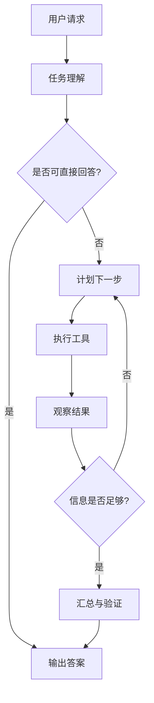

# ReAct 架构入门：从“固定流程”到“边思考、边行动、边观察”

> 目标读者：初次接触 AI Agent 的开发者。  
> 阅读目标：理解 ReAct 的思想、循环机制、工具调用过程、适用场景和常见误区。  
> 关联系统：招投标智能助手（LangGraph 单图 + Router + 业务节点）。

## 1. 一句话理解 ReAct

ReAct = Reasoning + Acting。

传统链式系统的做法通常是：

```text
用户问题 → 意图识别 → 调用一个功能 → 生成答案
```

它高效、稳定，但问题稍复杂就容易失效。例如用户问：

```text
帮我对比 A 公司近两年在中标项目里的报价变化，并说明可能原因。
```

系统不能只执行一次查询。它可能需要：

1. 识别公司名；
2. 查询项目与报价；
3. 判断是否缺少时间范围；
4. 继续查询或澄清；
5. 汇总变化；
6. 结合行业背景解释。

ReAct 的思路是让模型在一个循环里反复执行：

```text
Thought（思考）→ Action（行动）→ Observation（观察）→ Thought（思考）...
```

直到能给出 Final Answer。也可以简单记成：

```text
模型思考该做什么 → 执行工具或子任务 → 看结果 → 决定继续还是回答
```

ReAct 的价值不是“多调用几次模型”，而是让系统具备根据事实调整路径的能力。

## 2. 为什么要用 ReAct

### 2.1 固定流程的局限

固定流程像地铁线路：上车、换乘、到站，路线预先确定。

| 优点 | 缺点 |
| --- | --- |
| 可预测、延迟低 | 只适合已知、稳定的任务 |
| 成本可控 | 复杂问题容易被路由错 |
| 故障排查简单 | 难以处理多条件、多步骤任务 |

### 2.2 ReAct 的补充能力

ReAct 更像司机开车：先定方向，观察路况，再决定是否变道、绕行、停车确认。

| 场景 | 固定流程 | ReAct |
| --- | --- | --- |
| 简单意图 | 更好 | 过度设计 |
| 单次 SQL/RAG 查询 | 更好 | 过度设计 |
| 多步查询 | 容易失败 | 适合 |
| 需要验证中间结果 | 不擅长 | 适合 |
| 需要组合多个工具 | 不擅长 | 适合 |
| 输入含糊但可以查证 | 不擅长 | 适合 |
| 完全未知领域 | 可能不可靠 | 需要安全护栏 |

ReAct 适合处理“不能一次完成、但可以逐步验证”的任务，不适合所有请求都套一层循环。

## 3. 核心角色：Thought、Action、Observation

### 3.1 Thought：模型正在想什么

Thought 是中间推理文本，用来回答：

- 我理解的任务目标是什么？
- 当前缺什么信息？
- 下一步应该调用哪个工具？
- 如果工具失败，我该怎么办？

示例：

```text
Thought: 用户要对比“A 公司”近两年报价，但没有说明是否包含候选人公示、
成交公示和正式中标公示。我先调用 MySQL 查询，再观察是否能拿到足够数据。
```

Thought 不应该暴露敏感配置或无意义地重复。生产系统中它可以展示为简短的“执行计划”。

### 3.2 Action：决定调用什么工具

Action 通常包含工具名和参数：

```json
{
  "tool": "query_bid_price",
  "args": {
    "company_name": "A 公司",
    "time_range": "2024-01-01/2026-08-29",
    "fields": ["project_name", "bid_price", "award_date"]
  }
}
```

工具是系统真正可执行的函数，例如 MySQL 查询、Milvus 检索、文档问答、校验器。

### 3.3 Observation：工具返回的事实

Observation 是工具执行结果，而不是模型脑补的答案：

```json
{
  "ok": true,
  "rows": [
    {"project_name": "示例项目", "bid_price": 1200000, "award_date": "2024-06-01"},
    {"project_type": "市政工程", "bid_price": 980000, "award_date": "2025-07-15"}
  ],
  "missing": ["2026 年数据"],
  "source": "mysql.ztb_clean"
}
```

## 4. ReAct 循环如何工作



工程实现常见有三种形式：

| 形式 | 说明 | 优点 | 缺点 |
| --- | --- | --- | --- |
| Prompt 约定 | 用文本约定 Thought/Action/Observation 格式 | 简单直观 | 解析容易失败 |
| Tool Calling | 模型输出结构化工具请求 | 稳定、易观测 | 需要模型/框架支持 |
| LangGraph ReAct Agent | 用节点、边和 Checkpointer 管理循环 | 状态、超时、流式、恢复都可控 | 需要理解图结构 |

当前系统已有 LangGraph，因此最适合把 ReAct 作为“能力模式”引入，而不是重写整个系统。

## 5. 一个招投标场景示例

用户问题：

```text
查一下 A 公司近两年中标价格，如果降幅明显，分析可能原因。
```

### 第 1 轮：判断能否直接回答

```text
Thought: 该问题包含查询和分析两个任务。先确认是否有足够历史价格数据。
Action: query_bid_price({"company_name": "A 公司", "time_range": "近两年"})
Observation: 2024 年 3 条记录；2025 年 5 条记录；2026 年无记录。
```

### 第 2 轮：调整计划

```text
Thought: 有近两年数据。需要看报价和项目类型，避免用不可比项目解释价格变化。
Action: query_project_context({"company_name": "A 公司", "fields": ["project_type", "region", "bid_price", "award_date"]})
Observation: 2024 年主要是设备采购，2025 年新增服务类项目。
```

### 第 3 轮：补充法规/背景检查

```text
Thought: 服务类项目增加可能影响均价。我再查公共知识库，确认是否有政策变化。
Action: search_public_kb({"query": "服务类项目 价格评审 政策变化"})
Observation: 检索到 2 条相关政策片段，均包含来源编号。
```
### 第 4 轮：汇总

```text
Thought: 数据已覆盖公司、项目类型和可能的政策背景，可以回答。
Final Answer: A 公司 2024–2025 年中标均价下降约 X%。其中设备采购价格基本平稳，
服务类项目占比提升可能是均价变化的重要原因。相关项目和政策来源如下。
```

每一轮都把上一轮 Observation 纳入状态，这就是 ReAct 与一次性调用的主要差别。

## 6. 工具设计原则

ReAct 的效果高度依赖工具是否清晰。一个工具应该满足：

| 原则 | 说明 | 反例 |
| --- | --- | --- |
| 单一职责 | 一个工具做一类事 | 一个“万能查询”工具塞满所有逻辑 |
| 参数可校验 | 用 Pydantic/JSON Schema 定义参数 | 自由文本 SQL 传给数据库 |
| 返回事实 | 返回行数、分页、字段、错误码、来源 | 返回模型撰写的结论 |
| 失败可解释 | 返回 `ok=false`、原因和建议 | 抛出不可读异常 |
| 权限最小化 | 只允许白名单表、字段、操作 | 任意 DELETE/UPDATE |
| 有超时和限流 | 避免无限循环或拖垮数据库 | 长查询无限制 |
| 可观测 | 记录输入、耗时、行数、错误 | 只留下最终回答 |

工具输出建议统一为：

```json
{
  "ok": true,
  "data": {},
  "error": null,
  "metadata": {"source": "mysql", "row_count": 5, "elapsed_ms": 120}
}
```

## 7. 状态、记忆与上下文

Agent 上下文至少要区分三类信息：

1. **短期工作记忆**：本轮 Thought、Action、Observation；
2. **会话记忆**：用户 Thread 中的历史消息；
3. **任务状态**：已经拿到的证据、实体、计划、待办。

常见错误是把所有内容都塞进 messages。长上下文会带来成本上升、模型遗忘和幻觉风险。

更好的做法是：

```python
class TaskState(TypedDict):
    messages: list
    goal: str
    plan: list[str]
    evidence: dict
    tool_trace: list[dict]
    next_action: str | None
```

生产系统中通常只把摘要、关键实体和最新 Observation 放回模型上下文，完整 Trace 留在数据库或日志中。

## 8. 安全与失败模式

ReAct 引入自由决策后，常见风险包括：

| 风险 | 表现 | 护栏 |
| --- | --- | --- |
| 无限循环 | 反复调用同一工具 | 设置最大步数、重复检测、预算 |
| 幻觉行动 | 调用不存在的工具 | Tool Schema 校验 |
| 参数幻觉 | 实体名、时间、数字错误 | 实体归一化 + 参数校验 |
| 数据泄露 | 模型拿到敏感字段 | 字段白名单与脱敏 |
| 危险 SQL | 生成 DELETE/UPDATE | 只读账号 + SQL 静态检查 |
| 成本失控 | Token 和工具调用暴涨 | Token/时间/调用次数预算 |
| 过早回答 | 证据不足仍给结论 | 最低证据数量与引用要求 |

最小护栏建议：

1. 最大 5–8 轮；
2. 只读数据库账号；
3. 工具参数 Pydantic 校验；
4. 每个 Observation 都保留 `source`；
5. 最终答案必须有引用或明确说“未查到”。

## 9. 如何判断该不该用 ReAct

问自己五个问题：

1. 是否需要多个工具或多个数据源？
2. 是否需要根据中间结果调整路径？
3. 是否需要验证证据后再回答？
4. 用户是否能接受较高延迟？
5. 任务失败时的代价是否可控？

如果多数答案为“是”，ReAct 有价值；如果多数为“否”，保留固定流程更好。

## 10. ReAct 与当前系统的关系

当前系统：

```text
AgentGraph → Router → knowledge_qa / price_inquiry / general_chat / doc_qa / fallback
```

这是一个高质量的稳定骨架。ReAct 不必替换它，可以先作为局部增强：

| 当前能力 | ReAct 化思路 |
| --- | --- |
| Router 意图分类 | 保留为低延迟前置分类 |
| price_inquiry 多阶段检索 | 暴露成只读工具，由 ReAct 循环编排 |
| knowledge_qa RAG | 保持独立高频路径 |
| 复杂询价 | 启用 ReAct 子图 |
| 回答生成 | 基于 Observation 生成，而不是自由生成 |

第一阶段不建议让所有问题都进入 ReAct。建议只对“多步、低频、高价值”的任务开放。

## 11. 初学者常见误区

1. **以为 ReAct 等于 Agent**  
   ReAct 是一种推理与行动模式，Agent 还包括状态、记忆、工具、安全、评测和运维。

2. **以为思考越多越好**  
   没有必要的 Thought 会增加延迟和噪声。

3. **把数据库结果直接丢给模型**  
   应该分页、裁剪字段、限制行数，并说明字段含义。
4. **让模型自由生成 SQL**  
   应该用参数化查询或受控 SQL Builder。

5. **没有终止条件**  
   必须设置最大步数、时间预算和成本预算。

6. **把中间推理当最终答案**  
   最终答案必须经过汇总和校验。

## 12. 学习路径

1. 理解 Thought / Action / Observation；
2. 手写一个两个工具的小循环；
3. 增加 Pydantic 参数校验；
4. 增加最大步数和超时；
5. 增加日志、Trace 和引用；
6. 再迁移到 LangGraph 子图或官方 ReAct Agent；
7. 用真实问题做 A/B 评测。

## 13. 小结

ReAct 的核心思想是：**不假设一步能得到答案，而是通过“思考—行动—观察”的闭环，让系统基于事实不断修正路径。**

它适合多步查询、工具编排和需要验证中间结果的任务。生产落地的关键是工具清晰、状态可控、循环有边界、结果可溯源。
