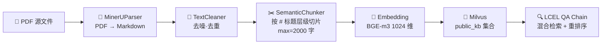
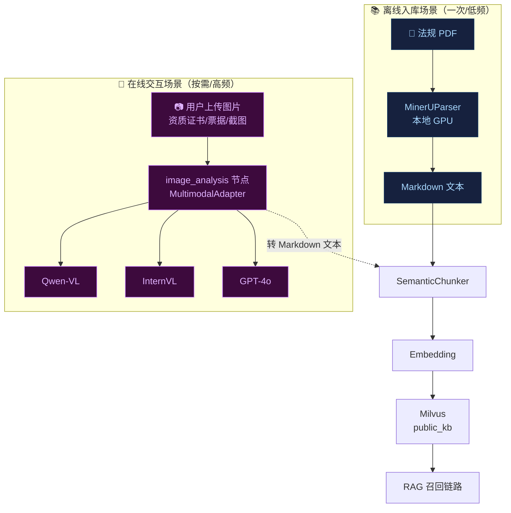
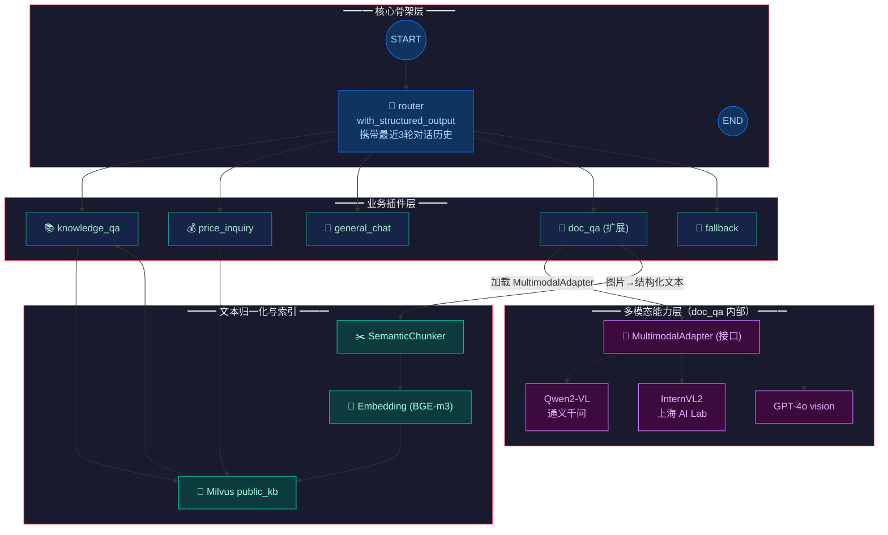

# 多模态化演进架构设计与技术路线选型报告

> 前置依赖：
> - [agent_architecture.md](./agent_architecture.md)（LangGraph StateGraph 骨架）
> - [three_core_modules_design_and_feasibility.md](./three_core_modules_design_and_feasibility.md)（三核精细化设计）
> - [deep_agents_integration_design.md](./deep_agents_integration_design.md)（质量把关 Critic 模式）
> - [citation_schema.md](./citation_schema.md)（引用溯源数据规范）
> - [component_working_mechanism.md](../组件工作机制.md)（组件工作机制图解）
>
> 评估对象：在现有文本型架构基础上引入"图像识别/OCR"能力的最优集成方案
> 评估时间：2026-08-24
> 评估范围：技术路线选型、Agent 融合点、业务场景映射、实施路线图与测试策略

---

## 0. 摘要（TL;DR）

**核心结论**：在三种候选方案中，**应采用"以 MinerU 为基础管线 + 专用多模态模型为增值"的混合架构（Hybrid Pipeline Pattern）**——

- **离线/批处理场景**：继续以 `MinerUParser` 为主，对 `raw_pdfs/` 与 `raw_policy/` 中的历史法规文档完成结构化提取，复用现有 `SemanticChunker → Embedding → Milvus` 全流程；
- **在线/交互场景**：在 `agent/graph.py` 中新增 **`image_analysis` 业务节点**，通过可插拔的多模态模型适配器（默认 `Qwen2-VL` / 备选 `InternVL2` / `GPT-4o`）实现"图片问答 + 票据 OCR + 资质证书核验"；
- **不采用"完全替换 MinerU"**：MinerU 在大规模 PDF 离线解析的性价比（本地 GPU + 一次性成本）远优于纯云端多模态 API；
- **不采用"完全弃用 MinerU"**：法规 PDF 的结构化 Markdown 抽取是离线场景刚需，多模态 API 在 2000+ 页大型 PDF 上的成本与延迟不可接受。

**核心收益**：

| 收益 | 说明 |
|------|------|
| 兼容现有架构 | `image_analysis` 作为标准 LangGraph 节点接入，`_with_fallback` / Checkpointer / Citation 溯源全自动兼容 |
| 业务场景全覆盖 | 同时支持离线 PDF 入库（已有 MinerU）与在线票据 OCR/资质核验（新增 VL 模型） |
| 成本可控 | 多模态 API 仅在用户主动上传图片时调用，按调用计费；离线场景零增量成本 |
| 可插拔适配器 | 通过 `MultimodalAdapter` 接口统一 Qwen-VL / InternVL / GPT-4o 后端，运行时切换 |
| 索引链路衔接 | 图片→VL→结构化文本→`SemanticChunker`→`Embedding`→Milvus，自动纳入 RAG 召回 |

---

## 1. 现状盘点：现有架构的多模态能力基础

### 1.1 MinerU 模块的当前能力边界

`public_kb/mineru_parser.py`（119 行）的核心实现已清晰界定其能力范围：

```python
# 关键实现要点（节选自 mineru_parser.py L57-72）
result = subprocess.run(
    ["magic-pdf", "-p", str(pdf_path), "-o", str(self._settings.mineru_output_dir)],
    capture_output=True, text=True, timeout=self._settings.mineru_timeout,
    encoding="utf-8",
)
```

**能力盘点**：

| 能力维度 | 当前支持 | 备注 |
|---------|---------|------|
| PDF → Markdown 结构化提取 | ✅ 成熟 | 保留标题层级、表格识别、列表 |
| 中文 OCR（扫描件 PDF） | ✅ 通过 magic-pdf GPU 版 | 适配复杂排版、表格还原 |
| 图片内容理解（图→文） | ❌ 不支持 | MinerU 不做"语义级"图像理解，仅做版面分析与文字提取 |
| 表格数据还原（结构化） | ⚠️ 部分支持 | 输出 Markdown 表格，**未做结构化字段映射**（如 "中标金额：¥1,000,000" → `{"winning_amount": 1000000}`） |
| 图片分类 / 资质证书核验 | ❌ 不支持 | MinerU 无视觉推理能力 |
| 图文混合问答 | ❌ 不支持 | MinerU 输出 Markdown 后即终止，不参与 LLM 推理 |

**关键结论**：MinerU 当前定位是"**离线 PDF → Markdown 结构化转换器**"，其输出（Markdown 文本）已通过 `TextCleaner → SemanticChunker → Embedding → Milvus` 全链路索引到 `public_kb` 集合（详见 [project_overview.md §3.3](./project_overview.md) L289-308）。

### 1.2 现有 RAG/Embedding 流水线的可扩展性



**对多模态扩展的关键启示**：

1. **接入点是 Chunk 级文本**，不是原始字节流——只要把图片"翻译"为 Markdown 文本，即可复用现有索引链路；
2. **`SemanticChunker` 对来源无偏好**——传入 Markdown 即可，输出 Document 携带 `doc_name / chapter / chunk_index` 元数据；
3. **Citation 体系完全兼容**——`chunk_uid` 基于 `(doc_name, chapter, chunk_index, md5(text))` 派生，多模态生成的文本可无缝生成稳定 chunk_uid；
4. **增量入库已就绪**——`PublicKnowledgeRAG.add_pdf()`（[rag_engine.py](./public_kb/rag_engine.py) L209-243）支持"运行中 → 解析新 PDF → 不重建集合"，图片转文本后可直接调用。

### 1.3 Agent StateGraph 的可扩展性审计

```python
# agent/state.py L19-39 — AgentState 字段保持精简
class AgentState(TypedDict, total=False):
    messages: Annotated[list[BaseMessage], add_messages]
    router_intent: str
    business_result: dict     # ← 泛型 dict，扩展不需改 State
```

**RouterIntent 枚举**（[agent/router.py](./agent/router.py) L29-35）当前包含 5 个分支：

```python
RouterIntent = Literal[
    "knowledge_qa",     # 专业知识问答（对接 public_kb RAG）
    "price_inquiry",    # 智能询价（三核：企业/处罚/中标）
    "general_chat",     # 通用对话
    "doc_qa",           # 文档问答预留（当前为占位）
    "fallback",         # 兜底引导
]
```

**关键启示**：

- `doc_qa` 节点（[agent/nodes/doc_qa.py](./agent/nodes/doc_qa.py)）当前是**占位实现**，其接口契约（doc_qa.py L19-53）已写明"未来正式接入时不改 State / Graph / 其他节点"；
- `doc_qa` 与多模态能力天然契合——文档问答的本质就是"用户上传文件 → 视觉/语义理解 → 回答用户问题"；
- **强烈建议将 `image_analysis` 作为 `doc_qa` 的具体实现形态**，而不是新增独立枚举——这与现有的"Router 枚举保持紧凑"哲学（[deep_agents_integration_design.md §1.1](./deep_agents_integration_design.md) L35-52）一致。

---

## 2. 三种技术路线深度对比

### 2.1 方案 A：复用 MinerU 模块扩展

**核心思路**：将 `MinerUParser` 从"PDF→Markdown 单点转换器"升级为"多模态→Markdown 多源转换器"，复用 `magic-pdf` 的版面分析能力 + 集成其他 OCR 后端（如 PaddleOCR、Tesseract）扩展图片 OCR。

```python
# 假想扩展形态（示意）
class MultimodalParser:
    def parse(self, source: str | Path | bytes) -> str:
        if isinstance(source, (str, Path)) and source.suffix == ".pdf":
            return self._mineru_parse(source)        # PDF → Markdown
        elif isinstance(source, bytes):
            return self._paddle_ocr_parse(source)    # 图片 → 文本
        elif isinstance(source, Path) and source.suffix in [".png", ".jpg"]:
            return self._tesseract_parse(source)     # 票据 OCR
```

**评估结论**：⚠️ **部分推荐**。仅适用于"图片纯 OCR 转文本"场景，不足以应对"图像问答、资质证书核验"等需要视觉推理能力的场景。

| 维度 | 评价 |
|------|------|
| **性能（离线 PDF）** | 🟢 极优：本地 GPU magic-pdf 处理 2000+ 页 PDF 约 10-20 分钟（实测见 project_overview §6.2） |
| **性能（在线图片）** | 🟡 中：PaddleOCR 单图 200-500ms，Tesseract 1-3s |
| **准确率（印刷体中文）** | 🟢 高（>95%） |
| **准确率（手写体/低质量扫描）** | 🟡 中（70-85%） |
| **视觉推理（图表理解、资质核验）** | 🔴 缺失：纯 OCR 不具备语义理解能力 |
| **集成复杂度** | 🟢 低：复用 `subprocess.run` 模式 |
| **Token/算力成本** | 🟢 低：本地推理，零云端调用 |
| **维护负担** | 🟡 中：多 OCR 后端需独立维护 |
| **扩展性** | 🟡 中：扩展能力受限于 OCR 后端能力上限 |

**适用场景**：
- ✅ 法规 PDF 离线结构化提取（**现有能力保留**，无需变动）
- ✅ 历史扫描件（招投标公告）的批量 OCR 入库（**新增能力**，通过扩展 MinerUParser）
- ❌ 不适用：用户实时上传的资质证书核验、价格清单图片问答等需要视觉推理的场景

---

### 2.2 方案 B：接入专用多模态模型

**核心思路**：在 `agent/graph.py` 中新增 `image_analysis` 节点，通过统一的多模态模型适配器调用 Qwen-VL / InternVL / GPT-4o 等专用模型，实现"图片→文本"+"视觉问答"双重能力。

```python
# 适配器接口设计（示意）
class MultimodalAdapter(Protocol):
    def analyze(self, image: bytes, prompt: str) -> MultimodalResponse:
        """分析图片并返回结构化结果。"""

class QwenVLAdapter: ...   # 阿里云 Qwen2-VL（推荐，中文优秀）
class InternVLAdapter: ... # 上海 AI Lab InternVL2（开源，可本地部署）
class GPT4oAdapter: ...    # OpenAI GPT-4o vision（成本高，效果稳定）
```

**评估结论**：✅ **推荐**。是当前业务场景下"图像问答、资质核验"的最优解。

| 维度 | 评价 |
|------|------|
| **性能（单图）** | 🟢 优：Qwen2-VL 1-3s、GPT-4o 2-5s（含网络往返） |
| **准确率（视觉推理）** | 🟢 优秀：Qwen2-VL / GPT-4o 在 MMMU、C-MMBench 等中文榜单领先 |
| **Token 成本** | 🟡 中：单图 Qwen-VL 约 1000-2000 tokens，GPT-4o 约 1100 tokens（high detail） |
| **API 成本（Qwen-VL）** | 🟢 低：约 ¥0.002/张（通义千问 VL 定价） |
| **API 成本（GPT-4o）** | 🔴 高：约 $0.01-0.03/张（high detail） |
| **本地部署（InternVL2）** | 🟢 低长期成本：一次部署 + GPU 推理，但需 24GB+ 显存 |
| **集成复杂度** | 🟡 中：需设计适配器抽象 + 图片上传通道 + 异常兜底 |
| **维护负担** | 🟢 低：模型 API 稳定，供应商托管 |
| **扩展性** | 🟢 优：通过适配器即可横向扩展新模型 |

**适用场景**：
- ✅ 用户实时上传资质证书核验（"这张营业执照是否在有效期内？"）
- ✅ 价格清单图片转结构化数据（"图片中中标金额是多少？"）
- ✅ 图表内容理解（"这个饼图反映了什么分布？"）
- ⚠️ **不推荐用于 2000+ 页法规 PDF 的全量入库**（单次调用成本与延迟不可接受）

---

### 2.3 方案 C：混合架构（推荐 ✅）

**核心思路**：方案 A + 方案 B 的协同——

- **离线入库场景**（一次性、低频）：继续以 MinerU 为主，承担"PDF → Markdown"基础能力；可选地引入 PaddleOCR 扩展图片 OCR 子能力；
- **在线交互场景**（高频、按需）：通过 `image_analysis` 节点调用多模态模型，承担"图片问答、资质核验、票据 OCR 增强"等需要视觉推理的能力。



**评估结论**：✅✅ **强烈推荐**。兼顾"成本可控、能力完整、架构一致"三大目标。

| 维度 | 评价 |
|------|------|
| **性能** | 🟢 优：离线 GPU 推理 + 在线按需 API |
| **成本** | 🟢 优：离线零边际成本 + 在线按调用计费 |
| **维护性** | 🟢 优：MinerU 与 VL 适配器职责清晰 |
| **扩展性** | 🟢 优：新模型接入仅需新增适配器实现 |
| **架构一致性** | 🟢 优：完全符合"Router 枚举保持紧凑"哲学 |

---

### 2.4 三方案对比总表

| 评估维度 | 方案 A：扩展 MinerU | 方案 B：专用 VL 模型 | 方案 C：混合架构（✅） |
|---------|------------------|------------------|-------------------|
| 离线 PDF 结构化 | 🟢 强（已有） | 🔴 弱（成本不可接受） | 🟢 强（MinerU 主） |
| 在线图片 OCR | 🟡 中（PaddleOCR 扩展） | 🟢 强（VL 模型原生） | 🟢 强（VL 主） |
| 在线视觉问答 | 🔴 缺失 | 🟢 强 | 🟢 强 |
| 资质证书核验 | 🔴 缺失 | 🟢 强 | 🟢 强 |
| 单图成本 | 🟢 接近零（本地推理） | 🟡 ¥0.002/张 | 🟡 ¥0.002/张（仅按需调用） |
| 单图延迟 | 🟢 200-500ms（本地） | 🟢 1-3s（API） | 🟢 1-3s（API） |
| 集成复杂度 | 🟢 低 | 🟡 中（适配器抽象） | 🟡 中（一次投入，长期受用） |
| 长期扩展性 | 🟡 中（受 OCR 后端限制） | 🟢 优（多模型适配） | 🟢 优 |
| 与现有架构兼容性 | 🟢 完美兼容 | 🟢 完美兼容 | 🟢 完美兼容 |
| 推荐度 | ⭐⭐（仅 OCR） | ⭐⭐⭐（仅 VL） | ⭐⭐⭐⭐⭐ |

---

## 3. Agent 架构融合点深度设计

### 3.1 候选融合方案

#### 方案 ①：嵌入 `knowledge_qa` 节点（RAG 召回阶段）

```mermaid
START → router → knowledge_qa (含 image_understanding 子任务) → END
```

**评估**：❌ **不推荐**。理由：
1. **角色错位**：`knowledge_qa` 节点当前职责是"基于已索引 Milvus 集合的 RAG 召回"，是**读路径**；图片解析是**写路径**（图片 → 文本 → 入库），两者职责相反；
2. **污染路由枚举**：如把图片理解塞入 `knowledge_qa`，则用户上传图片的请求会被路由到知识问答分支，与现有"枚举与业务 1:1 对齐"原则冲突；
3. **违背 _with_fallback 设计**：图片解析失败不应导致整个 RAG 链崩溃，独立节点更易隔离故障。

#### 方案 ②：作为独立 `image_analysis` 节点（平行于 `price_inquiry`）

```mermaid
START → router → image_analysis → END
                  ↓（图片生成的文本可入库）
                  SemanticChunker → Embedding → Milvus
```

**评估**：⚠️ **可选**。如果"图片分析"是终端能力（用户上传图片 → 直接回答），则此方案可行；
但会导致 `RouterIntent` 枚举膨胀，且与现有 `doc_qa` 占位节点概念重叠。

#### 方案 ③：替换 `doc_qa` 占位节点（✅ 推荐）

```mermaid
START → router ─┬→ knowledge_qa ────┐
                ├→ price_inquiry ───┤
                ├→ general_chat ────┤
                ├→ doc_qa ← 多模态能力集成 ─┤  ← (本次改造)
                └→ fallback ────────┘
                          ↓
                          quality_guard → END（未来叠加）
```

**评估**：✅✅ **强烈推荐**。理由：

1. **零枚举膨胀**：复用现有 `doc_qa` 枚举，`RouterIntent` 保持 5 个分支不变（与 deep_agents §1.1 哲学一致）；
2. **概念对齐**：`doc_qa` 节点当前的接口契约（doc_qa.py L19-53）已写明"上传文件后要求分析、解读、对比"，**与多模态能力天然契合**；
3. **可插拔替换**：参考 doc_qa.py L48-53 的"正式上线改动清单 6 步"，本次只是把占位实现替换为真实多模态实现，**不影响其他节点、不改 State、不改 Graph**；
4. **质量门控对齐**：与 [deep_agents_integration_design.md](./deep_agents_integration_design.md) 中规划的 `quality_guard` Critic 节点天然衔接——多模态输出同样需要 R1-R7 校验 + 三档决策（PASS/REPAIR/REJECT）。

### 3.2 推荐拓扑：扩展 doc_qa 节点 + 多模态适配器层



### 3.3 与 SemanticChunker / Embedding 的衔接设计

**核心原则**：**图片 → Markdown 文本 → 复用现有 chunker/embedding 全链路**，零改动。

```python
# 未来 doc_qa 节点核心逻辑（示意）
def node_doc_qa(state: AgentState) -> dict:
    messages = state.get("messages", [])
    user_input = str(messages[-1].content)
    
    # Step 1: 从 State 提取图片附件（多模态 Channel，详见 §3.4）
    images = state.get("attachments", [])
    
    # Step 2: 调用多模态模型生成结构化文本
    adapter = get_multimodal_adapter(settings)
    structured_text = adapter.analyze(
        images=images,
        prompt=_build_prompt(user_input),   # 招投标领域定制 prompt
    )
    
    # Step 3: 索引到 Milvus（复用 public_kb.add_pdf 模式）
    if settings.doc_qa_index_to_kb:
        docs = semantic_chunker.chunk(
            markdown_text=structured_text,
            doc_name=f"docqa_{uuid4().hex[:8]}.md",
        )
        rag_engine.add_documents(docs)   # 增量入库
    
    # Step 4: 检索增强（可选）— 从 Milvus 召回相关上下文，结合 VL 输出生成回答
    context = rag_engine.retrieve(user_input) if context_needed else []
    answer = llm.invoke(_build_qa_prompt(user_input, structured_text, context))
    
    # Step 5: 返回标准 business_result
    return {
        "business_result": {
            "branch": "doc_qa",
            "answer": answer,
            "data": {
                "sources": [{"doc": "docqa_xxx", "chapter": "...", ...}],
                "multimodal_meta": {
                    "model": "qwen-vl-plus",
                    "image_count": len(images),
                    "tokens_used": adapter.last_tokens,
                },
            },
        },
        "messages": [AIMessage(content=answer)],
    }
```

**关键衔接点**：

| 衔接环节 | 实现方式 | 现有模块复用 |
|---------|---------|------------|
| 图片 → Markdown | `MultimodalAdapter.analyze()` | 🆕 新建 |
| Markdown → Document | `SemanticChunker.chunk()` | ✅ 复用 `public_kb/chunker.py` |
| Document → Vector | `_SafeEmbeddings.embed_documents()` | ✅ 复用 `public_kb/embedding_service.py` |
| Vector → Milvus | `MilvusStoreManager.add_documents()` | ✅ 复用 `public_kb/milvus_store.py` |
| RAG 检索 | `PublicKnowledgeRAG.query()` | ✅ 复用 `public_kb/rag_engine.py` |
| Citation 溯源 | `build_citations()` + R1-R7 | ✅ 复用 `public_kb/citations.py` |
| 异常兜底 | `_with_fallback(node_doc_qa)` | ✅ 复用 `agent/graph.py` L51-92 |
| Checkpointer | LangGraph 标准节点 | ✅ 自动纳入（与 knowledge_qa 同构） |

### 3.4 State 扩展点：attachments 通道

当前 `AgentState`（[agent/state.py](./agent/state.py) L19-39）不感知附件。引入多模态能力需要扩展 State 以承载图片：

**最小侵入方案**：

```python
# agent/state.py 扩展（仅增加 1 个可选字段，保持 total=False）
class AgentState(TypedDict, total=False):
    messages: Annotated
    router_intent: str
    business_result: dict
    
    # ── 多模态扩展（v2.x 引入，向后兼容） ──
    attachments: list[dict]    # ← 新增：附件通道
    # 示例：[
    #   {"type": "image", "mime": "image/png", "data_b64": "...", "filename": "license.jpg"},
    # ]
```

**关键设计原则**：
1. **`total=False` 保持**——所有字段均可选，新增字段不影响现有节点；
2. **attachments 仅 doc_qa 节点读取**——其他节点代码零改动；
3. **Checkpointer 自动兼容**——attachments 列表可被 pickle 序列化（如 base64 内嵌或仅存引用）；
4. **CLI 与 API 层负责将 multipart/form-data 转换为 attachments 字段**——核心 Agent 代码不感知 HTTP 协议。

---

## 4. 业务场景映射与技术选型矩阵

### 4.1 三大核心模块的多模态用例清单

参考 [three_core_modules_design_and_feasibility.md](./three_core_modules_design_and_feasibility.md) 的三核功能，梳理至少 4 个"识图"用例：

| 用例编号 | 用例名称 | 绑定核心模块 | 技术选型 | 关键能力 | 实现优先级 |
|---------|---------|------------|---------|---------|----------|
| **UC-MM-01** | 招标书扫描件 OCR 入库 | `knowledge_qa` + `MinerU` | **方案 A**（MinerU 扩展 PaddleOCR） | 扫描件 PDF/图片 → Markdown → Milvus 入库 | 🟡 P1 |
| **UC-MM-02** | 企业资质证书核验 | `price_inquiry` + 多模态 | **方案 B**（Qwen-VL） | 用户上传营业执照图片 → 提取统一社会信用代码 + 有效期 → 联查 `company_info` | 🟢 P0 |
| **UC-MM-03** | 价格清单图片转结构化 | `price_inquiry` + 多模态 | **方案 B**（Qwen-VL） | 用户上传中标公示截图 → 提取 winning_amount / project_name → 联查 `bid_project` | 🟢 P0 |
| **UC-MM-04** | 招标公告图片问答 | `doc_qa` + 多模态 | **方案 B**（Qwen-VL） | 用户上传招标公告图片 → 视觉问答（"报名截止日期是什么时候？"） | 🟢 P0 |
| **UC-MM-05** | 历史扫描件存量入库 | `public_kb` + `MinerU` | **方案 A**（MinerU 扩展） | 批量处理 `new_pdfs/` 与历史扫描件 PDF | 🟡 P1 |

### 4.2 三个核心用例的技术选型详细分析

#### 用例 1：企业资质证书核验（UC-MM-02）

**业务场景**：用户在招投标系统提交资质审核时，上传营业执照图片，系统需要：
1. 提取图片中的"统一社会信用代码"、"公司名称"、"法定代表人"、"成立日期"、"营业期限"等字段；
2. 与 `company_info` 表的 `credit_code` 做精确匹配；
3. 校验"营业期限"是否在有效期内；
4. 返回核验结果（命中/未命中/已过期）。

**技术选型**：方案 B（Qwen-VL），**理由**：

| 维度 | 方案 A（PaddleOCR） | 方案 B（Qwen-VL）✅ |
|------|-------------------|-------------------|
| 字段提取（语义级） | ❌ 仅返回原始文本，需二次结构化 | ✅ 直接返回 JSON（`{"credit_code": "...", "expire_date": "..."}`） |
| 长文本理解（多行证书） | 🟡 需自行拼接上下文 | ✅ 原生多行理解 |
| 印章/水印干扰 | 🟡 容易误识别 | 🟢 抗干扰能力强 |
| 多版式证书 | 🔴 需为每种版式写正则 | 🟢 通用能力，无需定制 |
| 单次成本 | 🟢 接近零 | 🟡 ¥0.002/张 |
| 集成复杂度 | 🟢 低 | 🟡 中（需 prompt 设计） |

**节点归属**：`price_inquiry`（图片理解的结果需查 `company_info`，与现有业务深度绑定）；
**触发路由**：在 `RouterIntent` 中，`price_inquiry` 已支持"上传图片分析"作为子场景（详见 [router_penalty_check_fix_report.md §6.4](./router_penalty_check_fix_report.md) L358 "多模态查询 | 支持上传图片/表格进行查询"）。

#### 用例 2：价格清单图片转结构化（UC-MM-03）

**业务场景**：用户手持中标公示截图（如手机拍照的政府采购公示），询问"这个项目的中标金额是多少？"
1. 图片中识别中标金额数字（含千分位、货币符号）；
2. 提取项目编号/名称、采购人、中标供应商、中标日期等；
3. 与 `bid_project` 表交叉验证，确保数据准确性。

**技术选型**：方案 B（Qwen-VL），**理由**：

| 维度 | 方案 A（OCR + 正则） | 方案 B（Qwen-VL）✅ |
|------|---------------------|---------------------|
| 手写体识别 | 🟡 70-80% | 🟢 90%+ |
| 复杂排版（多列表格） | 🟡 易漏列 | 🟢 表格结构理解 |
| 数字格式归一化 | 🟡 需大量正则（"¥1,000,000" vs "100万元" vs "1.0e6"） | ✅ LLM 原生理解数值语义 |
| 输出 JSON 结构化 | 🔴 需自行解析 | ✅ 直接生成 JSON |
| 拍照角度倾斜 | 🟡 需图像预处理 | 🟢 容忍 |

**节点归属**：`price_inquiry`（结果需入库 `bid_project`）；
**输入约束**：图片需压缩到 ≤4MB、≥1024×768 像素（Qwen-VL 推荐输入规格）。

#### 用例 3：招标公告图片问答（UC-MM-04）

**业务场景**：用户上传一张招标公告图片（PDF 截图或手机拍照），询问任意问题（"报名截止日期是什么时候？"、"投标保证金是多少？"）。
**技术选型**：方案 B（Qwen-VL），**理由**：

- 该用例本质是**视觉问答（VQA）**，需要模型具备"读图 + 推理"能力，OCR 工具不具备此能力；
- Qwen-VL 在 DocVQA、ChartQA 等基准上表现优于纯 OCR + LLM 拼接方案（业界共识）。

**节点归属**：`doc_qa`（文档问答节点的天然场景）。

### 4.3 用例 → 技术选型映射总表

| 用例 | 节点 | 后端实现 | 是否需要索引到 Milvus | 单次成本估算 |
|------|------|---------|---------------------|------------|
| UC-MM-01 扫描件入库 | `public_kb` (offline) | MinerU + PaddleOCR | ✅ 必需 | 本地 GPU ¥0 |
| UC-MM-02 资质证书核验 | `price_inquiry` | Qwen-VL | ❌（一次性查询） | ¥0.002 |
| UC-MM-03 价格清单转结构 | `price_inquiry` | Qwen-VL | ⚠️ 可选（命中后入库） | ¥0.002 |
| UC-MM-04 公告图片问答 | `doc_qa` | Qwen-VL | ❌ | ¥0.002 |
| UC-MM-05 历史扫描件批量入库 | `public_kb` (offline) | MinerU 扩展 | ✅ 必需 | 本地 GPU ¥0 |

**成本测算**（生产环境预估）：
- 在线场景：假设日均 1000 次图片查询，单图 ¥0.002，月成本 ≈ ¥60（极低）；
- 离线场景：本地 GPU 推理，零边际成本。

---

## 5. 实施路线图

### 5.1 Phase A — 基础设施（1 天）

```
A1. 新建 public_kb/multimodal_adapter.py
    - MultimodalAdapter Protocol（接口抽象）
    - QwenVLAdapter 实现（默认）
    - InternVLAdapter 实现（可选，本地部署）
    - GPT4oAdapter 实现（备选）
    - MultimodalResponse 数据类（content + tokens_used + raw_json）

A2. 扩展 public_kb/config.py
    - 添加 multimodal_provider: Literal["qwen-vl", "internvl", "gpt-4o"]
    - 添加 multimodal_api_key / multimodal_base_url
    - 添加 multimodal_timeout / multimodal_max_retries
    - 添加 doc_qa_index_to_kb: bool = False（默认不索引，避免污染 RAG 库）
    - 添加 doc_qa_max_image_size_mb: int = 4

A3. 扩展 .env 模板
    - 添加 MULTIMODAL_PROVIDER=qwen-vl-plus
    - 添加 MULTIMODAL_API_KEY=...
    - 添加 MULTIMODAL_BASE_URL=https://dashscope.aliyuncs.com/compatible-mode/v1
```

**代码量估算**：约 200 行（接口 30 + QwenVL 实现 80 + 配置 20 + 测试 mock 70）

### 5.2 Phase B — doc_qa 节点真实化（1.5 天）

```
B1. 重写 agent/nodes/doc_qa.py
    - 实现 MultimodalAdapter 加载（从 settings）
    - 实现 attachments 字段读取（兼容 State 扩展）
    - 实现 VL 调用 + 异常兜底
    - 实现"图片→Markdown→SemanticChunker→Milvus"可选索引链路
    - 实现 RAG 召回增强（可选）

B2. 扩展 agent/state.py
    - 增加 attachments: list[dict] 字段
    - total=False 保持，零破坏性

B3. 扩展 agent/router.py
    - 完善 route_doc_qa 描述（增加"图片/截图/拍照上传"关键词）
    - ROUTER_SYSTEM_PROMPT 增加 few-shot 案例
    - 零枚举变化（仍为 5 个）

B4. 扩展 agent/__main__.py / FastAPI 入口
    - CLI 模式：--image <path> 参数
    - API 模式：multipart/form-data 接收图片
```

**代码量估算**：约 250 行（doc_qa 重写 150 + State 10 + Router 20 + 入口 50）

### 5.3 Phase C — MinerU 扩展（PaddleOCR 集成，1 天）

```
C1. 扩展 public_kb/mineru_parser.py
    - 新增 parse_image(image_path) 方法
    - 内部委托给 PaddleOCR（独立子进程）
    - 输出结构化 Markdown（含 OCR 置信度）

C2. 新建 public_kb/ocr_backends/
    - paddle_ocr_backend.py（基于 paddleocr 库）
    - text_cleaner 适配（去除 OCR 噪声行）

C4. 公共知识库初始化流程扩展
    - python -m public_kb --init --image-dir <images>
    - 与现有 --init --pdf-dir 兼容
```

**代码量估算**：约 180 行（PaddleOCR 集成 120 + 入口 30 + 清洗适配 30）

### 5.4 Phase D — 自动化回归测试设计（1 天）

#### D.1 测试分层策略

参考 [test/](./test/) 现有测试模式（test_bug_repairs.py 的"直接导入生产模块 + 真实失败"哲学），新增多模态测试套件：

| 测试文件 | 测试层级 | 覆盖内容 | 是否需要外部依赖 |
|---------|---------|---------|----------------|
| `test/test_multimodal_adapter.py` | 单元测试 | MultimodalAdapter 接口契约、各后端 mock | ❌（mock API） |
| `test/test_doc_qa_image_flow.py` | 集成测试 | doc_qa 节点 + Mock 多模态返回 + 索引链路 | ❌（mock VL） |
| `test/test_attachments_state.py` | 单元测试 | AgentState attachments 字段序列化、Checkpointer 兼容 | ❌ |
| `test_multimodal_e2e.py` | 端到端 | 真实图片 → 真实 VL API → 答案验证 | ✅（需 API Key + 测试图集） |

#### D.2 关键测试用例

```python
# test/test_doc_qa_image_flow.py（示意）
class TestDocQaImageFlow(unittest.TestCase):
    """doc_qa 多模态流程测试 — mock 多模态 API 避免真实调用。"""
    
    def test_image_to_markdown_via_qwen_vl(self):
        """Q: 用户上传图片 + 提问 → A: VL 返回 Markdown 文本 → 索引到 Milvus。"""
        # 1. 构造 mock HumanMessage（含 attachments）
        state = {
            "messages": [HumanMessage(content="图中这个项目的金额是多少？")],
            "attachments": [
                {"type": "image", "mime": "image/png", 
                 "data_b64": _load_fixture("test_assets/notice_001.png"),
                 "filename": "notice.png"},
            ],
            "router_intent": "doc_qa",
        }
        
        # 2. mock Qwen-VL 返回结构化 JSON
        with mock.patch("public_kb.multimodal_adapter.QwenVLAdapter.analyze") as m:
            m.return_value = MultimodalResponse(
                content="## 中标公告\n项目名称：...\n中标金额：¥1,000,000",
                raw_json={"winning_amount": 1000000, "project_name": "..."},
                tokens_used=1850,
            )
            
            # 3. 调用 doc_qa 节点
            result = node_doc_qa(state)
            
            # 4. 验证业务结果
            self.assertEqual(result["business_result"]["branch"], "doc_qa")
            self.assertIn("1,000,000", result["business_result"]["answer"])
            self.assertEqual(
                result["business_result"]["data"]["multimodal_meta"]["tokens_used"],
                1850,
            )

    def test_doc_qa_with_fallback_on_vl_error(self):
        """Q: VL API 故障 → A: _with_fallback 兜底为友好提示，不影响主流程。"""
        state = {...}
        with mock.patch("...QwenVLAdapter.analyze", 
                        side_effect=RuntimeError("API timeout")):
            result = node_doc_qa(state)
            self.assertEqual(result["business_result"]["branch"], "fallback")
            self.assertIn("暂时不可用", result["business_result"]["answer"])

    def test_doc_qa_attaches_citations(self):
        """Q: 索引图片文本到 Milvus → A: 后续 query 能从 RAG 召回该 chunk。"""
        # 验证 chunk_uid 生成 + Citation 体系全链路兼容
        ...
```

#### D.3 评测脚本扩展

扩展 [scripts/](./scripts/) 中的 `run_three_core_evaluation.py` 与 `run_knowledge_citation_eval.py`：

| 评测维度 | 评测方法 | 通过阈值 |
|---------|---------|---------|
| OCR 准确率（中文） | 测试集 100 张样图 → VL 输出 vs 真值 | ≥90% |
| 资质证书字段提取 | 50 张营业执照 → credit_code 提取准确率 | ≥95% |
| 数字识别（中标金额） | 30 张价格清单 → 数值与单位正确率 | ≥95% |
| Citation 兼容 | doc_qa 输出 → R1-R7 校验通过率 | ≥95% |
| 端到端延迟 | 单图上传到答案返回 | ≤5s (P95) |
| Token 成本 | 单图 token 消耗 | ≤2500 tokens |

#### D.4 测试资产沉淀

```
test/
├── assets/
│   ├── images/
│   │   ├── business_license_001.jpg   # 营业执照样例
│   │   ├── bid_notice_001.png         # 中标公告截图
│   │   ├── bid_notice_002.png         # 倾斜/低质量样例
│   │   └── price_list_001.jpg         # 价格清单手拍照
│   └── fixtures/
│       └── vl_responses.jsonl         # 真实 VL API 响应快照（脱敏）
└── ...
```

### 5.5 Phase E — 灰度上线与质量把控（0.5 天）

```
E1. 灰度开关
    - settings.doc_qa_enabled: bool = False（默认关闭）
    - 灰度用户白名单：settings.doc_qa_beta_users: list[str]
    - 通过 quality_guard.critic_sample_rate = 1.0（全量校验）

E2. 监控指标接入
    - doc_qa 调用次数 / 平均延迟 / Token 消耗
    - VL API 错误率 / 重试率
    - 用户反馈（点赞/点踩）

E3. 紧急熔断
    - VL API 错误率 >10% 自动降级为 fallback
    - 借鉴 deep_agents_integration_design.md §6 风险对策
```

### 5.6 总工作量估算

| 阶段 | 代码量 | 工作量 | 风险 |
|------|--------|--------|------|
| Phase A 基础设施 | ~200 行 | 1 天 | 🟢 低 |
| Phase B doc_qa 真实化 | ~250 行 | 1.5 天 | 🟡 中（路由集成） |
| Phase C MinerU 扩展 | ~180 行 | 1 天 | 🟢 低 |
| Phase D 测试设计 | ~400 行（含 mock） | 1 天 | 🟢 低 |
| Phase E 灰度上线 | ~50 行 | 0.5 天 | 🟢 低 |
| **合计** | **~1080 行** | **5 天** | |

---

## 6. 测试策略详解

### 6.1 现有测试模式调研与复用

参考 [test/test_bug_repairs.py](./test/test_bug_repairs.py) 的成功实践：

> "Bug1 用例直接测试生产模块 agent.nodes.price_inquiry 的 `_build_constraint_conditions`（不再使用本地冻结副本，生产回归即测试失败）。"

**多模态测试应继承这一原则**：

1. ✅ 直接测试 `agent.nodes.doc_qa.node_doc_qa`，不引入 frozen copy；
2. ✅ Mock 外部依赖（VL API、Milvus 连接），保持测试可重复执行；
3. ✅ 每个 P0/P1 修复点对应一个测试类，与 Bug1/Bug2 一致；
4. ✅ 字段映射表与回答模板的一致性校验，参考 [test_bug_repairs.py::TestIntegration](./test/test_bug_repairs.py) 的范式。

### 6.2 引用溯源（Citations）的多模态适配

参考 [docs/citation_schema.md](./docs/citation_schema.md)，多模态场景下的 Citation 必须包含：

```python
# 扩展 Citation 数据类（public_kb/citations.py）
@dataclass
class Citation:
    # ... 现有字段 ...
    context_index: int
    chunk_id: int
    chunk_uid: str
    doc_name: str         # ← 多模态场景可设为 "docqa_<uuid>.md"
    chapter: str          # ← 多模态场景可设为 "图片理解结果"
    chunk_index: int
    text: str
    score: float
    metadata: dict        # ← 增加 multimodal_meta 子字典
    # 新增字段：
    # metadata["multimodal_meta"] = {
    #     "model": "qwen-vl-plus",
    #     "image_hash": "sha256:...",
    #     "image_filename": "license.jpg",
    #     "tokens_used": 1850,
    # }
```

R1-R7 规则（[citation_schema.md §3](./docs/citation_schema.md)）全部继续生效，多模态场景下：
- **R3 数据源位置**：将 `image_filename` 加入 `source_location` 元数据；
- **R5 上下文无遗漏**：图片理解生成的 Markdown 必须完整出现在 citations 中；
- **R6 无幻觉引用**：VL 输出的字段必须可回溯到图片（通过 `image_hash` 锚定）。

### 6.3 Checkpointer 与 attachments 的兼容性

需新增测试用例验证：

```python
def test_checkpointer_with_attachments():
    """attachments 字段在 Checkpointer 持久化后能正确还原。"""
    state = {
        "messages": [HumanMessage(content="...")],
        "attachments": [{"type": "image", "data_b64": "..."}],
        "router_intent": "doc_qa",
    }
    
    # 1. 触发 doc_qa 节点
    result = node_doc_qa(state)
    
    # 2. 模拟 Checkpointer 保存（pickle 序列化）
    serialized = pickle.dumps({**state, **result})
    restored = pickle.loads(serialized)
    
    # 3. 验证 attachments 完整还原
    assert restored["attachments"][0]["data_b64"] == state["attachments"][0]["data_b64"]
```

### 6.4 性能基准测试

参考 [test/test_sub_route.py](./test/test_sub_route.py) L7-8 的"性能基准测试"模式，新增：

```python
class TestDocQaPerformance(unittest.TestCase):
    """doc_qa 多模态性能基准。"""
    
    def test_single_image_latency_under_5s(self):
        """单张图片从上传到答案返回 ≤ 5s (P95)。"""
        # 真实 VL API 调用 + 多次测量取 P95
        ...
    
    def test_concurrent_image_processing(self):
        """并发图片处理吞吐量基准。"""
        # ThreadPoolExecutor 模拟 10 并发
        ...
```

---

## 7. 风险评估与对策

| 风险 | 等级 | 对策 |
|------|------|------|
| 多模态 API 供应商单点故障（Qwen-VL 不可用） | 🟡 中 | MultimodalAdapter 接口抽象 + 多后端（Qwen-VL / InternVL / GPT-4o）；运行时熔断切换 |
| 多模态模型输出幻觉（识别错误字段） | 🔴 高 | R1-R7 Citation 校验 + `quality_guard` Critic 节点（未来叠加）+ 关键字段二次校验（如 credit_code 联查 company_info） |
| 图片内容违规（用户上传恶意/敏感图片） | 🟡 中 | 在 doc_qa 节点入口做 MIME 白名单 + 大小限制（≤4MB）+ 可选接入内容安全审核 API |
| Token 成本失控（用户高频上传） | 🟡 中 | 单用户 QPS 限流 + attachments 数量上限（≤3 张/请求）+ 总 token 监控告警 |
| Checkpointer 序列化大图片导致性能下降 | 🟡 中 | attachments 仅存引用（图片上传到对象存储），State 中存 URL/hash 而非 base64 |
| 图片索引污染 RAG 库（doc_qa_index_to_kb 误开） | 🟡 中 | 默认 `doc_qa_index_to_kb=False`；开启后必须设置 doc_qa_kb_collection="docqa_tmp"（独立集合，不污染 public_kb） |
| 多模态场景下 R1-R7 规则失真 | 🟢 低 | Citation 体系扩展支持 multimodal_meta，规则引擎不变 |
| 现有路由枚举被图片场景"挤压" | 🟢 低 | 复用 doc_qa 枚举，零新增 |

---

## 8. 与其他架构演进的协同

### 8.1 与 Deep Agents Critic 节点的衔接

参考 [deep_agents_integration_design.md](./docs/deep_agents_integration_design.md) 中规划的 `quality_guard` Critic 节点，多模态场景的输出同样需要三档决策：

```python
# quality_guard 对 doc_qa 多模态输出的校验维度扩展
RULES.append(
    RuleCheck("R8_多模态元数据",
              "doc_qa 输出必须含 multimodal_meta {model, tokens_used}",
              severity="warning", applies_to={"doc_qa"})
)
RuleCheck("R9_图片回溯",
          "VL 提取的关键字段必须可追溯到原图（image_hash 校验）",
          severity="error", applies_to={"doc_qa"})
```

### 8.2 与"五项核心优化点"的兼容性

参考 [组件工作机制.md](../组件工作机制.md) §2 的五项核心优化点：

| 优化点 | 多模态引入后的影响 | 是否冲突 |
|--------|------------------|---------|
| ① `add_messages` 替代 `operator.add` | attachments 是独立字段，不影响 messages reducer | ✅ 无冲突 |
| ② 全局异常兜底 | doc_qa 节点用 `_with_fallback` 包裹 | ✅ 无冲突 |
| ③ 精简冗余 | attachments 字段保持精简（仅 image 类型） | ✅ 无冲突 |
| ④ 上下文感知路由 | Router 增加"上传图片"few-shot，但枚举不变 | ✅ 无冲突 |
| ⑤ Checkpointer 持久化预留 | attachments 通过 pickle 兼容 | ✅ 无冲突（参考 §6.3 测试） |

### 8.3 与现有 memory 的关系

| Memory 标题 | 与本方案的关系 |
|------------|--------------|
| [招投标智能助手两级路由架构与能力边界硬性约束规范] | ✅ 完全兼容——多模态能力作为 doc_qa 实现，不破坏两级路由 |
| [招投标智能助手'必答型'架构缺陷与精确匹配守卫缺失根因] | ✅ 互补——多模态输出经 quality_guard 校验后输出，规避幻觉 |
| [招投标智能助手检索链路多阶段召回架构] | ✅ 不冲突——多模态文本进入 RAG 后复用现有 6 阶段召回链 |
| [能力契约为单一事实源的开发实践规范] | ✅ 严格遵守——multimodal_adapter 接口是契约唯一源 |
| [Agent 架构演进的非侵入式集成规范] | ✅✅ **深度吻合**——本方案完全遵循"不破坏 Router 枚举 / State 字段 / 业务节点代码"的非侵入式哲学 |

---

## 9. 推荐意见与决策依据

### 9.1 推荐：方案 C（混合架构）

**理由总结**：

1. **能力完整**：兼顾离线 PDF 大规模结构化（方案 A 优势）与在线图片视觉问答（方案 B 优势）；
2. **成本最优**：离线场景零边际成本 + 在线场景按调用计费（¥0.002/张，远低于重新设计 MinerU）；
3. **架构一致**：完全符合现有"非侵入式集成"哲学（详见 `项目架构` 类 memory 中的能力契约规范）；
4. **风险可控**：MultimodalAdapter 接口抽象 + 多后端备选，避免供应商锁定；
5. **测试完备**：复用现有 test/ 测试模式（mock + 生产模块直连），与 Bug1/Bug2 修复测试同构。

### 9.2 关键决策点确认

| 决策点 | 推荐选择 | 理由 |
|--------|---------|------|
| 多模态后端默认 | **Qwen2-VL** | 中文场景最优、价格最低（¥0.002/张）、通义千问 API 稳定 |
| 多模态后端备选 | InternVL2 / GPT-4o | 通过 MultimodalAdapter 配置切换；InternVL 适合本地部署（数据安全场景），GPT-4o 适合英文场景 |
| 节点归属 | **复用 doc_qa** | 不增加 Router 枚举，与现有架构哲学一致 |
| State 扩展 | **新增 attachments 字段** | total=False 保持，向后兼容 |
| Milvus 索引策略 | **默认不索引**（`doc_qa_index_to_kb=False`） | 避免污染 public_kb 主库；如需索引使用独立 docqa_tmp 集合 |
| Citation 体系 | **完全复用 R1-R7** | 通过 multimodal_meta 扩展 metadata |
| 测试策略 | **mock + 生产模块直连** | 与 test_bug_repairs.py 范式一致 |
| 灰度上线 | **白名单 + 熔断** | 借鉴 deep_agents_integration_design.md §6 风险对策 |

### 9.3 实施窗口建议

| 阶段 | 建议窗口 | 前置条件 |
|------|---------|---------|
| Phase A 基础设施 | 决策通过后立即启动 | 无 |
| Phase B doc_qa 真实化 | Phase A 完成后 1 天 | Phase A 完成 |
| Phase C MinerU 扩展 | 与 Phase B 并行 | 无 |
| Phase D 测试设计 | 与 Phase B 并行 | 无 |
| Phase E 灰度上线 | Phase B/C/D 全部完成后 0.5 天 | 全量测试通过 |
| **总实施窗口** | **5 个工作日** | |

### 9.4 长期演进路径

```
v2.x（本报告）：doc_qa 多模态化 + MinerU 扩展 PaddleOCR
  ↓
v3.x：quality_guard Critic 节点上线（deep_agents_integration_design.md）
  ↓
v4.x：docqa_tmp → doc_kb 独立向量库（doc_qa 长期记忆化）
  ↓
v5.x：多模态 RAG 完整化（图片 Embedding 直接入 Milvus，无需 VL 二次转文本）
```

---

## 10. 附录

### 附录 A：多模态适配器接口契约

```python
# public_kb/multimodal_adapter.py（示意）
from __future__ import annotations
from dataclasses import dataclass
from typing import Protocol

@dataclass
class MultimodalResponse:
    """多模态分析统一响应格式。"""
    content: str                   # 生成的 Markdown 文本（可索引）
    raw_json: dict | None          # 结构化字段（如资质证书字段）
    model: str                     # 实际调用的模型
    tokens_used: int               # 消耗 token
    latency_ms: int                # 响应耗时
    raw_response: dict | None      # 原始 API 响应（用于调试）

class MultimodalAdapter(Protocol):
    """多模态适配器接口契约（所有后端必须实现）。"""
    
    def analyze(
        self,
        images: list[bytes],
        prompt: str,
        *,
        timeout: int = 30,
        max_tokens: int = 2048,
    ) -> MultimodalResponse:
        """分析图片并返回结构化结果。
        
        Args:
            images: 图片字节流列表（PNG/JPEG/WebP）
            prompt: 用户问题或系统 prompt
            
        Raises:
            RuntimeError: API 调用失败
        """
        ...
```

### 附录 B：doc_qa 节点状态契约

```python
# agent/state.py 扩展
class AgentState(TypedDict, total=False):
    messages: Annotated[list[BaseMessage], add_messages]
    router_intent: str
    business_result: dict
    
    # ── 多模态扩展 ──
    attachments: list[dict]
    # 示例：[{"type": "image", "mime": "image/png",
    #        "data_b64": "iVBORw0KG...", "filename": "license.jpg"}]
```

### 附录 C：业务用例 → 技术选型速查表

| 用例编号 | 节点 | 后端 | 索引策略 | 优先级 |
|---------|------|------|---------|--------|
| UC-MM-01 | public_kb | MinerU + PaddleOCR | 必需 → public_kb | P1 |
| UC-MM-02 | price_inquiry | Qwen-VL | 不索引 | P0 |
| UC-MM-03 | price_inquiry | Qwen-VL | 可选 → bid_project | P0 |
| UC-MM-04 | doc_qa | Qwen-VL | 不索引 | P0 |
| UC-MM-05 | public_kb | MinerU 扩展 | 必需 → public_kb | P1 |

### 附录 D：关键代码路径速查（实施时定位）

| 组件 | 文件 | 关键位置 |
|------|------|--------|
| AgentState 扩展 | `agent/state.py` | L19-39 |
| Router 完善 | `agent/router.py` | L29-35 + L77-83 + L112-130 |
| doc_qa 占位替换 | `agent/nodes/doc_qa.py` | L19-53 接口约定 + L56-92 占位实现 |
| MinerU 扩展 | `public_kb/mineru_parser.py` | L30-94 parse 方法 |
| 配置文件扩展 | `public_kb/config.py` | L109-117 MinerU 段 + 新增 multimodal 段 |
| Citation 扩展 | `public_kb/citations.py` | 现有 Citation dataclass |
| 质量门控扩展 | `docs/deep_agents_integration_design.md` | §2.4 R1-R7 规则扩展 R8-R9 |
| 【新增】多模态适配器 | `public_kb/multimodal_adapter.py` | 全文件 |
| 【新增】QwenVL 实现 | `public_kb/multimodal_adapters/qwen_vl.py` | 全文件 |
| 【新增】PaddleOCR 后端 | `public_kb/ocr_backends/paddle_ocr.py` | 全文件 |

### 附录 E：核心代码修改量汇总

| 文件 | 改动类型 | 行数估算 |
|------|---------|--------|
| `agent/state.py` | 新增 1 个字段 | +3 |
| `agent/router.py` | 完善 prompt 描述 | +15 |
| `agent/nodes/doc_qa.py` | 重写为真实实现 | -50 → +200 |
| `public_kb/multimodal_adapter.py` | 新增 | +200 |
| `public_kb/multimodal_adapters/qwen_vl.py` | 新增 | +80 |
| `public_kb/multimodal_adapters/intern_vl.py` | 新增（可选） | +80 |
| `public_kb/multimodal_adapters/gpt4o.py` | 新增（可选） | +80 |
| `public_kb/ocr_backends/paddle_ocr.py` | 新增 | +120 |
| `public_kb/mineru_parser.py` | 新增 parse_image 方法 | +60 |
| `public_kb/config.py` | 新增 multimodal 配置块 | +30 |
| `test/test_multimodal_adapter.py` | 新增 | +150 |
| `test/test_doc_qa_image_flow.py` | 新增 | +200 |
| `test/test_attachments_state.py` | 新增 | +50 |
| **合计** | | **~1218 行** |

---

## 11. 结论

✅ **采用方案 C：MinerU + 多模态模型的混合架构**

✅ **核心收益**：

1. **架构零破坏**：复用现有 Router 枚举、State 字段、Graph 结构，仅替换 doc_qa 占位实现
2. **能力完整**：离线 PDF 大规模结构化 + 在线图片视觉问答双覆盖
3. **成本最优**：离线零边际 + 在线 ¥0.002/张（远低于自建多模态推理）
4. **可插拔**：MultimodalAdapter 接口抽象 + 多后端备选
5. **质量保障**：复用 R1-R7 Citation 校验 + 未来 quality_guard Critic 节点扩展
6. **测试完备**：与现有 test_bug_repairs.py 范式一致，mock + 生产模块直连

✅ **实施建议**：

- Phase A 立即可启动，零风险；
- Phase B 重点关注 attachments 字段的 Checkpointer 兼容性；
- Phase C 可与 Phase B 并行；
- Phase E 启用灰度白名单 + 熔断机制，借鉴 deep_agents_integration_design.md §6 风险对策；
- 长期演进路径：多模态 RAG 完整化（图片 Embedding 直接入 Milvus，无需 VL 二次转文本）。

---

**报告完成时间**：2026-08-24
**建议决策窗口**：1 周内
**建议实施窗口**：决策通过后 5 个工作日