# 招投标智能助手 — 组件工作机制图解

> 使用 Mermaid 最新语法，中文标注，全面展示每个组件的内部工作机制与数据流向。

---

## 目录

1. [系统全景架构](#1-系统全景架构)
2. [Agent 骨架 — StateGraph 工作流](#2-agent-骨架--stategraph-工作流)
3. [Router — 意图路由机制](#3-router--意图路由机制)
4. [Knowledge QA — 专业知识问答](#4-knowledge-qa--专业知识问答)
5. [Price Inquiry — 智能询价全链路](#5-price-inquiry--智能询价全链路)
6. [Price Inquiry — 多阶段召回与权重策略](#6-price-inquiry--多阶段召回与权重策略)
7. [Public KB — RAG 混合检索流水线](#7-public-kb--rag-混合检索流水线)
8. [Public KB — PDF 入库全流程](#8-public-kb--pdf-入库全流程)
9. [Answer Templates — 回答模板渲染引擎](#9-answer-templates--回答模板渲染引擎)
10. [Output Templates — 输出字段筛选框架](#10-output-templates--输出字段筛选框架)
11. [Fallback — 全局异常兜底机制](#11-fallback--全局异常兜底机制)
12. [Checkpointer — 对话记忆持久化](#12-checkpointer--对话记忆持久化)
13. [数据源协同策略](#13-数据源协同策略)

---

## 1. 系统全景架构

```mermaid
graph TB
    %% 样式定义
    classDef entryLayer fill:#1a1a2e,stroke:#e94560,stroke-width:2px,color:#eee,rx:15,ry:15
    classDef coreLayer fill:#0f3460,stroke:#1677ff,stroke-width:2px,color:#a8d8ff,rx:12,ry:12
    classDef bizLayer fill:#162447,stroke:#1b998b,stroke-width:2px,color:#a8e6cf,rx:12,ry:12
    classDef dataLayer fill:#1a1a2e,stroke:#f4a261,stroke-width:2px,color:#ffd166,rx:12,ry:12
    classDef infraLayer fill:#2d1b00,stroke:#5c6370,stroke-width:1.5px,color:#abb2bf,rx:10,ry:10
    classDef externalAPI fill:#3d0a3d,stroke:#c77dff,stroke-width:2px,color:#e0b3ff,rx:10,ry:10
    classDef router fill:#3a0a3a,stroke:#ff6b6b,stroke-width:2px,color:#ffc0cb,rx:12,ry:12
    classDef guard fill:#2d1b00,stroke:#e76f51,stroke-width:2px,color:#ffc069,rx:10,ry:10

    %% 标题
    TITLE["🏗️ 招投标智能助手 — 系统全景架构"]
    class TITLE entryLayer

    %% 接入层
    subgraph L1["━━━ 接入层 ━━━"]
        direction LR
        CLI["🖥️ CLI 命令行<br/>python -m agent"]
        WEB["🌐 FastAPI 接口<br/>（规划中）"]
    end
    class L1 entryLayer

    %% Agent 核心层
    subgraph L2["━━━ LangGraph Agent 骨架 ━━━"]
        direction TB
        START((▶ START))
        ROUTER["🔀 Router<br/>LLM 意图分类器<br/>────────<br/>structured_output<br/>↓ 回退<br/>Tool Calling"]
        STATE[("📋 AgentState<br/>messages + router_intent<br/>+ business_result")]
        END_NODE((🏁 END))
    end
    class L2 coreLayer

    %% 业务插件层
    subgraph L3["━━━ 业务插件层 ━━━"]
        direction LR
        KQA["📚 专业知识问答<br/>knowledge_qa<br/>────────<br/>对接 Milvus RAG<br/>混合检索 + 拒答"]
        PI["💰 智能询价<br/>price_inquiry<br/>────────<br/>统一意图解析<br/>6级多阶段召回<br/>安全校验 + 模板渲染"]
        GC["💬 通用对话<br/>general_chat<br/>────────<br/>纯 LLM 闲聊<br/>功能引导"]
        DQ["📄 文档问答<br/>doc_qa<br/>────────<br/>占位节点<br/>功能待上线"]
        FB["🔄 兜底引导<br/>fallback<br/>────────<br/>意图不明引导<br/>异常降级接管"]
    end
    class L3 bizLayer

    %% 防护层
    subgraph L4["━━━ 安全防护层 ━━━"]
        FALLBACK_WRAP["🛡️ _with_fallback 装饰器<br/>所有业务节点统一包裹<br/>单点故障不中断整体流程"]
        GUARDS["🔒 多层安全校验<br/>P0-1 编号特征识别<br/>P0-11 工商主体名校验<br/>P0-12 项目编号正则兜底<br/>前置拦截 + 后置回溯"]
    end
    class L4 guard

    %% 基础设施层
    subgraph L5["━━━ 基础设施层 ━━━"]
        direction LR
        MILVUS[("🐘 Milvus<br/>向量数据库<br/>1024维 COSINE<br/>IVF_FLAT nlist=128")]
        MYSQL[("🐬 MySQL ztb_clean<br/>4张核心表<br/>FULLTEXT ngram<br/>连接池 max=8")]
        MEM[("💾 Checkpointer<br/>MemorySaver<br/>→ SQLite → PG → Redis")]
    end
    class L5 infraLayer

    %% 外部 API
    subgraph L6["━━━ 外部服务 ━━━"]
        direction LR
        DEEPSEEK[("🤖 DeepSeek API<br/>deepseek-chat<br/>temperature=0")]
        SILICON["("🧬 SiliconFlow API<br/>BGE-m3 Embedding<br/>BGE-reranker-v2-m3")]
        MINERU[("📑 MinerU API<br/>PDF → Markdown<br/>OCR 解析")]
    end
    class L6 externalAPI

    %% 连线
    CLI --> START
    WEB --> START
    START --> ROUTER
    STATE -.- ROUTER
    ROUTER --> KQA
    ROUTER --> PI
    ROUTER --> GC
    ROUTER --> DQ
    ROUTER --> FB
    KQA -.->|🛡️| FALLBACK_WRAP
    PI -.->|🛡️| FALLBACK_WRAP
    GC -.->|🛡️| FALLBACK_WRAP
    DQ -.->|🛡️| FALLBACK_WRAP
    KQA --> END_NODE
    PI --> END_NODE
    GC --> END_NODE
    DQ --> END_NODE
    FB --> END_NODE
    KQA -.-> MILVUS
    KQA -.-> DEEPSEEK
    PI -.-> MYSQL
    PI -.-> MILVUS
    PI -.-> DEEPSEEK
    GC -.-> DEEPSEEK
    MILVUS -.-> SILICON
    MILVUS -.-> SILICON
    PI -.-> GUARDS
```

---

## 2. Agent 骨架 — StateGraph 工作流

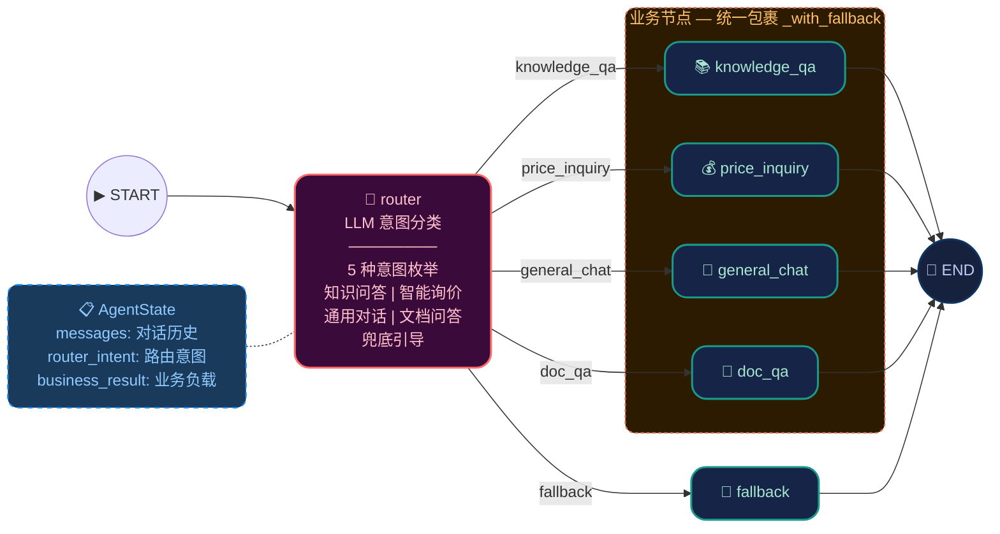

### 工作流说明

| 步骤 | 组件 | 动作 |
|------|------|------|
| ① | `AgentGraph.invoke(question)` | 创建 HumanMessage，传入 StateGraph |
| ② | `router` | LLM 携带最近3轮历史进行意图分类 |
| ③ | `_route_by_intent(state)` | 条件边：根据 `router_intent` 分发到对应节点 |
| ④ | 业务节点 | 执行具体逻辑，返回 `business_result` + `AIMessage` |
| ⑤ | `_with_fallback` | 任何未捕获异常 → 自动降级为友好提示 |
| ⑥ | `END` | 输出 `{"answer", "intent", "business_result"}` |

---

## 3. Router — 意图路由机制

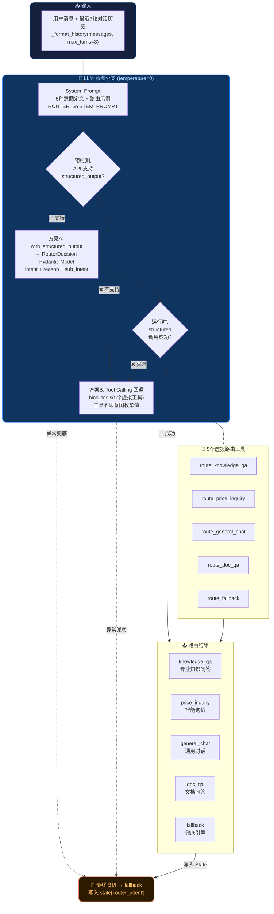

### 路由枚举与触发条件

| 意图 | 枚举值 | 典型触发 |
|------|--------|---------|
| 专业知识问答 | `knowledge_qa` | "招标方式有哪些？""评标委员会怎么组成？" |
| 智能询价 | `price_inquiry` | "XX公司中标了什么？""查一下皮艺沙发的中标记录" |
| 通用对话 | `general_chat` | "你好""你能做什么？" |
| 文档问答 | `doc_qa` | "帮我分析这个文档"（Demo占位） |
| 兜底引导 | `fallback` | 意图无法确定时 |

---

## 4. Knowledge QA — 专业知识问答

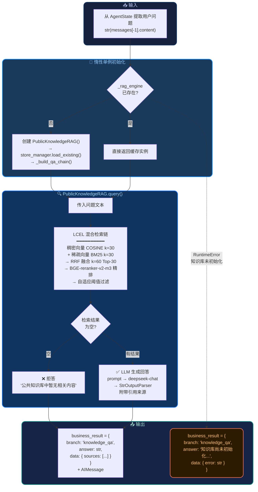

---

## 5. Price Inquiry — 智能询价全链路

```mermaid
graph TB
    classDef step1 fill:#16213e,stroke:#0f3460,stroke-width:2px,color:#c0caf5,rx:12,ry:12
    classDef step2 fill:#0f3460,stroke:#1677ff,stroke-width:2px,color:#a8d8ff,rx:12,ry:12
    classDef step3 fill:#162447,stroke:#1b998b,stroke-width:2px,color:#a8e6cf,rx:12,ry:12
    classDef step4 fill:#1a3a5c,stroke:#c77dff,stroke-width:2px,color:#e0b3ff,rx:12,ry:12
    classDef step5 fill:#2d1b00,stroke:#f4a261,stroke-width:2px,color:#ffd166,rx:12,ry:12
    classDef guard fill:#3d0a3d,stroke:#e76f51,stroke-width:2px,color:#ffc069,rx:12,ry:12
    classDef output fill:#1a1a2e,stroke:#1b998b,stroke-width:2px,color:#a8e6cf,rx:12,ry:12

    subgraph S1["📥 阶段1: 统一意图解析 _parse_unified_intent()"]
        direction TB
        Q1["用户问题"]
        LLM1["ChatOpenAI (temperature=0)<br/>_UNIFIED_INTENT_PROMPT<br/>───────<br/>一次性输出:<br/>• sub_route 二级路由<br/>• query_type 查询类型<br/>• hard_filters 过滤条件<br/>• semantic_keywords 语义关键词<br/>• exact_tokens 精确匹配"]
        PARSE["_extract_json()<br/>容错提取 JSON"]
        POST["_post_process_intent()<br/>去噪 + 归一化<br/>• _denoise_keywords()<br/>• _split_overlong_keyword()"]
        INTENT[("SearchIntent<br/>sub_route<br/>query_type<br/>hard_filters<br/>semantic_keywords")]
    end
    class S1 step1

    subgraph S2["🛡️ 阶段2: 多层安全校验"]
        direction TB
        G1{"product_query?"}
        G2{"project_detail<br/>无project_number?"}
        G3{"裸实体名<br/>无查询意图?"}
        G4{"未提取到<br/>有效实体?"}
        G5{"project_number<br/>确定性提取<br/>成功?"}
        PASS["✅ 通过所有校验"]
        REJECT["❌ 触发引导话术<br/>_build_unified_guidance()"]
    end
    class S2 guard

    subgraph S3["🔀 阶段3: 二级路由分发"]
        direction LR
        ROUTE_MAP["_SUB_ROUTE_MAP<br/>───────<br/>company_query<br/>→ _query_company()<br/>bidding_query<br/>→ _query_bidding()<br/>all → 多表并行"]
        THREAD["ThreadPoolExecutor<br/>跨平台超时控制<br/>node_total_timeout=45s"]
    end
    class S3 step2

    subgraph S4["🔍 阶段4: 多阶段召回 (详见 §6)"]
        direction TB
        STAGE0["Stage 0 (1.08): Milvus 语义检索<br/>mysql_price_semantic 集合"]
        STAGE1["Stage 1 (1.00): OR FULLTEXT<br/>MATCH...AGAINST IN BOOLEAN MODE"]
        STAGE2["Stage 2 (0.92): AND FULLTEXT<br/>+前缀强匹配"]
        STAGE3["Stage 3 (0.82): LIKE 回退<br/>%关键词%"]
        STAGE4["Stage 4 (0.72): 逐关键词拆分检索"]
        STAGE5["Stage 5 (0.55): 全表扫描兜底<br/>LIMIT 限制"]
        RANK["混合重排序<br/>综合权重 + MySQL得分 + 语义相似度"]
    end
    class S4 step3

    subgraph S5["🛡️ 阶段5: 后置回溯校验"]
        direction TB
        V1{"bidding_query<br/>召回结果匹配<br/>目标公司?"}
        V2{"company_query<br/>召回结果匹配<br/>目标公司?"}
        VPASS["✅ 校验通过"]
        VREJECT["❌ 盲目召回<br/>→ 触发引导话术"]
    end
    class S5 guard

    subgraph S6["📤 阶段6: 模板渲染"]
        direction TB
        FILTER["output_templates<br/>字段筛选<br/>_apply_output_template()"]
        RENDER["answer_templates<br/>自然语言渲染<br/>render_answer()"]
        FINAL["最终回答<br/>business_result + AIMessage"]
    end
    class S6 step5

    Q1 --> LLM1
    LLM1 --> PARSE
    PARSE --> POST
    POST --> INTENT
    INTENT --> G1
    G1 -->|"是(已砍除)"| REJECT
    G1 -->|"否"| G2
    G2 -->|"是"| REJECT
    G2 -->|"否"| G3
    G3 -->|"是"| REJECT
    G3 -->|"否"| G4
    G4 -->|"是"| G5
    G5 -->|"是:确定性兜底"| PASS
    G5 -->|"否"| REJECT
    G4 -->|"否"| PASS
    PASS --> ROUTE_MAP
    ROUTE_MAP --> THREAD
    THREAD --> STAGE0
    STAGE0 --> STAGE1
    STAGE1 --> STAGE2
    STAGE2 --> STAGE3
    STAGE3 --> STAGE4
    STAGE4 --> STAGE5
    STAGE5 --> RANK
    RANK --> V1
    V1 -->|"否"| VREJECT
    V1 -->|"是"| V2
    V2 -->|"否"| VREJECT
    V2 -->|"是"| VPASS
    VPASS --> FILTER
    FILTER --> RENDER
    RENDER --> FINAL
```

---

## 6. Price Inquiry — 多阶段召回与权重策略

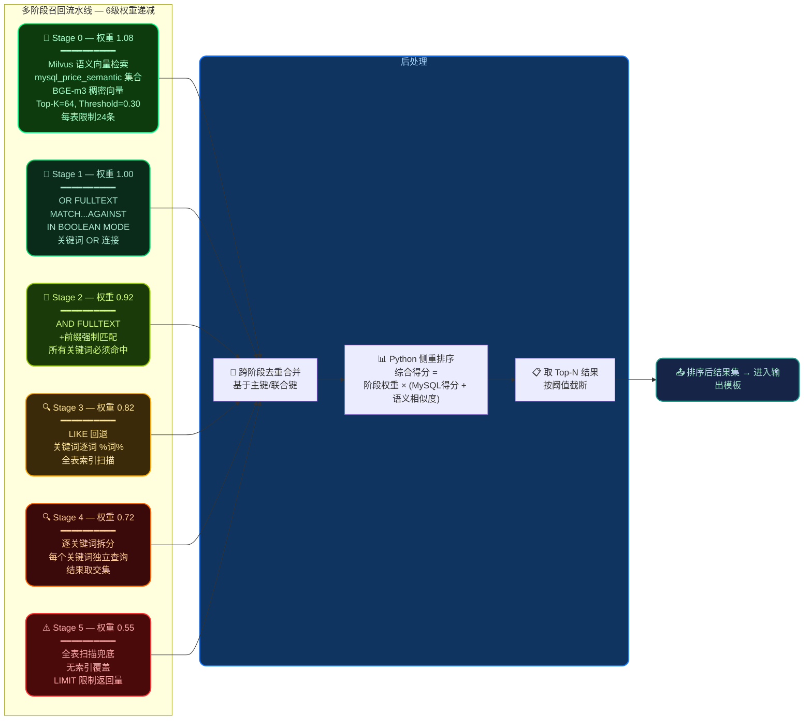

### 召回阶段触发条件与策略

| 阶段 | 权重 | 方法 | 触发条件 | 性能 |
|------|------|------|---------|------|
| **0** | 1.08 | Milvus 语义检索 | 始终执行（如有语义集合） | ⚡ 快，依赖 Milvus |
| **1** | 1.00 | OR FULLTEXT | 有关键词 + FULLTEXT索引存在 | ⚡ 快，索引覆盖 |
| **2** | 0.92 | AND FULLTEXT | Stage1 结果不足时 | ⚡ 快，更严格匹配 |
| **3** | 0.82 | LIKE 回退 | Stage2 仍不足 + 关键词有效 | 🐢 慢，全索引扫描 |
| **4** | 0.72 | 关键词拆分 | Stage3 不足 + 多关键词 | 🐢 慢，多次查询 |
| **5** | 0.55 | 全表兜底 | 极端情况（所有上级均空） | 🐌 最慢，紧急信号 |

---

## 7. Public KB — RAG 混合检索流水线

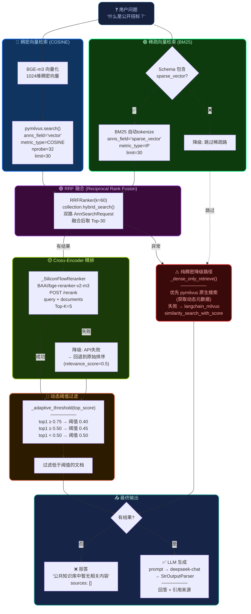

---

## 8. Public KB — PDF 入库全流程

```mermaid
graph TB
    classDef input fill:#16213e,stroke:#0f3460,stroke-width:2px,color:#c0caf5,rx:12,ry:12
    classDef parse fill:#0f3460,stroke:#1677ff,stroke-width:2px,color:#a8d8ff,rx:12,ry:12
    classDef clean fill:#0d3b0d,stroke:#00ff88,stroke-width:2px,color:#a8ffcc,rx:12,ry:12
    classDef chunk fill:#1a3a0a,stroke:#99cc00,stroke-width:2px,color:#d4ff80,rx:12,ry:12
    classDef embed fill:#3a0a3a,stroke:#c77dff,stroke-width:2px,color:#e0b3ff,rx:12,ry:12
    classDef store fill:#2d1b00,stroke:#f4a261,stroke-width:2px,color:#ffd166,rx:12,ry:12
    classDef done fill:#162447,stroke:#1b998b,stroke-width:2px,color:#a8e6cf,rx:12,ry:12

    subgraph S1["📥 步骤1: 文件扫描"]
        PDF_DIR["raw_pdfs/ 目录<br/>3本法规PDF (~2000+页)<br/>sorted(*.pdf)"]
    end
    class S1 input

    subgraph S2["📑 步骤2: MinerU 解析"]
        direction TB
        CACHE_CHECK{"缓存.md<br/>已存在?"}
        CACHE_LOAD["直接读取缓存<br/>跳过解析"]
        MINERU_RUN["subprocess: magic-pdf<br/>-p pdf_path<br/>-o output_dir<br/>timeout=3600s"]
        MD_OUT["输出: 结构化Markdown<br/>保留完整标题层级"]
    end
    class S2 parse

    subgraph S3["🧹 步骤3: 文本清洗 — TextCleaner.clean()"]
        direction TB
        R1["① 去页眉页脚<br/>频次统计: ≥5次出现<br/>且长度 <80字符 → 移除"]
        R2["② 去页码<br/>独立纯数字行 → 移除"]
        R3["③ 去过短行<br/><10字符的非标题行 → 移除"]
        R4["④ 压缩空行<br/>连续3+空行 → 压缩为2个"]
    end
    class S3 clean

    subgraph S4["✂️ 步骤4: 语义切片 — SemanticChunker.chunk()"]
        direction TB
        C1["主策略: 按 #/##/###<br/>标题层级拆分<br/>保留章节路径<br/>'第一章 > 第一节'"]
        C2["补策略: 超长块<br/>按句子边界二次拆分<br/>中文句号/问号/感叹号<br/>max_chars=2000<br/>overlap_chars=100"]
    end
    class S4 chunk

    subgraph S5["🧬 步骤5: 向量化"]
        direction TB
        EMBED_CALL["_SafeEmbeddings<br/>BGE-m3 (1024维)<br/>超长文本自动截断<br/>batch_size=100"]
    end
    class S5 embed

    subgraph S6["🐘 步骤6: 入库 Milvus"]
        direction TB
        DROP_OLD["_drop_if_exists()<br/>删除旧集合"]
        CREATE_COL["create_schema()<br/>id(INT64,auto_id)<br/>text(VARCHAR 65535)<br/>vector(FLOAT 1024维)<br/>+ 动态字段"]
        INDEX["create_index()<br/>IVF_FLAT + COSINE<br/>nlist=256"]
        BATCH_INSERT["_batch_insert()<br/>逐批向量化 + 插入<br/>batch_size=100"]
        FLUSH["flush() + load_collection()"]
    end
    class S6 store

    subgraph S7["✅ 完成"]
        QA_BUILD["_build_qa_chain()<br/>构建 LCEL 问答链"]
        READY["PublicKnowledgeRAG<br/>就绪，可查询"]
    end
    class S7 done

    PDF_DIR --> CACHE_CHECK
    CACHE_CHECK -->|"是"| CACHE_LOAD
    CACHE_CHECK -->|"否"| MINERU_RUN
    CACHE_LOAD --> MD_OUT
    MINERU_RUN --> MD_OUT
    MD_OUT --> R1
    R1 --> R2
    R2 --> R3
    R3 --> R4
    R4 --> C1
    C1 --> C2
    C2 --> EMBED_CALL
    EMBED_CALL --> DROP_OLD
    DROP_OLD --> CREATE_COL
    CREATE_COL --> INDEX
    INDEX --> BATCH_INSERT
    BATCH_INSERT --> FLUSH
    FLUSH --> QA_BUILD
    QA_BUILD --> READY
```

---

## 9. Answer Templates — 回答模板渲染引擎

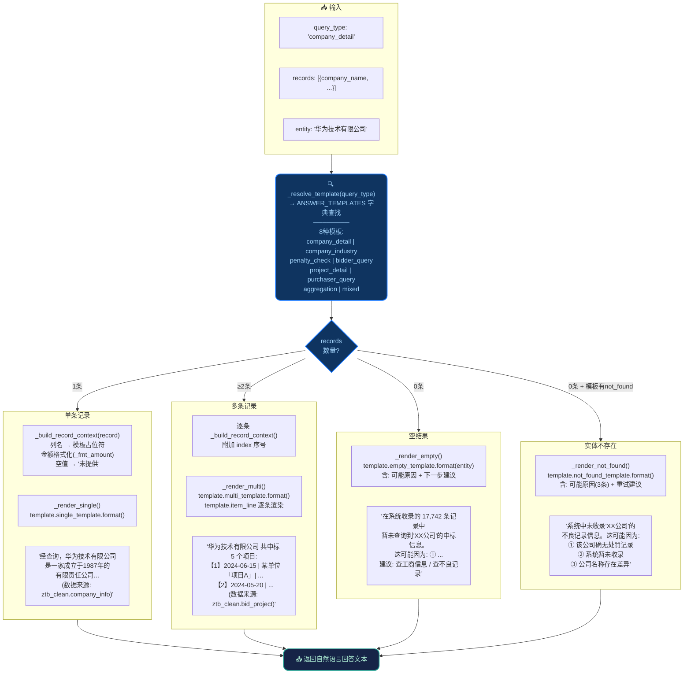

---

## 10. Output Templates — 输出字段筛选框架

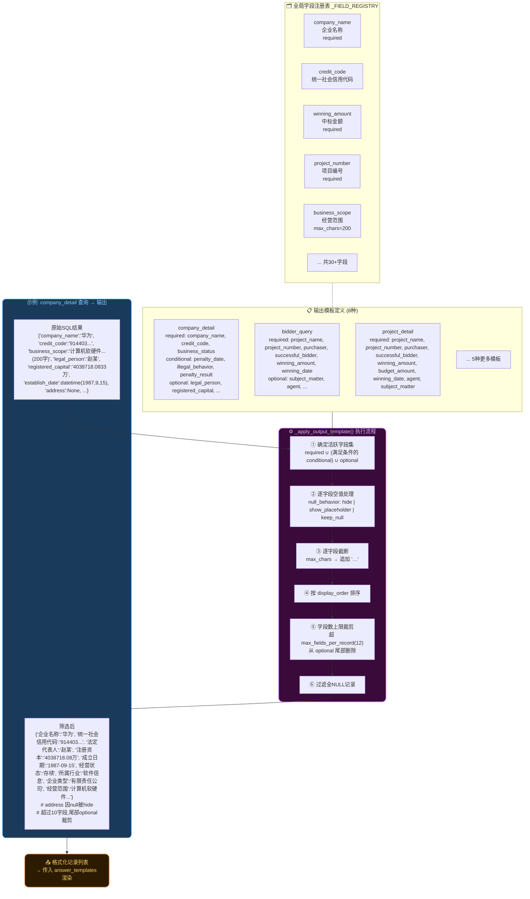

---

## 11. Fallback — 全局异常兜底机制

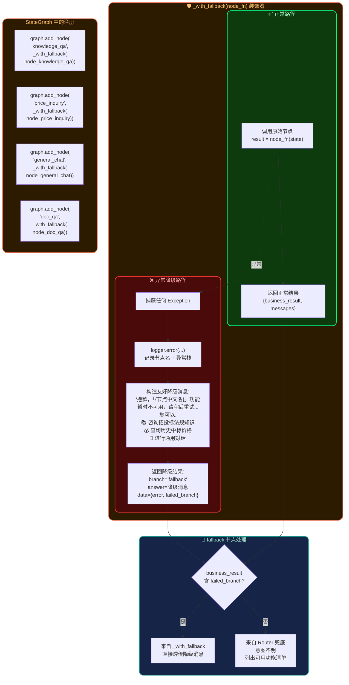

---

## 12. Checkpointer — 对话记忆持久化

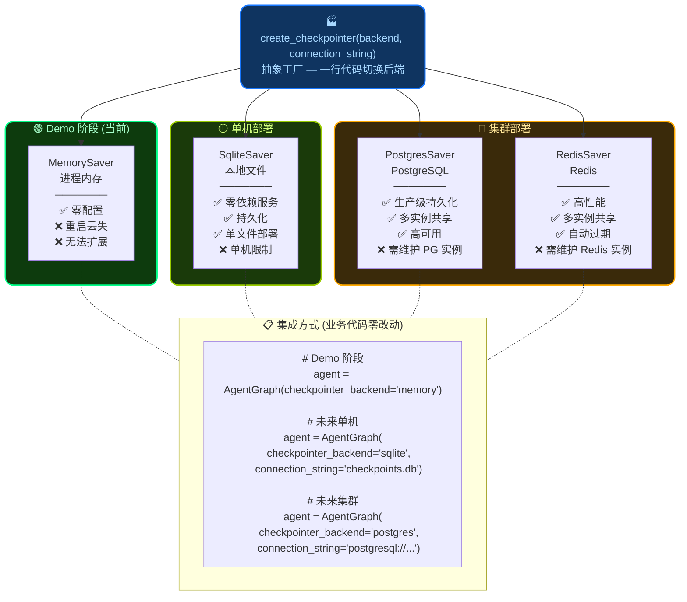

---

## 13. 数据源协同策略

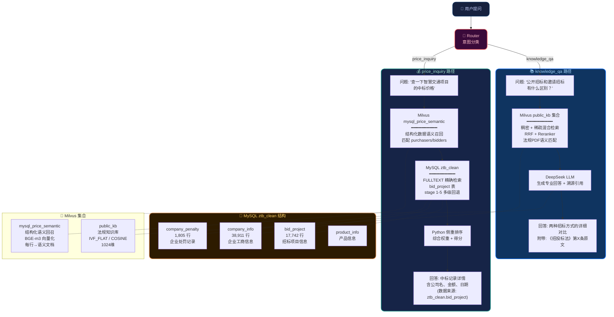

---

## 附录：关键代码路径速查

| 组件 | 文件 | 关键行/函数 |
|------|------|-----------|
| StateGraph 构建 | `agent/graph.py` | L108-184 `build_graph()` |
| 全局异常兜底 | `agent/graph.py` | L51-92 `_with_fallback()` |
| 意图分类 | `agent/router.py` | L159-212 `_route_via_tool_calling()` |
| State 定义 | `agent/state.py` | L19-37 `AgentState` |
| 统一意图解析 | `agent/nodes/price_inquiry.py` | L577-617 `_parse_unified_intent()` |
| 多阶段召回权重 | `agent/nodes/price_inquiry.py` | L116-123 `_RECALL_STAGE_WEIGHTS` |
| P0-11 公司名校验 | `agent/nodes/price_inquiry.py` | L472-504 `_is_valid_company_name()` |
| P0-12 项目编号提取 | `agent/nodes/price_inquiry.py` | L427-468 `_extract_project_number_candidate()` |
| 回答模板引擎 | `agent/nodes/answer_templates.py` | L377-427 `render_answer()` |
| 输出字段筛选 | `agent/nodes/output_templates.py` | L264-337 `_apply_output_template()` |
| LCEL 问答链 | `public_kb/qa_chain.py` | L106-310 `build_qa_chain()` |
| 混合检索逻辑 | `public_kb/qa_chain.py` | L157-270 `_retrieve()` |
| 自适应阈值 | `public_kb/qa_chain.py` | L368-380 `_adaptive_threshold()` |
| Reranker 客户端 | `public_kb/qa_chain.py` | L317-365 `_SiliconFlowReranker` |
| Milvus 集合管理 | `public_kb/milvus_store.py` | L26-200 `MilvusStoreManager` |
| 安全 Embedding | `public_kb/embedding_service.py` | L28-50 `_SafeEmbeddings` |
| 全局配置 | `public_kb/config.py` | L22-176 `Settings` |
| Checkpointer 工厂 | `agent/checkpointer.py` | L20-83 `create_checkpointer()` |
